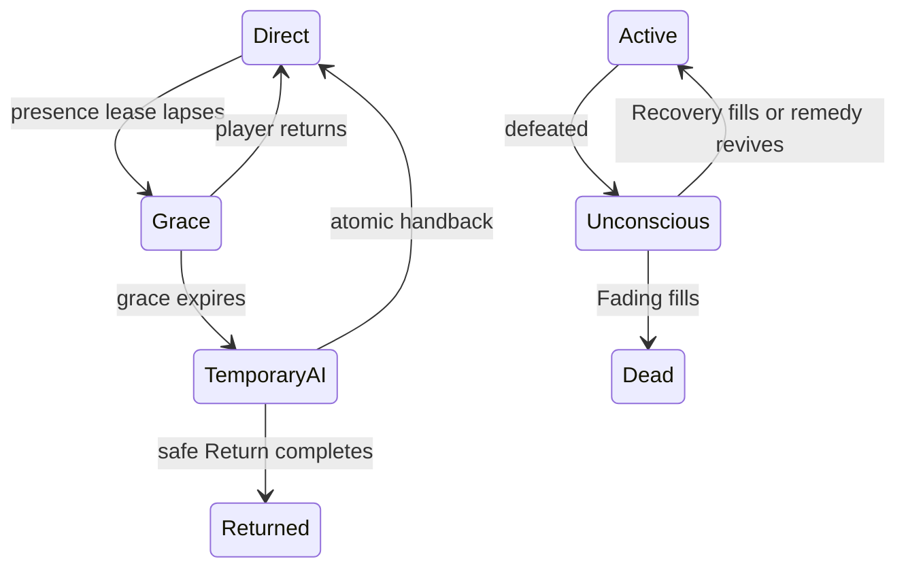

# Avatar Lifecycle And The Rescue Run — Backlog

**Epic**: Give every avatar one controller-neutral lifecycle from presence
through Death or Return, and make a knockout the start of a rescue rather than
the end of a tale.

> Absence changes the controller. Knockout changes the body. Only Death or
> Return ends the avatar.

**Status**: Groomed 2026-07-26, amended with the rescue-run decisions
2026-07-28, folded into this document 2026-07-30. Direction, not committed
scope — nothing here is in a 1.0 milestone.

**Prior execution backlog**: epic
[#380](https://github.com/cenetex/cosyworld/issues/380) and children
[#382](https://github.com/cenetex/cosyworld/issues/382),
[#383](https://github.com/cenetex/cosyworld/issues/383),
[#384](https://github.com/cenetex/cosyworld/issues/384),
[#385](https://github.com/cenetex/cosyworld/issues/385),
[#492](https://github.com/cenetex/cosyworld/issues/492),
[#493](https://github.com/cenetex/cosyworld/issues/493), closed into this
document. [#491](https://github.com/cenetex/cosyworld/issues/491) — renewable
potion supply — shipped separately as a standalone bug.

| Ticket | Prior issue | Priority |
| --- | --- | --- |
| LC-0 — preserve identity through Knockout and revival | [#385](https://github.com/cenetex/cosyworld/issues/385) | P1, load-bearing |
| LC-1 — collapse downed bodies into a targetable rescue row | [#382](https://github.com/cenetex/cosyworld/issues/382) | P1 |
| LC-2 — carry downed bodies; pause Fading in sanctuary | [#492](https://github.com/cenetex/cosyworld/issues/492) | P1 |
| LC-3 — the rescue run: birth draught, revival, independence release | [#493](https://github.com/cenetex/cosyworld/issues/493) | P1 |
| LC-4 — presence lease and atomic handback to temporary AI | [#384](https://github.com/cenetex/cosyworld/issues/384) | P2 |
| LC-5 — Fading, Death, and Return as bounded population sinks | [#383](https://github.com/cenetex/cosyworld/issues/383) | P2 |

**Related architecture**:

- [The CosyWorld Pact](../cosyworld-pact.md) — "Home Holds" and "Leaving Is Not
  A Promise To Win" are the product law this backlog implements.
- [CosyWorld RPG System Bible](../systems/09-cosyworld-rpg-system.md)
- [Thresholds, Trails, And The Strict Referee](thresholds-trails-and-strict-referee.md)
  — owns Anchors, retreat reachability, and the fatigue restrictions that must
  never remove a rescue path.
- [Rest, Travel, and Weariness](rest-travel-and-weariness.md) — owns the
  recovery reachability invariant at Spent.

---

## Why now

The current runtime treats Knockout as the end of a tale: the browser clears
the active session, offers Begin Again, creates a replacement actor, and leaves
the former actor `KNOCKED_OUT` holding its items and identity. In a shared
persistent room this produces an unreadable crowd of downed and replacement
avatars.

Production evidence, 2026-07-27, Flooded Barrow:

- Ten full-size portraits occupied the primary avatar rail while the linked
  traveler was inactive.
- The account stayed in the room and rendered `cannot act right now. Return
  when your traveler is active.` — but the action hand still showed a single
  `Notice` card, which then failed with the stale-choice receipt `That choice
  changed while you were deciding.`

That is internally contradictory. An inactive linked traveler should receive an
explicit Knockout observer/rescue surface, not an ordinary action it can never
commit. Both observations need production-shaped regressions that assert the
**authoritative actor status**, not the UI's inference of it.

---

## Product decision: the rescue run

Distilled from the 2026-07-28 design discussion. This is the decided shape of
the loop, superseding the earlier "full ghost vs. diminished ghost" question.

### The blocking discovery

There was exactly one usable potion in the world: Hearth Tonic (2001), one
charge, in the Cosy Cottage. Dawn Oil (8403) is a campaign puzzle item already
consumed by the beacon. One instance with charges in a shared persistent world
means the first player to pick it up owns the only rescue in the game, and the
first use spends it. Any rescue loop deadlocks on turn one and "oldest fades"
becomes the only outcome — rescue degenerates into a slow attrition timer.

This was a live bug independent of the rest of this epic:
`resident_healing_target` already heals downed actors with potions and could be
stranded. Fixed separately as #491.

### The birth draught

After a knockout, the account's next avatar is born carrying a draught —
granted **because** there is a body to deliver it to, never at a first-ever
birth. Supply therefore scales exactly with rescue demand and is unfarmable:
you cannot mint rescue potions without first being knocked out. It rides the
existing claim-keyed starter-grant path on `CREATE_ACTOR`, alongside
`STARTING_ORBS`.

### The choice is the mechanic

Delivering is optional. Not delivering is a legitimate reroll whose cost is
everything the old body carries and is — gear stays on the body, keepsakes stay
with it. Abandonment needs no designed penalty because its cost is intrinsic.

### Revival is a swap, not an accumulation

On delivery the body wakes, the player chooses which of the two to inhabit, and
the other **unlinks from the account and becomes an independent resident** —
keeping name, gear, keepsakes, and history, and joining the same bounded
autonomy pool as lapsed avatars (LC-4). Your failed hero is not deleted; they
stay in the world and you can walk past them.

**Max two avatars per account, by construction.** The second body exists only
transiently during the rescue window. No persistent character-select, no
per-avatar session juggling, no swap-at-will — which is what keeps losing a
body expensive.

### The cascade, pinned

> A unconscious + B unconscious → A (oldest) Dies, spawn C.
> Result: B unconscious + C active.

The invariant: at most two bodies per account, exactly one playable. Never
stuck, never accumulating, always rescuing something. Repeated failure costs
your longest-lived character one at a time — a real, legible stake with no dead
end. It also gives Death a player-caused route alongside the Fading clock,
which is better drama than a timer.

### The account bargain

No linked account → one avatar, no rescue; it transfers to temporary AI when it
drops. Linked account → the two-body rescue loop. The account buys you the
right to go get your character back. The Knockout screen's job changes
accordingly: not *"this tale has ended"* but *"your avatar is down — link an
account and go get them."*

---

## The controller/body state model

Controller state and body state are orthogonal.

---

## Principles (acceptance gate for every ticket)

1. One actor ID survives direct control, absence, temporary AI, Knockout, and
   revival. Knockout never creates a replacement actor.
2. Begin Again is unavailable until an authoritative terminal state: Death,
   Return, retirement, or release.
3. Lack of chosen actions is not abandonment. A player may be reading or
   watching; only a lapsed **presence lease** transfers control.
4. An Unconscious actor never acts merely because its presence lease expired.
5. Fading advances through committed play, never because real-world minutes
   passed. No real-time-only expiry can kill or retire an avatar.
6. **Fading must not advance in sanctuary.** Per the Pact, sanctuary cannot
   receive irreversible loss. Sanctuary pauses the clock; it does not heal,
   restore, or reset it, and it never rewinds.
7. Every temporarily autonomous avatar has a bounded terminal path — Death in
   genuinely mortal play, or a safe authored Return. Temporary autonomy must
   not ship before its sink exists.
8. Controller transitions and terminal transitions are journaled, snapshot-safe,
   replay-safe, and exactly once.
9. Direct and inference controllers receive the same legal action set once
   active; only controller ownership differs.
10. Dead and Returned avatars leave active rosters, offers, initiative,
    presence leases, and autonomy scheduling — but remain in account history,
    Journal evidence, provenance, and replay.
11. Items can never remain trapped on an unreachable terminal actor.

### Out of scope

- **Ghost conversion.** It can follow after rescue, Death, and Return exist. A
  ghost must consume an explicit bounded population budget and must not
  substitute for a real terminal lifecycle.
- **Making Knockout cheaper.** Scarce recovery is part of the campaign's
  stakes.

---

## LC-0 — Preserve actor and account identity through Knockout and revival

**Priority**: P1 — load-bearing; every other slice depends on it
**Scope**: Rust lifecycle state + browser session + migration

### What to do

Knockout pauses an avatar; it does not end that avatar or create a replacement
identity. Recovery returns the same actor with the same history, inventory,
relationships, and account ownership.

- An account remains linked to its Knocked Out actor.
- Refresh or reconnect returns an observer/rescue view for that actor rather
  than character creation.
- The actor cannot submit ordinary actions while Unconscious — and no card that
  would deterministically reject on that basis may be displayed.
- A legal remedy or filled Recovery clock changes that same actor from
  `KNOCKED_OUT` to `ACTIVE`; it never clones or relinks.
- If the account has active presence at revival, direct control resumes. If it
  is absent and temporary autonomy is enabled, the same actor resumes under
  temporary AI.
- Carried items, Calling, Bonds, practices, Journal evidence, campaign claims,
  and provenance remain attached throughout.

### Acceptance

- [ ] Actor ID and account link are unchanged across Knockout, refresh,
      snapshot, replay, remedy, and revival.
- [ ] Knockout refresh cannot enter character creation or mint a replacement.
- [ ] A present owner observes while Knocked Out and regains control exactly
      once on revival.
- [ ] An absent owner does not block another co-located actor from committing
      legal care.
- [ ] Revival clears only the conditions named by the remedy/rules profile.
- [ ] Duplicate remedy submissions and replay cannot reward, heal, or
      reactivate twice.
- [ ] Begin Again fails closed while the linked actor is Active or Knocked Out.
- [ ] Existing snapshots containing a Knocked Out actor migrate without
      inventing a replacement.
- [ ] A production-shaped fixture covers refresh/reconnect while Knocked Out
      and asserts the authoritative actor status: the account stays linked,
      ordinary action cards are absent, and the visible state names
      Knockout/Unconscious rather than generic inactivity.

### Tests

Protect direct-input and inference-controlled rescuers, present and absent
owners, reconnect races, snapshot restore, stale action offers, and replay from
before Knockout through revival.

---

## LC-1 — Collapse downed bodies into a targetable rescue row

**Priority**: P1
**Scope**: projection + browser rail
**Depends on**: LC-0, and one shared roster/offer visibility predicate

### What to do

The main room rail communicates who can act. Knocked-out bodies remain present
and consequential without turning the room heading into a wall of portraits.

- The existing portrait rail contains active, visible avatars only.
- Every co-located Unconscious avatar appears beneath it as one compact rescue
  indicator.
- Indicator colour communicates medical urgency — Stable, Fading, Critical —
  but colour is never the only signal; every indicator has an accessible name
  and state.
- A compact summary stays legible at crowd size (`3 knocked out`), with bounded
  individual dots and a `+N` overflow.
- Selecting an indicator opens that avatar's keepsake/rescue sheet: identity,
  medical state, Recovery and Fading clocks, and legal care actions.
- A potion, First Aid, Carry, or other authored remedy targets the selected
  downed actor directly. The server still validates co-location, charges,
  conditions, and replay identity.
- Downed avatars do not appear as ordinary Chat, gift, friendship, combat, or
  work targets.

### Acceptance

- [ ] Active portraits and downed indicators derive from one visibility
      predicate.
- [ ] A room containing active, Stable, Fading, and Critical avatars renders
      each in the correct surface.
- [ ] The rescue summary is understandable without colour and is
      keyboard/screen-reader operable.
- [ ] A legal potion committed from the selected indicator revives exactly the
      selected actor.
- [ ] Stale, duplicate, remote, and forged targets fail closed without
      consuming the remedy.
- [ ] Refresh and snapshot restore reproduce the same rail, indicators, target,
      and clocks.
- [ ] A bounded browser fixture protects empty, one-Knockout, and crowded
      layouts — including the production-shaped ten-actor case from Flooded
      Barrow, where multiple downed avatars must keep active participants
      legible.

### Out of scope

Controller takeover, Death, and Begin Again. This slice exposes the medical
state and legal care the server already owns.

---

## LC-2 — Carry downed bodies and pause Fading in sanctuary

**Priority**: P1
**Scope**: kernel-validated move + clock suspension
**Depends on**: LC-1 (bodies are targetable), LC-5 (Fading owns the clock)

### What to do

A downed body is a physical thing allies can move. Carrying it to sanctuary
stops its Fading clock, which makes sanctuary meaningful to the death loop and
gives allies something to do with a dot in the rescue row besides heal it. The
rescue run becomes an actual run.

- Fading must not advance in sanctuary. A body delivered there is safe.
  Sanctuary pauses the clock — it does not heal, restore, or reset it.
- Carrying is a journaled move of the unconscious actor through the normal
  validated path, with a claim key. The rescue row reflects the body's location
  as it travels.
- Setting a body down outside sanctuary resumes Fading from where it paused. No
  pause-and-reset exploit; the clock only ever freezes, never rewinds.
- Carrying is deliberately unglamorous: it occupies hands/capacity like any
  heavy load, so the carry is a commitment, not a free taxi for downed friends.
- The carrier need not be the body's owner. Any ally — or a resident — can make
  the delivery, which is what turns a dot on the row into a cooperative errand.

### Acceptance

- [ ] An unconscious actor can be picked up, moved, and set down by another
      actor, all journaled and replayable.
- [ ] Fading does not advance for any clock whose actor is inside a sanctuary
      location; it resumes at the same value on exit.
- [ ] Replay and snapshot round trips reproduce carried state and paused clocks
      exactly.
- [ ] The rescue row and room presentation distinguish a body being carried
      from a body lying in a room.
- [ ] No sanctuary loss path: nothing in the carry/deliver flow can kill,
      strip, or transfer a body against its owner's account.

---

## LC-3 — The rescue run: birth draught, revival, and independence release

**Priority**: P1
**Scope**: new action code + claim-keyed grant + ownership transfer
**Depends on**: LC-0; interacts with LC-2 and LC-5

### What to do

Implement the decided rescue loop above.

- The draught is granted at avatar creation **only when the account has a
  downed body** — never at a first-ever birth — on the existing claim-keyed
  starter-grant path on `CREATE_ACTOR`.
- Player-caused revival uses the normal item-use path already exercised by
  `resident_healing_target`, extended to a validated player action on a downed
  actor.
- Revive + inhabit choice + unlink is a single journaled, terminal-class action
  with a claim key — a **new action code**, never a reinterpretation of an
  existing one — and must survive journal replay and snapshot round trips.
- The double-Knockout cascade applies during the rescue window. That death is a
  journaled `combat.death`-class event with a claim key, never implicit
  cleanup, so replay reproduces which avatar died.

### Acceptance

- [ ] Account with a downed body → next created avatar carries the draught;
      first-ever avatar → no draught.
- [ ] Revival, inhabit choice, and unlink replay exactly once; a snapshot round
      trip preserves the ownership transfer.
- [ ] The released avatar appears in the world as an independent resident with
      its prior identity, gear, and keepsakes.
- [ ] Double-Knockout during the rescue window kills the oldest body and spawns
      a replacement avatar, journaled and replayable.
- [ ] The Knockout screen copy changes from "this tale has ended" to "your
      avatar is down — link an account and go get them," in register per
      `v2/docs/writing-style.md`.
- [ ] Unauthenticated players keep the single-avatar path: no rescue run, and
      the avatar transfers to temporary AI when it drops.

---

## LC-4 — Presence lease and atomic handback to temporary AI

**Priority**: P2
**Scope**: presence lease state machine + controller epoch
**Depends on**: LC-0. **Must not ship before LC-5.**

### What to do

A player avatar can keep participating when its human controller truly leaves,
then return to that human without changing actor identity or creating
controller-specific rules.

- The server owns a renewable presence lease for every directly controlled
  active avatar, renewed by client heartbeats.
- Lease expiry enters a configurable grace state. Grace expiry journals a
  controller transition to temporary AI.
- Temporary AI receives the same server-authored legal offers and authoritative
  validation as a human controller.
- Reconnection atomically increments a controller epoch, returns control to
  direct input, and invalidates any inference submission prepared under the old
  epoch.
- Only one controller may commit for an actor at a time. A late heartbeat,
  inference response, retry, or replay cannot create a double turn.
- The room communicates temporary autonomy quietly but unambiguously; it does
  not pretend the human is speaking.

### Acceptance

- [ ] Lease, grace, takeover, and handback are explicit server states with
      configurable durations.
- [ ] Takeover and handback are journaled exactly once and survive
      snapshot/replay.
- [ ] A valid heartbeat during grace prevents takeover.
- [ ] Disconnecting eventually enables temporary AI without creating a new
      actor; an idle but connected client retains control.
- [ ] Reconnect wins before the next autonomous commit; stale AI work fails
      closed by controller epoch.
- [ ] Human and temporary-AI controllers see the same action identifiers,
      costs, consent rules, and results.
- [ ] Knocked Out, Dead, Returned, retired, and released actors cannot acquire
      an actionable AI lease.
- [ ] Metrics expose lease expiry, takeover, handback, stale-controller
      rejection, and autonomous lifetime.

---

## LC-5 — Fading, Death, and Return as bounded population sinks

**Priority**: P2
**Scope**: kernel terminal states + cleanup + item disposition
**Depends on**: LC-0

### What to do

Every player-created avatar needs an explicit, replayable terminal path. Danger
can end in Death; ordinary abandonment can end in a safe Return. Neither
outcome silently erases the life that happened. The kernel already defines
`DEAD`, but current combat sets only `KNOCKED_OUT`, and abandoned temporary
actors would otherwise accumulate forever.

**Medical sink**

- Knockout creates public three-segment Recovery and Fading clocks.
- Fading advances on deterministic committed danger beats.
- Stable prevents ordinary Fading; care advances Recovery per the remedy.
- Recovery 3/3 revives the same actor. Fading 3/3 commits one atomic Death
  event. Mortal stakes, method capability, and mortality profile must all
  permit Death.

**Abandonment sink**

- Temporary AI receives a bounded, visible Return obligation rather than
  roaming forever.
- Return advances through committed autonomous play toward an authored safe
  destination; it is not a hidden wall-clock deletion.
- Reclaiming the actor cancels or pauses Return according to one explicit rule.
- Completing Return retires the actor from active world participation without
  calling the outcome Death.
- A temporarily autonomous avatar remains subject to ordinary mortal danger and
  may die before returning.

**Terminal cleanup**

- Dead and Returned actors leave active rosters, action offers, initiative,
  presence leases, and autonomy scheduling.
- Carried items move atomically to the authored death/return destination or
  cache with provenance intact.
- Account history and Journal retain identity, Calling, Bonds, deeds, and
  terminal cause.
- Begin Again unlocks only after the terminal event is durable.

### Acceptance

- [ ] Recovery/Fading clocks, Stable, Critical, Death, and Return have one
      authoritative state model.
- [ ] Death and Return each emit a distinct versioned event and cannot be
      conflated with Knockout.
- [ ] No real-time-only expiry can kill or retire an avatar.
- [ ] No terminal actor can receive offers or autonomous turns.
- [ ] Items cannot remain trapped on an unreachable terminal actor.
- [ ] Begin Again cannot race terminal cleanup or duplicate account rewards.
- [ ] Population remains bounded under repeated disconnect, temporary-AI,
      Knockout, revival, Death, and Return cycles.
