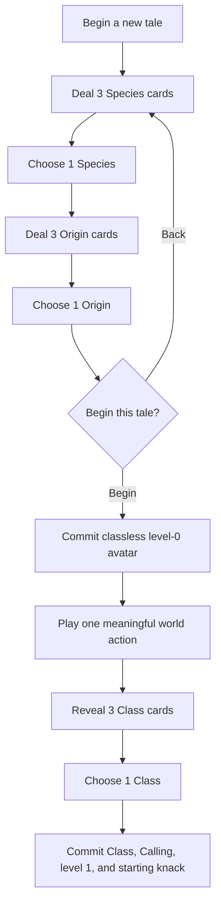

# Card-Composed Character Creation

Status: staged-creation vertical slice implemented, broader account collection
proposed, 2026-07-22.

## Decision

Character creation becomes the first expression of CosyWorld's collection
game. An account receives a free starter set of nine identity cards:

- three **Species** cards;
- three **Class** cards; and
- three **Origin** cards.

A new avatar initially chooses one Species and one Origin. They enter the world
**classless at level 0**. After their first meaningful committed player action,
the three owned Class cards are revealed; choosing one completes the
composition and advances the avatar to level 1. All twenty-seven eventual
starter combinations are legal. The selected cards are locked into that
avatar's history, while the account keeps the cards and may use them again when
beginning a later tale.

The player-facing questions stay ordinary:

1. **What are you?** — Species
2. **Where did you come from?** — Origin
3. **What do you do first?** — one real choice in the world
4. **What did that reveal?** — Class

The selected Class supplies the first authored Calling. Calling may later be
revised through the existing growth rules.

`species`, `class`, and `origin` are stable schema terms, not three new
top-level product nouns. They live under the existing **Cards** concept. Class
does not introduce a class tree: it is a balanced starting approach and kit.
The carried item deck, equipped charms, Friends, Calling, and Journal remain
the long-term build and progression surfaces.

The free starter set must be sufficient to enjoy the whole core game. Cards
found later add identity, story, art, and horizontal build possibilities; paid
ownership never buys a stronger species, an exclusive maximum statistic, an
extra turn, or progression.

## Why this is better than the current picker

The current campaign profile offers one compound choice such as `Lantern
Warden` or `Mothwood Guide`. That single choice currently bundles together:

- identity and appearance;
- a profession or approach;
- an implied past;
- an authored Calling;
- a title and description;
- a starting skill; and
- the campaign entry room.

It is fast, but it hides the collection and produces only four authored
characters. Splitting the choice into three reusable cards creates a small
combinatorial space without a tabletop form: three visible choices at a time
produce twenty-seven coherent starters. It also gives exploration a durable
account reward. The world can later reveal a new Species, teach a new Class, or
make a new Origin available for the account's next tale.

## The card types

Identity cards are account-level creation entitlements. They are not item
cards, world actors, physical possessions, action offers, or equipment.
Player copy may call the collection simply **your cards** and use Species,
Class, and Origin as section labels. The existing word **keepsake** remains
reserved for collectible representations of actors, items, and locations; an
identity card is not a keepsake unless the player lexicon is deliberately
revised.

| Slot | Fictional promise | Bounded rules contribution | It must not do |
| --- | --- | --- | --- |
| Species | body, scale, senses, visual language, naming texture | one validated species trait profile and appearance fragments | grant raw arbitrary stats, lock ordinary content, or imply that a people is loot |
| Class | learned work and favored approach | one validated level-one rules profile plus a choice of common starter kit/charm | create a permanent class tree or exclusive best-in-slot power |
| Origin | a remembered place, custom, and connection | one entry hook, one lore tag or known contact, and Calling fragments | grant paid access, move shared residents, or rewrite the campaign entry room |

The compiler accepts references to validated rules profiles, traits, hooks,
items, and charms. It does not accept arbitrary stat blocks or prose-defined
effects.

### Suggested Lantern Keeper starter set

These names are illustrative content, not yet canon:

| Species | Class | Origin |
| --- | --- | --- |
| Human | Lantern Warden | The Cosy Cottage |
| Mouse | Mothwood Guide | The Open Road |
| Badger | Hedge Mender | The Old Chapel |

This eventually gives immediately legible combinations:

- a Mouse Lantern Warden from the Old Chapel;
- a Human Hedge Mender from the Open Road; or
- a Badger Mothwood Guide from the Cosy Cottage.

Moth-Sprite is a good candidate for the first later Species discovery. Its
content pass must test scale-sensitive scenes first; a thumb-sized body needs a
trait profile that explicitly handles carrying, doors, movement, and targeting
without becoming either a superior mobility option or a constant exception.

## First-time flow

The creation surface uses the same three-choice rhythm as the action hand, but
it is not the action hand and never randomly withholds an owned card.



On a phone, each step shows:

- the campaign question at the top;
- three illustrated cards in a swipeable row or compact stack;
- one short sentence per card;
- a persistent composition strip whose Class slot remains veiled; and
- Back without losing later choices.

Selecting a Species moves it into the composition strip and deals Origin.
Back returns to Species without losing the Origin choice. There is no separate
wizard progress bar: the Species and Origin silhouettes plus the veiled Class
slot are the progress indicator.

Each card face contains only:

- art, label, and one-line fantasy;
- one plain-language mechanical fact;
- its source mark; and
- a details affordance for trait, kit, hook, provenance, and accessibility
  text.

The card detail explicitly separates **in this tale** from **appearance and
story**. Players should never have to guess whether an attractive visual choice
also changes combat numbers.

### When the collection grows beyond three

The starter account has exactly three cards in each slot, so its first deal is
the whole choice set. Later creation screens still feature three cards at once:

1. newly discovered cards;
2. cards with authored campaign connections; then
3. recently or frequently chosen cards.

The featured three are recommendations, never a random gate. **All Species**,
**All Classes**, or **All Origins** opens the complete owned collection as a
filterable grid, and selecting from that grid returns the chosen card to the
three-card composition surface. An owned, compatible card is always reachable
without a consumable redraw, currency, or luck.

Unknown cards do not fill the creation grid with a global checklist of
silhouettes. The world may place a specific, story-earned hint in the account
collection after the player encounters it; otherwise undiscovered identities
remain undisclosed.

After Origin, the two cards fan together into the arrival preview:

> Mouse · from the Old Chapel · Class unknown

The preview shows body language, connection, and campaign arrival. After the
player acts in the world, the Class cards replace the normal action hand until
one is selected:

> Your first choice revealed three paths.

The chosen Class supplies the starting approach, level-one knack, title, and
authored Calling. Calling remains a personal purpose that may later be revised
through existing growth rules; it is not another account collectible.

The arrival confirmation offers only:

- **Begin this tale**
- **Change a card**

Class selection is a second replay-safe commit; refresh cannot put the avatar
back into initial creation or grant the starting knack twice.

Name and portrait generation begin after arrival commit so an inference delay never
blocks browsing or loses the selected composition. The immediate arrival uses
an authored fallback name/title and composited card art; generated identity art
may replace it through the existing durable media path when ready.

## Returning-player flow

The account owns the identity collection, not the active avatar.

- A returning active avatar resumes immediately. Character creation is not
  shown on every login.
- A knocked-out, retired, released, or deliberately archived avatar remains in
  account history and never receives a fresh active session.
- **Begin a new tale** opens the same composition surface with every identity
  card the account has unlocked.
- The account may initially have one active avatar per shard. Starting another
  requires the previous tale to be in a terminal state; multi-avatar rosters
  can be designed later without changing card ownership.
- The new avatar does not inherit the previous avatar's carried items,
  friendships, Calling, Journal, conditions, or room position.
- Account-level cards, art variants, access entitlements, provenance, and
  account Orbs survive between tales.

This makes defeat consequential without making collection progress disposable.
It also resolves the identity boundary exposed by wallet recovery: a wallet or
passkey restores the account and collection, while an actor session controls
one active avatar.

## Discovery in the world

Identity cards are unique account unlocks. They do not drop as biological
objects and they do not silently rewrite the current avatar.

### Species

A Species card represents welcome, kinship, or enough lived understanding for
a future tale to begin as that kind. Suitable grants include:

- completing a people-specific story with dignity;
- becoming trusted by several members of that community;
- discovering a hidden community and accepting its invitation; or
- carrying an account legacy forward from a completed campaign.

Player copy should say:

> The moth-sprites would welcome one of your future tales.

It should never say that the player captured, looted, or owns a species.

### Class

A Class card represents an apprenticeship or practiced tradition. It may be
earned by:

- completing a mentor's teaching arc;
- resolving a job with the class's approach;
- assembling and using its common kit; or
- finishing a campaign in which the practice is publicly recognized.

Class unlocks a balanced creation profile and starter-kit choice. The active
avatar learns real ongoing capabilities from physical charms, tools, spells,
and play—not from an account menu.

### Origin

An Origin card means a future character may truthfully belong to a place or
tradition. It may be earned by:

- making a sanctuary familiar;
- completing a local story;
- being adopted into a community;
- restoring a forgotten route or home; or
- finishing a world pack.

Origins add relationships and story hooks, not location access. A gated
location still requires its normal pass, and the campaign profile remains
authoritative for the avatar's initial room.

### Duplicate discoveries

The account unlock is unique on `(account_id, identity_card_id)`. Discovering
the same card again adds a provenance stamp or art treatment to that card; it
does not create a second mechanical copy or convert into power/currency.

Identity unlocks are non-transferable by default because they record account
progress. Tradable NFT art or keepsake variants may visually decorate an
already-free identity option, but selling that asset cannot remove the
account's earned ability to begin that kind of tale.

## Composition and balance

Every eventual legal combination must fit the same level-one budget.

1. The arrival commit creates a classless level-zero actor.
2. Species supplies one bounded trait profile. Species never modifies the
   class's primary stat budget.
3. Class selection, only after a qualifying world action, advances the actor to
   level 1 and grants one authored starting knack.
4. A Class may later offer one of up to three common starter kits. The chosen
   kit is granted through the normal collection/equip path with creation
   provenance.
5. Origin supplies one relationship or lore hook and composition text. It does
   not add another combat modifier.
6. Calling supplies existing Journal triggers and identity text, not creation
   stats.
7. Campaign supplies entry room, campaign hook, and any safe presentation
   overlay. It may restrict cards only for an explicit fiction or rules
   incompatibility declared and validated in the world pack.

Core starter cards must be mutually compatible. A pack may add an optional
pair/triple presentation override, but the fallback composition must always
work from the three individual fragments. Authors therefore write nine cards,
not twenty-seven bespoke characters.

Pair overrides may change:

- title grammar;
- visual prompt details;
- arrival wording;
- suggested names; and
- Calling options.

They may not change legality, stats, rewards, access, or power.

## Account boundary

First play must remain possible without a wallet, passkey ceremony, typing, or
purchase.

Recommended account lifecycle:

1. The server creates a provisional account and opaque session on first Begin.
2. It grants the nine starter identity cards idempotently.
3. The player creates and plays an avatar normally.
4. The first non-starter identity discovery prompts the player to add a passkey
   for recovery, but never blocks the reward or the current session.
5. Optional wallets attach external cards and entitlements to the same account.

A browser-local collection is not authoritative. Losing the provisional
session before adding a recovery method may make the account unrecoverable, so
the UI should explain that plainly after the player has something worth
keeping—not before the first tale begins.

Deployments remain tenant boundaries. Card grants are keyed by the deployment's
account/store identity unless an explicit federation or import contract exists;
sharing one email, passkey credential, or wallet address across domains must not
silently merge canonical world history.

## World-pack contract

Character-creation schema version 2 stages Species and Origin before Class. The
implemented vertical slice embeds authored cards in the campaign profile; these
may move to referenced account-card resources when the collection ledger lands:

```json
{
  "schema_version": 2,
  "id": "the-lantern-keeper",
  "name": "The Lantern Keeper",
  "entry_location_id": 800,
  "prompt": "What kind of traveler reaches the last light?",
  "class_prompt": "What did your first choice reveal about you?",
  "default_species_id": "human",
  "default_origin_id": "wayside-inn",
  "default_choice_id": "lantern-warden",
  "species": [{ "id": "human", "label": "Human" }],
  "origins": [{ "id": "wayside-inn", "label": "The Wayside Inn" }],
  "choices": [{ "id": "lantern-warden", "label": "Lantern Warden" }]
}
```

Each referenced card is a versioned world-pack resource with:

- stable id, slot, label, detail, art and accessibility text;
- authored identity and visual fragments;
- validated trait/profile/hook references;
- discovery policy;
- source pack, version, license, and attribution;
- compatibility declarations;
- optional pair/triple presentation overrides; and
- an authored fallback for every generated field.

The compiler must reject:

- missing or duplicate slots;
- fewer than three free starter choices in any required slot;
- raw stat/effect payloads;
- unknown rule, item, charm, hook, or location references;
- a starter combination that fails compatibility;
- paid-only or wallet-only core starters;
- origins that bypass location access;
- species or class text that promises unsupported mechanics; and
- a campaign with no fully deterministic creation path.

## Persistence and events

Suggested durable records:

```text
account_identity_card_unlocks
  account_id, card_id, source_event_id, source_pack_hash,
  first_unlocked_at, latest_provenance_json
  UNIQUE(account_id, card_id)

avatar_creation_drafts
  draft_id, account_id, campaign_id, selections_json,
  composition_hash, status, expires_at

avatar_identity_composition
  actor_id, account_id, species_card_id, origin_card_id,
  nullable_class_card_id, class_selection_ready, qualifying_world_actions,
  calling, starter_kit_card_id, campaign_pack_hash, composition_hash
  UNIQUE(actor_id)
```

Draft choices are private account state and may expire. Arrival is one
idempotent transaction that:

1. verifies the account session and card unlocks;
2. validates Species and Origin against the mounted pack/rules profile;
3. creates the actor through the kernel;
4. forces level 0 and records the partial immutable identity composition;
5. links the account to the new active actor;
6. writes the arrival events; and
7. returns the same result on retry.

The first qualifying player card or speech event records
`class.selection_ready`. Class selection is then a separate replay-safe system
mutation that validates the profile, records `class.chosen`, sets level 1,
updates Calling and title, and grants the starting knack exactly once.

Public world history needs one compact event such as `actor.created` with the
resolved title. The detailed account card choices may be projected into the
avatar sheet, but private creation drafts do not enter the room transcript.

Identity discovery uses an idempotent `account.identity_card_unlocked` account
event linked to its committed world source event. A public room beat may
celebrate the discovery without exposing account identifiers.

## API shape

The implemented vertical route surface is:

```text
GET    /state
POST   /avatar          { character_creation_id, species_id, origin_id }
POST   /avatar/class    { actor_id, character_creation_id, class_id }
```

The account-card and durable draft routes remain future work. Both implemented
mutations recompute their selection from mounted content; the client cannot
submit a stat block, level, title, Calling, or skill grant.

## Migration from character creation v1

Schema v1 remains replayable and mountable during migration.

1. Introduce identity card resources and schema v2 behind a feature flag.
2. Map each v1 compound choice to a canonical v2 composition for history and
   support displays. Do not reinterpret the old `actor.created` event.
3. Grant existing accounts the free starter set.
4. Project existing avatars with `legacy_choice_id` plus the mapped composition
   version; their stats, items, Calling, and entry history do not change.
5. Make v2 the creation default only after all twenty-seven starter
   combinations pass compiler, rules, copy, portrait, mobile, and smoke checks.
6. Retain v1 request acceptance until old clients are outside the supported
   release window.

## Instrumentation

Record:

- creation opened;
- Species and Origin inspected and selected;
- Back/change-card use;
- level-zero arrival reached;
- first qualifying world action;
- Class cards revealed and selected;
- confirm attempted/succeeded/rejected;
- time per slot and total time to arrival;
- starter versus discovered card use; and
- new-tale creation after a terminal avatar.

Do not optimize for the fastest possible confirm alone. The primary funnel is:

> Begin → choose Species and Origin → arrive → act → choose Class

Target for a first-time phone visitor: reach the world in under ninety seconds
without typing, while being able to answer “what am I and where am I from?”
The world then helps answer “what do I do?”

## Acceptance gates

1. A guest can create a valid avatar from the free starter set with no wallet,
   passkey, typing, payment, or AI availability.
2. All nine Species/Origin arrivals and all twenty-seven eventual starter
   combinations compile, commit, replay, and render on the narrow mobile
   layout.
3. Refreshing or retrying arrival or Class selection cannot create a second
   actor, grant the starting knack twice, or duplicate a card grant.
4. An account linked to an inactive avatar may begin a new tale; an active
   avatar resumes instead of opening creation.
5. A found identity card belongs to the account and never mutates the current
   avatar.
6. Species, Class, and Origin cards cannot directly grant arbitrary stats,
   paid access, progression, extra turns, or best-in-slot power.
7. Removing or selling an external art/NFT variant cannot remove an earned
   native identity unlock.
8. Every unlock and final composition is linked to committed, replayable
   provenance.
9. Packs can add cards and presentation overrides through data, but cannot
   execute client text or bypass kernel/Rust validation.
10. A Class is unavailable before the first qualifying committed player action,
    and selecting it atomically advances level 0 to level 1.
11. Existing v1 avatars replay byte-for-byte under their original creation
    semantics.

## Recommended first slice

Build only the vertical path needed to prove the idea:

1. nine authored starter identity cards;
2. the two-step Species/Origin mobile selector;
3. classless level-zero arrival;
4. first-action Class reveal and selection;
5. immutable staged avatar composition persistence;
6. one authored Calling per Class;
7. account-level idempotent starter grants;
8. v1-to-v2 compatibility mapping;
9. one later in-world identity-card discovery;
10. one terminal-avatar **Begin a new tale** flow; and
11. complete twenty-seven-combination and retry coverage.

Do not begin with trading, rarity, booster duplication, arbitrary user-authored
cards, species stat bonuses, multiple simultaneous avatars, or AI-generated
mechanics. The value of the first slice is the clear identity composition and
the discovery promise, not collection breadth.
