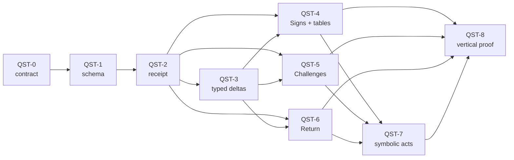

# Quest Grammar And Return

**Outcome**: compose deterministic, replayable tales from Hearth, Sign,
Venture, Challenge, Discover, and Return across avatars, items, and locations
without adding a second action system or handing authority to AI.

**Status**: Groomed and filed (2026-07-30). The linked issues are the source of
truth for implementation state.

**Execution backlog**: epic
[#639](https://github.com/cenetex/cosyworld/issues/639).

## Diagnosis

CosyWorld has most of the rules needed to resolve a good quest, but no
authoritative structure that says what role those resolutions played in a
tale.

The runtime can move and place actors and items, reveal and unlock routes,
resolve checks, apply closed effects, advance Job clocks, allocate loot, form
Bonds, record discoveries, and preserve replay. Those systems are strong
foundations. They currently meet in ad hoc projections: a Search receipt, a
route discovery, a local Lead, a Job contribution, a loot allocation, a Visit
Ledger mark, or a frontier-return mark. Nothing binds them into one typed,
versioned causal arc.

The gap is therefore not “add quests to the kernel.” It is:

> Add a deterministic semantic layer that compiles authored quest functions
> into existing legal actions, records the evidence and world delta of each
> resolution, and makes Return settle that delta into shared play.

This is the next major windfall because it joins work that otherwise risks
becoming several parallel discovery, traversal, Job, and Journal systems.

## Existing Foundations

| Foundation | Current evidence | What it already gives the grammar |
| --- | --- | --- |
| Append-only concrete actions | `cw_action_kind` in `v2/core-c/include/cosy_kernel.h` | Stable authority for physical actions, kernel Gate transitions, and versioned discovery-procedure commits. |
| Small deterministic world state | `cw_world` in `v2/core-c/include/cosy_kernel.h` | Canonical actors, items, locations, exits, evolution, and encounters. |
| Three card subject kinds | seed-card validation in `v2/orchestrator-rust/src/content_load.rs` | The avatar/item/location focus axis already exists. |
| Jobs and clocks | `JobState` in `v2/orchestrator-rust/src/jobs.rs` | Premise, stakes, participants, places, progress, danger, reward, consequence, and completion memory. |
| Named contribution methods | `JobContributionStrategy` and `JobContributionTrace` in `v2/orchestrator-rust/src/main.rs` | Versioned methods, requirements, checks, effects, claims, and causal receipts. |
| Closed world changes | `EffectDescriptor` in `v2/orchestrator-rust/src/rpg/effects.rs` and `ProjectionMutation` in `main.rs` | A fail-closed compiler seam for authoritative and projected effects. |
| Threshold authority | `ThresholdPredicate`, `AcceptedThresholdIntent`, and kernel Gate state | Versioned Leads, Gates, Hazards, Anchors, holder/actor/expedition/world scopes, exact methods, and conditional transitions. |
| Discovery authority | `DiscoveryRollReceipt` and `DiscoveryClaimState` | Versioned stocking/event/presentation tables and one frozen procedure across focused Notice, Search, Study, and Scout. |
| Route truth and provenance | `RouteRecordState` in `v2/orchestrator-rust/src/topology.rs` | Separate topology, lifecycle, discovery, unlock history, and route version. |
| Concrete local leads | `LocalLeadState` in `v2/orchestrator-rust/src/local_leads.rs` | A source, origin, destination, hint, consumption, settlement, and forgetting state. |
| Frozen loot draws | `LootAllocationState` in `v2/orchestrator-rust/src/quest_loot.rs` | Table and pack versions, replay algorithm, roll seed and input, selected entries, materialized IDs, and destination. |
| Focused scenes | `FocusedEncounterView` in `v2/orchestrator-rust/src/turns.rs` | Existing nodes, relations, conditions, completion, stop, and retreat fields for Challenge presentation. |
| Shared discovery memory | Search, Study, hidden-exit, avatar, item, and Visit Ledger projections | Evidence-backed discoveries with witnesses and replay. |
| Evidence-based identity | player-authored Calling state plus deed/practice records in `v2/orchestrator-rust/src/actor_practice.rs` | A foundation for becoming through witnessed action rather than inferred personality. |
| Player-facing chronicle | semantic Journal and Visit Ledger | A place to present resolved differences without exposing event grammar. |
| Voice/authority boundary | `PRD.md`, `AI.md`, and the AI gateway | AI can render selected facts but cannot choose rules, topology, or rewards. |

## Code-To-Vision Gaps

| Vision | Current code | Gap |
| --- | --- | --- |
| Six reusable quest functions | Concrete C actions and Job contribution kinds | There is no `QuestPattern`, quest node, transition graph, or function binding. |
| Avatar/item/location as typed focal roles | Card subjects validate those three kinds | Contribution targets also admit stringly `job`, `room`, and `feature`; there is no canonical quest entity reference or role. |
| A tale may branch, loop, retreat, and resume | Jobs expose two clocks and a status | Jobs have no authored beat graph, entry nodes, failure edges, return vector, or resume contract. |
| Venture follows a Lead from an Anchor | Legacy `scout_v1` remains replay-readable; `scout_v2` now commits through a frozen Discovery Slot, while Anchor/Lead descriptors can declare return chains and branch authority | Perishable active-foray state, track loss, fatigue binding, and quest Venture/Return-vector integration remain outside the shipped procedure. |
| Signs arise from evidence and may retain plural readings | The v2 discovery procedure now shares a frozen receipt across focused Notice, Search, Study, and Scout; local Leads cite concrete sources | There is no quest Sign record binding that evidence to a node, recurring motif, authored tension, or plural interpretation policy. |
| Discovery changes a relation or capacity | Reveal, unlock, placement, Bond, tag, clock, and memory mutations exist | Their effects have no common typed delta that says what the resulting assemblage can now do. |
| Challenge can hold two legitimate claims in contact | Progress/danger clocks and multiple contribution strategies exist; focused scenes expose graph-shaped fields | There is no authored tension or per-pole engagement, and current focused work/combat scenes leave local nodes, relations, and conditions empty. |
| Return reintegrates the venture's difference | `apply_frontier_return_ledger_projection` marks a successful flee from frontier to non-frontier | This is a narrow spatial ledger mark, not a departure snapshot, return vector, witnessed settlement, or durable quest closure. |
| One causal receipt joins action, evidence, roll, delta, and next state | Each subsystem has its own trace or projection mutation | There is no unified frozen `quest.phase.resolved` receipt for replay, Journal, tests, and AI narration. |
| Original OSR-style tables select bounded facts | Discovery and Job loot each freeze table/version/algorithm/input/selection in durable but distinct receipts | Quest nodes cannot yet cite both receipt families through one evidence contract, and motif, encounter, or return-hook use has no quest binding. |
| Quest capacities arise from relations | Threshold descriptors already express exact items, installed items, charges, tags, Jobs, Bonds, grants, claims, holder scope, and kernel-owned Gate transitions | Those facts remain threshold-specific; there is no cross-domain quest delta that joins custody, placement, Bond, Anchor, route, obligation, and memory without duplicating their existing authorities. |
| Identity can be complicated through play | Calling is a statement with keyword/exact relevance; faction truth, failure mode, verbs, and motifs are mostly content; deeds are durable evidence | Quest outcomes cannot yet support, contradict, or invite revision of a Calling through an authored tension without inferring a psyche. |
| Symbolic acts remain concrete and safe | Items, placements, features, Jobs, and Bonds can express them | There is no recipe vocabulary or safety rule preventing diagnosis, coercion, or real-world prescription. |

## Design Decision

The six words are **quest functions**, not new player buttons and not new C
action codes:

| Function | Authoritative meaning |
| --- | --- |
| **Hearth** | Establish or strengthen an anchor and a return vector. |
| **Sign** | Bind observable evidence to an open question, Lead, motif, or tension. |
| **Venture** | Cross or create an edge and expose part of the current arrangement to risk. |
| **Challenge** | Alter a relationship, threshold, obligation, or clock under resistance. |
| **Discover** | Add usable knowledge, a capacity, or a relation that did not exist in this arrangement before. |
| **Return** | Settle the venture's difference into an anchor as durable world state and memory. |

Travel, Inspect/Search, Study, Work, Help, Give, Use, Rest, Flee, and the other
concrete verbs remain the actions a player commits. A quest node names which
function one of those actions may resolve and the evidence required to prove
it.

The canonical six-function walk is useful:

`Hearth → Sign → Venture → Challenge → Discover → Return`

It is not mandatory. A pattern may have several entry points, loop, retreat,
skip a function, make a new Hearth, or remain unresolved. The world graph is
globally centerless; a quest gives one live subgraph a temporary center.

## The Eighteen Focal Operations

|  | Avatar | Item | Location |
| --- | --- | --- | --- |
| **Hearth** | host, trust, accompany, or make a promise | entrust, prepare, cache, keep, or install | shelter, camp, raise a cairn, or maintain a landmark |
| **Sign** | witness an appeal, contradiction, gesture, or changed deed | inspect damage, residue, provenance, absence, or unusual use | notice a track, threshold, weather change, or disturbed feature |
| **Venture** | follow, escort, seek, separate, or invite | carry, send, risk, or deploy | scout, cross, descend, climb, or open a route |
| **Challenge** | bargain, refuse, confront, question, or aid under pressure | test, repair, break, combine, sacrifice, or use against resistance | endure a hazard, negotiate a boundary, or alter terrain |
| **Discover** | form a reciprocal capacity or authored understanding | reveal a contextual use, provenance, or relationship | reveal a path, site, resource, feature, or condition |
| **Return** | escort, reconcile, reintroduce, answer, or report | restore, give, offer, bury, display, or install | revisit, reconnect, mark, secure, or deliberately abandon |

These are authoring slots, not an exhaustive verb list. A quest should involve
at least two focal kinds and create, alter, or resolve at least one cross-kind
relationship.

`Discover avatar` never authorizes the game to reveal a hidden psyche. It can
only recognize something the avatar's player authored, something the avatar
did, or something another actor reciprocally disclosed.

## Design Lineage Without Doctrine

- **The hero's journey** supplies a readable local rhythm. It does not make one
  protagonist, one sequence, separation, victory, or homecoming universal.
- **Jung** contributes recurring motifs, compensation for one-sided action,
  tension between legitimate poles, and integration through a changed Return.
  Archetype names, universal symbol dictionaries, and psychological diagnoses
  stay out of authoritative state.
- **Deleuze and Guattari** contribute assemblages, capacities produced by
  relations, many entrances, rerouting after rupture, provisional territories,
  and becoming rather than revealed essence. Hearth makes Venture possible; it
  is not the opposite of freedom.
- **Jodorowsky** contributes the possibility of a concrete symbolic act whose
  physical arrangement carries meaning. CosyWorld confines this to consensual
  fictional action with authored effects. It is never therapy, diagnosis,
  humiliation, self-harm, coercion, or a real-world instruction.

The synthesis is architectural:

> Use Jung for local recurrence and accountability, Deleuze and Guattari for a
> relational and centerless world, Jodorowsky for bounded material action, and
> the hero's journey as one rhythm rather than a railway.

### Mechanical translations

- **Constellation is an evidence threshold.** A worldpack may make a motif
  eligible as a Sign after it recurs across two focal kinds or several
  causally distinct events. The exact threshold is authored and frozen; the
  runtime does not scan prose for secret meaning.
- **Compensation is authored counterpressure.** Repeated one-sided methods may
  make an excluded claim or capacity newly actionable. It is neither a random
  punishment nor a diagnosis of the player.
- **Tension is two tracked claims.** Challenge records effective engagement
  with each pole. A third arrangement is an authored capacity unlocked only
  after both have affected play.
- **Assemblage is a typed relation set.** A bell is not inherently a key. The
  bell, its holder, an installed place, a route condition, and a learned
  practice may together grant one contextual capacity.
- **The refrain is Hearth–Venture–Return.** Hearth establishes enough
  continuity to leave; Venture opens the arrangement to change; Return
  establishes continuity again with a recorded difference.
- **Becoming is a changed capability, not a revealed essence.** Deeds and quest
  receipts may let a player affirm, complicate, or revise a Calling. The
  player chooses the statement.
- **A symbolic act is material.** Its meaning comes from an optional in-world
  arrangement of actors, items, and places with ordinary legal actions and
  bounded effects.

## Authoritative Contract

A versioned quest pattern needs, at minimum:

```text
QuestPattern
  id, version, source pack
  entry nodes
  nodes
    function
    focal entity reference or predicate
    required evidence
    allowed concrete methods
    resolution policy
    success, consequence, retreat, and rupture edges
  motifs
  optional authored tensions
  anchor rules and return vectors
  completion and continuation policy
```

A quest instance freezes the chosen pattern version, bound entity references,
departure revision, active node set, evidence, relation/capacity baseline,
table results, resolved nodes, return state, and unresolved threads.

Reference the proven `DiscoveryRollReceipt` and `LootAllocationState` through a
closed quest evidence-reference type. Do not reroll, rewrite, or replace either
implementation with a third roller. Generalize the focused-scene graph for
Challenge presentation; do not add another encounter protocol beside it.

Every resolved function emits one shared causal receipt containing:

- quest, pattern, version, instance, and node identity;
- function and focal actor/item/location reference;
- committed action and source event sequence;
- cited evidence and frozen table roll, when any;
- resolution policy and outcome;
- typed before/after relation or capacity delta;
- opened, closed, or rerouted nodes;
- anchor and return-vector changes;
- idempotency key and provenance.

The receipt summarizes authoritative facts. It does not let Rust or AI
contradict a physical C-kernel result. If a new physical invariant cannot be
derived from existing actions, it receives a new append-only action/event
meaning; historical action `0` and existing event meanings are never
reinterpreted.

## Invariants

1. Quest functions never become a second legal-action surface.
2. The same world state, pattern version, table version, seed, and action
   produce the same result and receipt.
3. AI cannot choose eligibility, a table row, a check, a transition, topology,
   custody, access, reward, or effect.
4. Every Sign cites observable evidence. Symbolic signs preserve at least two
   authored viable readings until play settles one.
5. Every resolved node names an actor, item, or location focus.
6. Every quest changes or resolves at least one cross-kind relation.
7. Discover adds actionable knowledge, a capacity, a relationship, or an edge;
   prose alone cannot satisfy it.
8. A third arrangement in Challenge requires effective engagement with both
   authored poles.
9. Losing an actor, item, or location may reroute or fail a node but never
   erases causal history.
10. Quest-level Return requires a difference from the departure snapshot and
    writes that difference into shared state or memory.
11. Spatial revisit semantics reserved by
    [#93](https://github.com/cenetex/cosyworld/issues/93) are not reused for
    quest settlement. Use a distinct versioned namespace.
12. Retreat, refusal, rescue, and unresolved Return remain representable
    outcomes.
13. A symbolic act is optional, fictional, consent-aware, and selected from
    an authored closed vocabulary.
14. Browser, terminal, direct API, and inference controllers see the same
    legal actions and consequences.
15. Mounted quest situations become actionable through Hearth or Sign
    conditions and exact legal offers. Legacy quest acceptance remains a
    replay no-op; no quest-log Accept button returns.

## Integration Boundaries

This backlog does not duplicate:

- [#586](https://github.com/cenetex/cosyworld/issues/586), which owns the
  strict-referee primitives for Leads, Gates, Hazards, Pressure, and evidence;
- [ADR 0005](../decisions/0005-thresholds-trails-and-strict-referee.md),
  [#589](https://github.com/cenetex/cosyworld/issues/589), and
  [#601](https://github.com/cenetex/cosyworld/issues/601), which established
  kernel Gate transitions and the unified v2 discovery procedure;
- [#594](https://github.com/cenetex/cosyworld/issues/594), which owns anchored
  Scout forays and perishable geographic Leads;
- [#602](https://github.com/cenetex/cosyworld/issues/602), which owns bounded
  materialization of item and location discoveries;
- [#157](https://github.com/cenetex/cosyworld/issues/157), which established
  authoritative Job clocks and contribution strategies;
- [#158](https://github.com/cenetex/cosyworld/issues/158), which established
  deterministic physical Job loot;
- [#289](https://github.com/cenetex/cosyworld/issues/289), which owns the
  distinction between route existence, discovery, and knowledge;
- [#292](https://github.com/cenetex/cosyworld/issues/292), which owns arrival
  presentation and derived pact context;
- [#357](https://github.com/cenetex/cosyworld/issues/357), whose Lantern Keeper
  campaign is the preferred player-facing proof surface.

Quest grammar consumes those facts and emits typed narrative function
receipts. THR remains authoritative for how evidence, routes, thresholds, and
pressure work. Jobs remain authoritative for contribution methods and clocks.
The kernel remains authoritative for physical mutation.

## Execution Backlog

| Slice | State | Outcome | Depends on |
| --- | --- | --- | --- |
| [QST-0 — quest-function contract](https://github.com/cenetex/cosyworld/issues/640) | P1 / next / ready | Record the grammar, namespace, authority, migration, and safety decision. | Existing foundations |
| [QST-1 — pattern schema and compiler](https://github.com/cenetex/cosyworld/issues/641) | P1 / next / blocked | Validate versioned graphs, typed focal references, transitions, motifs, tensions, and anchors. | QST-0 |
| [QST-2 — phase receipt and replay](https://github.com/cenetex/cosyworld/issues/642) | P1 / next / blocked | Persist quest instances and emit one frozen causal receipt per resolved function. | QST-1 |
| [QST-3 — relation and capacity deltas](https://github.com/cenetex/cosyworld/issues/643) | P1 / next / blocked | Adapt existing threshold, custody, placement, Bond, route, and Anchor facts into typed quest deltas. | QST-2 |
| [QST-4 — evidence-led Signs and tables](https://github.com/cenetex/cosyworld/issues/644) | P1 / next / blocked | Bind existing discovery/loot receipts to plural symbolic Signs and quest evidence. | QST-2, QST-3, THR-D2 |
| [QST-5 — two-pole Challenges](https://github.com/cenetex/cosyworld/issues/645) | P1 / next / blocked | Reuse focused scenes, contribution methods, and pressure for authored tension, retreat, and third arrangements. | QST-2, QST-3, THR-6 |
| [QST-6 — Return settlement](https://github.com/cenetex/cosyworld/issues/646) | P1 / next / blocked | Compare departure and return, settle a durable delta, and open an honest continuation. | QST-2, QST-3 |
| [QST-7 — symbolic-act recipes](https://github.com/cenetex/cosyworld/issues/647) | P2 / later / blocked | Add safe, concrete, pack-authored arrangements and narration guardrails. | QST-4, QST-5, QST-6 |
| [QST-8 — vertical proof](https://github.com/cenetex/cosyworld/issues/648) | P1 / later / blocked | Prove branching, retreat, replay, offline play, and Return across all three focal kinds. | QST-4 through QST-7, THR-7/D2 |



## First Vertical Proof

Use one compact authored situation rather than a generated epic:

- a Hearth at a known shared place;
- a damaged or displaced item that provides a Sign;
- an exact frontier Lead and anchored Venture;
- a Challenge between two legitimate uses of a location;
- at least three concrete methods, including Help and withdrawal;
- a Discover result that changes a route or installed capacity;
- a Return that settles the item, relationship, and public memory;
- one unresolved thread that can become the next Sign.

The proof passes only when:

- the pattern compiles from a worldpack with no bespoke runtime IDs;
- direct play, terminal play, and provider-offline play produce the same
  legality and authoritative receipts;
- each supported branch and retreat path replays across restart;
- actor, item, and location each serve as a focal node;
- the Journal renders concrete outcomes without machine vocabulary;
- AI narration cannot add a route, reward, meaning, or effect;
- a simple spatial revisit cannot claim quest Return;
- a second traveler can enter through a different node and still act on the
  shared result.

## Non-Goals

- A universal story generator.
- Six mandatory stages or six new UI buttons.
- A generic graph language that can mutate arbitrary state.
- Fixed archetypes, a symbol dictionary, personality scoring, or player
  diagnosis.
- AI-authored legality or dynamically improvised rewards.
- Replacing Jobs, clocks, strict-referee primitives, the action hand, the
  Journal, or the C kernel.
- Treating every errand, conversation, or revisit as a quest.
