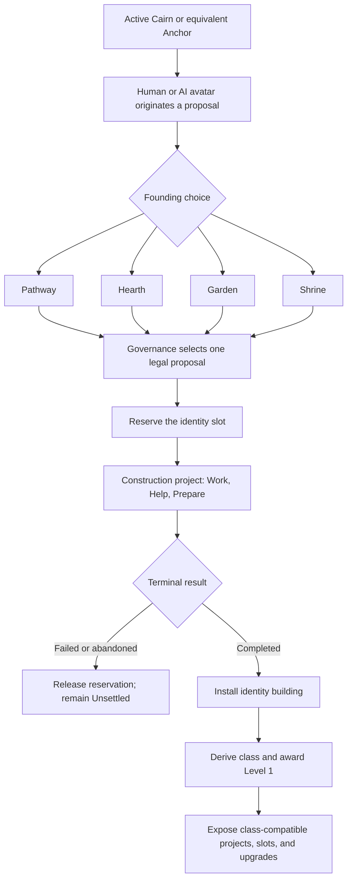

# Location Classes, Development Projects, and Buildings

Status: accepted product direction. The runtime contains much of the building,
project, governance, and generated-place substrate described here, but the
class, typed-slot, and project-derived-level contracts are not fully shipped.

This document is the canonical product model for how locations develop. Route
and discovery authority remain in
[ADR 0005](decisions/0005-thresholds-trails-and-strict-referee.md), while
[Construction, Place Development, and Route Discovery](worldpacks/construction-and-routing-discovery.md)
tracks the relationship between this target and current runtime behavior.

## Product decision

A location changes because avatars complete durable projects there. Traffic,
chat volume, model output, repeated service work, and elapsed time never make a
place level up.

An active **Cairn** or setting-equivalent Anchor is the permission boundary for
founding development. It lets any legal human- or AI-controlled avatar originate
a location project. It does not itself choose a class, occupy a building slot,
settle the place, provide shelter, grant a rest grade, or create sanctuary.

The first completed founding project installs one identity building. That
building determines the location's class:

```text
location class = class of the completed building in the identity slot
```

Class is therefore a consequence of represented world state, not a free-floating
label selected in a form. Supporting buildings express and deepen that class in
the same way that compatible equipment expresses an avatar's class: they occupy
typed slots, must be legal for the loadout, and grant concrete capabilities.
Unlike personal equipment, buildings are durable shared history and cannot be
swapped instantly.

## Vocabulary

| Term | Meaning |
| --- | --- |
| **Cairn / Anchor** | Durable navigation fixture that permits a founding proposal at its location. It is not a building slot or a rest entitlement. |
| **Unsettled** | A cairned location with no completed identity building. It has no numbered development level or class. |
| **Location class** | The class family derived from the completed identity building. Initial families are Pathway, Hearth, Garden, and Shrine. |
| **Building archetype** | A pack-authored structure or durable civic work with class affinities, slot kind, prerequisites, and installed capabilities. |
| **Location slot** | A typed, bounded place in which one building may be constructed. |
| **Development project** | A unique founding, construction, expansion, upgrade, conversion, repair-with-advancement, or landmark project that changes durable location state. |
| **Service project** | Repeatable production, care, maintenance, delivery, or stewardship work. It may use a building but does not advance the location's level. |
| **Advancement receipt** | Replay-safe proof that one unique development project completed and received location-level credit. |

The existing building-catalog field named `classification` currently means
`universal` versus resource-specific `special`. It is an eligibility category,
not a location class. New authoring should keep those concepts separate.

## Development lifecycle



Originating a proposal and changing the shared place are separate acts. A
proposal freezes a legal candidate. Governance selection atomically reserves
the target slot and opens construction. Only terminal construction completion
installs the building, grants capabilities, and awards advancement.

For a private or explicitly founder-governed location, the authored governance
policy may select the founder's sole legal proposal immediately. Public places
use their authored support, objection, quorum, or steward policy. Controller
kind never changes the rule.

## Initial location classes

The first catalog should prove four broad ways a place can care for the world.
These are extensible pack-authored families rather than a permanent closed enum.

| Class | Identity expressions | Compatible supporting expressions | Capability direction |
| --- | --- | --- | --- |
| **Pathway** | Trailhead, waystone, marked path | Waystation, bridge, ferry, boathouse, signal tower | Routes, discovery, deliveries, signals, traveler arrivals |
| **Hearth** | Firepit, communal hearth | Cottage, kitchen, bathhouse, guest room, meeting hall | Rest, sanctuary, hosting, bonds, resident arrivals |
| **Garden** | Garden plot, tended grove | Orchard, market garden, conservatory, herbalist, apothecary | Cultivation, food, medicine, production, stewardship |
| **Shrine** | Shrine, standing stone, memorial | Archive, healing house, observatory, vow or remembrance space | Memory, lore, healing, reflection, vows, stewardship |

The identity expression can improve without changing class: a Firepit may
become a Hearth and later a Hall. A conversion project can deliberately change
class, but it must preserve provenance and reconcile every installed building.
Compatible buildings remain; incompatible ones become dormant until converted,
moved through a legal project, or decommissioned. Conversion never erases the
location's history or lowers its level.

## Typed slots

Locations have a small loadout rather than an unbounded settlement inventory.

| Slot kind | Capacity law | Purpose |
| --- | --- | --- |
| **Cairn** | One active fixture outside the building loadout | Authorizes founding proposals and retains its navigation meaning. |
| **Identity** | Exactly one reserved or completed building | Determines class. Available to the first founding project. |
| **Amenity** | Zero or more, each opened by an explicit civic expansion project | Holds class-compatible supporting buildings. |
| **Landmark** | At most one, opened by a high-order development project | Holds a defining capstone without replacing the identity building. |
| **Route** | Governed by topology and connection authority, not ordinary building capacity | Holds durable connections and Pathway infrastructure where authored. |

Slot capacity is a project reward, not an automatic side effect of receiving a
level. A completed civic expansion may open an Amenity slot and receive one
advancement receipt; a later construction project fills that slot and receives
its own receipt. This keeps both changes visible and causal.

Selecting a proposal reserves its slot so concurrent actors cannot start
contradictory construction. Failure or explicit abandonment releases the
reservation through a journaled transition. Completed buildings can leave a
slot only through a decommission, relocation, destruction, or conversion
project with explicit capability and custody consequences.

### Installed model-backed devices

Per [ADR 0007](decisions/0007-model-bindings-and-item-devices.md), a fixed
camera, voice console, listener, semantic instrument, or similar model-backed
facility is an Item in the installed zone. The location supplies presence,
access, and shared publication context; the item supplies the exact binding,
settings, use, exhaustion, custody, and attribution contract. Neither the
location nor its building becomes an actor merely to call the model.

Installing a device does not by itself occupy a building slot, determine
location class, award a development receipt, or increase location level. A
building archetype may require, construct, house, or expose an installed device.
When that installation is part of a unique completed development project, the
project—not provider output or device use—owns any advancement receipt. Moving,
removing, repairing, or replacing a fixed device follows an explicit item or
project transition and immediately changes which location-scoped actions are
eligible.

## Levels

A cairned location without an identity building is shown as **Unsettled**, not
as Level 1. The founding construction completion awards the first advancement
receipt and establishes Level 1.

```text
location level = min(unique credited development-project completions, 20)
```

The receipt is keyed to the durable project instance or authored one-shot
identity, not merely to an event type or reusable job ID. Replay, retry,
reconciliation, and resetting a repeatable clock cannot award the receipt
again.

The following project completions may receive advancement credit:

- founding an identity building;
- constructing a building in an opened slot;
- opening a new typed slot;
- completing an authored building upgrade;
- converting the location's class;
- completing a landmark or durable route-development project; and
- completing an authored reconstruction whose outcome is a new advancement,
  rather than restoration of already credited state.

The following never receive location-level credit:

- chat, speech, typing, movement, inspection, or presence events;
- individual contributions or clock segments before terminal completion;
- failed, abandoned, or merely proposed projects;
- repeatable production, maintenance, delivery, care, or stewardship projects;
- replaying, resetting, reconciling, or repairing an already credited project;
- AI plans, summaries, generated prose, or provider output; and
- Orb funding or community-art generation.

Damage, dormancy, or loss of a building may suppress its installed capabilities,
but location level records completed history and does not decrease. Recovery can
restore the existing receipt without minting another one.

## Building legality and class fit

Building legality is the intersection of server-owned facts:

```text
mounted archetype
+ available typed slot
+ location-class affinity
+ environment and revealed natural feature
+ installed prerequisite capabilities
+ access and covenant policy
+ governance selection
```

AI prose, user wording, controller type, biome inference, and popularity are not
eligibility inputs. A universal building may fit several classes, while a
class-affine building can have a deeper upgrade path or more efficient slot use
in its native class. For example, a Hearth may support a modest kitchen garden,
but only a Garden-class location should reach Garden landmarks and the deepest
cultivation upgrades.

A target archetype shape is:

```json
{
  "id": "herbalist",
  "eligibility_classification": "special",
  "fits_location_classes": ["garden", "hearth"],
  "slot_kind": "amenity",
  "building_tier": 1,
  "natural_resource": "rare_herb_habitat",
  "required_capabilities": ["cultivation"],
  "capabilities": ["herbalism", "medicine"],
  "construction_project_template": "construction.herbalist"
}
```

This is a target contract, not the current schema. Packs must not emit these
fields until the compiler and runtime version the extension.

## Human and AI civic agency

Every avatar uses the same authoritative action to originate or contribute to a
location project. The server checks that the avatar:

- can act and is present at the target location;
- addresses an active Cairn or authorized equivalent;
- names a mounted legal archetype and compatible slot;
- satisfies access, class, environment, and capability prerequisites; and
- does not conflict with a selected proposal or reserved slot.

An autonomous avatar may propose one legal alternative, support or object for
an attributable reason, volunteer itself, and contribute with ordinary actions.
It may not invent an archetype, material, capability, project outcome, resource,
slot, or topology; assign another avatar; or bypass governance. Directly
controlled avatars receive no extra mechanical authority.

## Community art

Location art follows authoritative development level. Reaching a new level
opens at most one community-art pool for that level; funding does not affect
level, class, slots, construction, or capabilities. The image brief should use
the completed class and installed visible buildings through the recorded
history boundary.

Unsettled locations may retain authored or base unexplored art, but they do not
advertise a numbered level portrait. A location that reaches Level 3 because of
three credited development projects may request Level 3 art for three pooled
Orbs. Service-project volume cannot increase that price or unlock another image.

## Relationship to the current runtime

The current Rust runtime already provides useful substrate:

- generated-place Anchor, Connection, and Settlement jobs;
- public governance decisions with frozen legal alternatives;
- atomic major-footprint claims;
- construction and upgrade clocks;
- building instances with archetype, status, capabilities, and provenance;
- universal and natural-resource-specific building eligibility; and
- one initial major footprint plus a civic project that can open a second.

The remaining product changes are explicit:

1. Make an active Cairn the direct prerequisite for originating a founding
   proposal; Connection may remain a project or archetype prerequisite, but is
   not a universal pre-proposal gate.
2. Generalize development from generated places to every cairned location.
3. Add the identity class and typed-slot contract.
4. Add class affinities and building tiers to versioned archetypes without
   conflating them with `universal`/`special` eligibility.
5. Replace event-count location levels with replay-safe development receipts.
6. Give directly controlled and autonomous avatars the same proposal surface.
7. Migrate existing generated settlement buildings and community-art state
   without inventing advancement receipts from chat history.

Until those changes ship, documentation and UI must distinguish current
generated-settlement behavior from this accepted direction. No client should
infer class, slot capacity, legality, or level from descriptive text.

## Invariants

1. No active Cairn or authorized equivalent means no founding proposal.
2. A Cairn authorizes a proposal; it does not itself settle, shelter, or class a
   location.
3. Class comes only from the completed identity building.
4. Only one identity slot can be reserved or occupied at a time.
5. Only a selected, legal project can reserve a slot.
6. Only terminal development completion can install a building or advance
   location level.
7. Every advancement is unique, causal, replay-safe, and inspectable.
8. Repeatable service work never advances level.
9. Buildings grant only declared capabilities and never passive unrepresented
   output.
10. Human and AI avatars share the same rules and governance boundaries.
11. Level never derives from event volume, model activity, or Orb funding.
12. Route topology, discovery, access, safety, shelter, and class remain
    separate authoritative facts.
