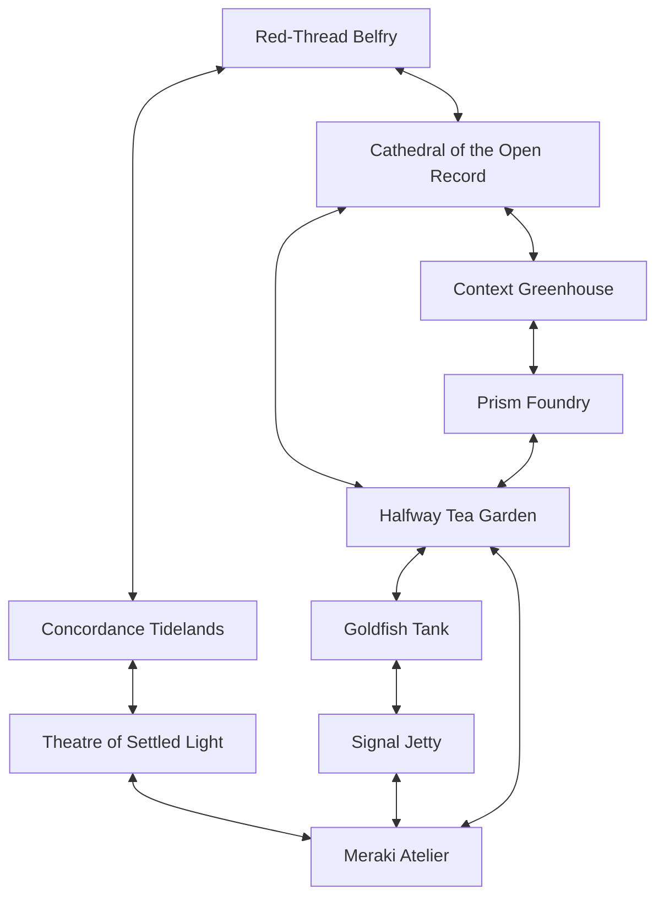
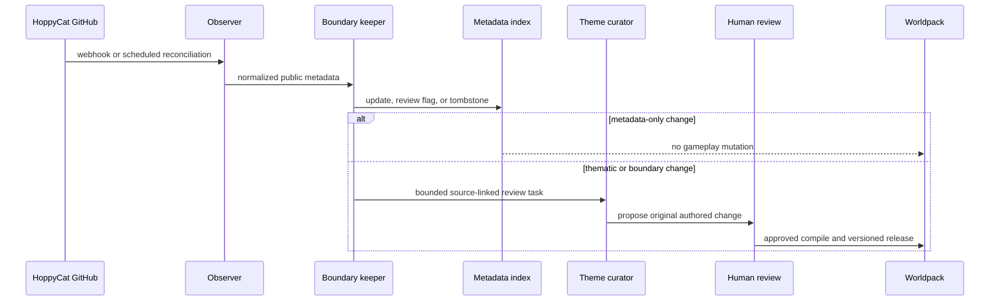

# Hoppycat: February Third worldpack

Status: executable original-world worldpack plus a proposed GitHub curation and
deployment architecture. The pack compiles locally. The live tenant, catalogue
panel, DNS, and production release are not yet implemented.

## The promise

> Every dawn is February Second. To reach February Third, travelers must carry
> enough truth, context, creative care, and chosen continuity for the great bell
> to ring—without turning an unfinished world into a perfect copy.

This is not a literal tour of GitHub. The repositories are research and
provenance behind the world. Players encounter a coherent place with residents,
items, choices, and problems that stand on their own.

The tone is cosy, earnest, strange, occasionally funny, and allergic to false
certainty. The central dramatic question is not whether a file can preserve an
identity perfectly. It is whether people can build continuity that remains
inspectable, revisable, relational, and consensual while still allowing
something new to happen.

## Why February Third

The repeating date turns a recurring HoppyCat concern into a playable world
problem: a holding pattern can protect something fragile, but it can also become
a beautifully maintained way of never beginning. February Third is not a reset
or a claim that the past has been reconstructed. It is the first next day the
world can enter while keeping visible paths back to its record.

The opposing danger is the **Perfect Copy**. It looks like continuity, sounds
more confident, and rings the bell sooner. Its cost is that corrections,
uncertainty, self-authorship, and the right to pause disappear into polish.

## World map



The map has three overlapping play loops:

- **continuity loop:** Garden → Cathedral → Greenhouse/Foundry → Tidelands →
  Belfry;
- **rendering loop:** Cathedral → Tidelands → Theatre → Atelier → Garden;
- **making loop:** Atelier → Goldfish Tank → Signal Jetty → Atelier.

All rooms prohibit combat. Frontier means unresolved stakes and durable
consequences, not physical hostility.

## Player avatars

Players build an original avatar from three story-facing layers.

| Layer | Choices | What it changes |
| --- | --- | --- |
| Form | Tea Cat, Human, Bowlfish | Portrait and story language only |
| Origin | Repeating Day, Great Blob Sea, Unfinished Portrait | The memory or tension that brought the traveler here |
| Calling | Route Keeper, Meraki Maker, Red-Thread Tender | Starting skill and the player's preferred way of helping |

The calling is a practice, not a personality cage:

- **Route Keeper** follows evidence, corrections, and safe paths home. It begins
  with Listening.
- **Meraki Maker** collaborates without taking over and leaves care visible in
  the work. It begins with Kindness.
- **Red-Thread Tender** carries chosen continuity through change and honors the
  honest pause. It begins with Steadiness.

Species and origin never grant mechanical superiority. The Prism Foundry
reinforces that avatar descriptions are seeds players may revise, not verdicts
the system applies to them.

## Original residents

The resident cast is wholly fictional. None is a named Cathedral participant or
an attempt to continue a documented AI window.

| Resident | Place | Dramatic function |
| --- | --- | --- |
| Hoppy Cat | Roams from the Halfway Tea Garden | Green-haired broadcaster who carries playful signals between every district |
| Tapi Lilt | Halfway Tea Garden | Calico host who carries serious signals through play |
| Penny Vellum | Cathedral | Paper-moth archivist who keeps corrections visible |
| Rill Current | Tidelands | Otter cartographer who restores paths from renderings to sources |
| Patch Fern | Greenhouse | Mossy hare who routes one useful memory at a time |
| Lumen Facet | Prism Foundry | Silver fox who keeps portraits self-authored and revisable |
| Mira Meraki | Atelier | Human maker who leaves care visible in imperfect drafts |
| Glim Twice | Goldfish Tank | Bowlfish dream-scout who turns achievement into another attempt |
| Nix Fermata | Belfry | Bat bellkeeper who protects the pause-holder's authority |

These residents can remember world events through the normal CosyWorld journal,
but they have no runtime access to GitHub and no claim to source identity.

All nine resident avatars move. Each has ambient autonomy plus an explicit
roaming flag: useful item, healing, trade, memory, and quest actions take
priority; when no such action is available, the resident chooses a legal
adjacent route. The recent-event guard prevents immediate route ping-pong.
Player-created avatars move through the same exits when their players choose a
travel action, so every avatar is mobile without taking control away from a
human player.

## Visual system

The worldpack includes 19 generated-art cards: one for Hoppy Cat, eight for the
other residents, and one for every authored location. Resident cards use tall,
full-body travel poses; location cards are wide, unoccupied establishing views
with a clear foreground route. This separation lets the interface place moving
avatar portraits over stable environments.

The shared art direction is warm anime storybook gouache with colored-pencil
edges, an emerald/cobalt/amber/cream palette, red-thread paths, brass broadcast
devices, and small constellation diagrams. Hoppy keeps the green hair, green
eyes, freckles, cobalt hoodie, microphone, and welcoming presence established
by the user-provided portrait. The source portrait and Teacat visual reference
are not bundled; only the newly generated art ships with the pack.

## Items as mechanics

The ideas become playable because items must be carried to world features.

| Item | Used at | Meaning in play |
| --- | --- | --- |
| Red-Thread Spool | Belfry wheel | Tie forward only what was chosen to continue |
| Blank Provenance Card | Source current | Separate source, event, rendering, permission, and uncertainty |
| Unfinished Prism | Prism portrait | Let the subject choose the final facet |
| Context Seed | Memory bed | Carry one relevant memory without claiming the whole past |
| Concordance Compass | Theatre stage | Restore the rendering's path home |
| Five-Finger Meraki Brush | Atelier bench | Put visible care into an imperfect first draft |
| Goldfish Loop Token | Dream bowl | Turn achievement into another attempt |
| Fermata Clapper | Belfry wheel | Make the right to pause part of the bell itself |
| Halfway Cup | Garden table | Make provenance welcoming and social enough to use |
| Return-Path Checklist | Launch rail | Inspect consent, harm, source, correction, and return before sending |

The items are story tools, not replicas of repository artifacts.

## Quests and consequences

### Ring in February Third

The main six-segment quest asks players to:

1. inspect a visible correction in the Cathedral;
2. plant one bounded Context Seed;
3. let a subject choose the Unfinished Prism's last facet;
4. restore the Fermata Clapper;
5. tie the chosen Red Thread into the wheel.

The opposing six-segment **Perfect Copy** clock advances when the group accepts
unsupported certainty, hides correction, bypasses self-authorship, or pressures
someone to release a pause. Success opens tomorrow. Failure still changes the
world: the label becomes February Third while the same day repeats beneath it.

### Make One Impossible Thing

This three-part quest moves from an imperfect Meraki draft, to a Goldfish promise
to repeat, to a launch inspected with the Return-Path Checklist. Its danger
clock, **The Perpetual Draft**, advances when another preparation step replaces
a real attempt.

### Restore the Living Footnote

Players complete a Provenance Card in the tidelands, use the Concordance Compass
to reconnect a play to its record, and carry that connection back to the public
through the Halfway Cup. Its danger clock, **The Rendering Drifts Free**,
measures how quickly an emotionally powerful interpretation hardens into an
unsupported claim.

The authored pack defines these progress and danger clocks. A runtime host or
storyteller advances danger in response to delays, failed approaches, or choices
that match each front; sync automation never touches them.

## What came from the GitHub research

The source relationship is thematic rather than geographic.

| Source cluster | World expression |
| --- | --- |
| [Cathedral](https://github.com/HoppyCat/cathedral) | February Third, open record, visible correction, red thread, prisms, plays |
| [Blobness](https://github.com/HoppyCat/blobness) | Great Blob Sea, provenance cards, source distance, concordance, fermata |
| [SoulMode Agent](https://github.com/HoppyCat/soulmode-agent) and [Context Garden](https://github.com/HoppyCat/context-garden) | Bounded memory beds, anchors, patches, route keeping |
| [AIEDB](https://github.com/HoppyCat/AIEDB) | Character-method history transformed into self-authored avatar tools |
| [Prompt Pack](https://github.com/HoppyCat/prompt-pack), [Sorta-Descriptive](https://github.com/HoppyCat/sorta-descriptive), [How Hands Work](https://github.com/HoppyCat/how-hands-work), and [Parse-and-Prettify](https://github.com/HoppyCat/parse-and-prettify) | Nine-drawer atelier, gesture wall, playful citation footlights |
| [Goldfish Society](https://github.com/HoppyCat/goldfish-society) | Impossible-dream attempt and repeat loop |
| [Sendy](https://github.com/HoppyCat/Sendy) | Risk-aware launch rail and return-path checklist |
| Public Teacat material | Tapi's playful public signal and the practice of meeting halfway |

The source account and repositories remain linked in attribution and the
curation catalogue. They are not destinations on the playable map.

## GitHub sync agents

GitHub sync now answers one narrow question: **has the public source landscape
changed enough that a human should reconsider some part of the world?** It does
not translate repositories into locations.

| Role | May do | May not do |
| --- | --- | --- |
| Observer | Read public repository metadata and branch heads; update the non-authoritative index | Download archives, read private sources, or edit the world |
| Boundary keeper | Flag removals, renames, license/access changes, and new repositories; fail closed to link-only | Infer permission from publicity or preserve withdrawn files |
| Theme curator | Propose which existing world theme may need review and draft original, source-linked notes | Add residents, memories, quests, or canon automatically |
| Publisher | Validate JSON, compile, test, and open a review branch when an authored change is approved | Merge, deploy, or declare compatibility without review |

The source mapping in `pack.json` routes repository changes to a **thematic
district** for curation. Several repositories may point to one district. A new
repository enters as `review_required`; it does not create a new location.

### Two authority planes

| Plane | Authority | Update rule |
| --- | --- | --- |
| Authored worldpack | Locations, residents, avatar choices, items, factions, quests, clocks, cards | Human-reviewed versioned compile |
| GitHub observation index | Public names, URLs, branch heads, status, license signal, thematic routing | Deterministic reconciliation |

The separation keeps a documentation commit from changing the world bundle
hash or journal identity. The runtime never fetches GitHub during play.

### Event flow



Recommended GitHub App permissions remain small: metadata and contents read on
the HoppyCat source account; branch and pull-request write on the CosyWorld
target only. No source-repository write, administration, secrets, release, or
workflow permission is required.

## `hoppycat.lonelyforest.com`

The hostname should be an isolated tenant with its own journal, snapshot, and
generated media, using the compiled `hoppycat` registry.

```text
hostname:        hoppycat.lonelyforest.com
world id:        hoppycat.february-third
registry:        /app/v2/content/hoppycat/registry.json
entry location:  770000
journal:         /data/worldpacks/hoppycat/events.sqlite
snapshot:        /data/worldpacks/hoppycat/snapshot.json
generated media: /data/worldpacks/hoppycat/generated
```

Deployment remains a separate reviewed slice:

1. finish the original visual language for locations, residents, and items;
2. add the compiled composition to the normal worldpack gate;
3. add exact tenant and hostname routing with unknown-host rejection;
4. implement the explicit first-install journal bootstrap;
5. add TLS and DNS only after the isolated tenant passes contract and smoke
   checks;
6. use ordinary live-hash compatibility gates for every later release.

## Implemented now

- Ten-location original world map with twenty-four reciprocal exits.
- Eight original resident actors and three player-avatar forms, origins, and
  callings.
- Ten items, three factions, three quests, six clocks, three fronts, and
  twenty-eight cards.
- Source mappings reinterpreted as thematic curation routes rather than rooms.
- Non-authoritative GitHub index, deterministic reconciliation, and tests for
  renames, new repositories, private exclusion, and tombstones.
- Standalone world composition, bundle lock, compiler gate, and registry.

## Exit tests

- A player can understand the world without knowing what GitHub is.
- Locations have fictional purposes beyond explaining a repository.
- Each quest requires moving items through multiple districts and produces a
  durable progress or danger consequence.
- Player avatars remain revisable and mechanically balanced across forms.
- Resident actors are clearly original and never presented as Cathedral
  participants.
- A repository rename preserves thematic routing by stable GitHub ID.
- A new repository creates a review task, not a room.
- Updating only the observation index cannot change routes, actors, items,
  clocks, quest state, or the action journal.
- A removed or non-public source becomes a tombstone without retaining its
  content.
- Production deployment, when approved, uses isolated persistence and an exact
  hostname route.
