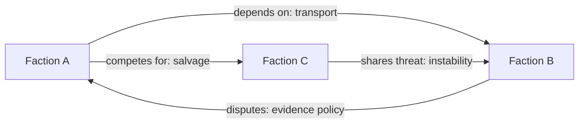
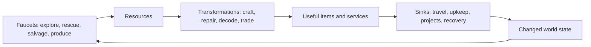

# How to Design a Worldpack

Status: tentative reference, version 0.1. This is a design method under active
review, not a frozen pack schema.

A good worldpack is a small, coherent world that can keep producing meaningful
situations. It does not need infinite content. It needs a legible promise,
strong authored landmarks, actors with reasons to act, pressures that can
change, and rules that preserve player agency when those parts interact.

This reference separates design authority from implementation detail. Use it
before writing pack JSON, then use the
[machine contract](https://github.com/cenetex/cosyworld/blob/main/v2/docs/worldpacks.md)
to compile and validate the result.

## The design plan

Design in six passes. Each pass produces a graph or table that the next pass
can challenge.

| Pass | Question | Required artifact | Exit test |
| --- | --- | --- | --- |
| 1. Promise | What experience can this world reliably deliver? | One-sentence promise, player verbs, boundaries | A new scene can be accepted or rejected against the promise. |
| 2. World | Where can pressure, safety, discovery, and return occur? | Place-and-route graph with gates | Every reachable danger has a legal recovery path. |
| 3. Actors | Who can change the situation, and why would they? | Character and faction graphs | Every recurring actor has a need, capability, limit, and visible tell. |
| 4. Economy | What moves, accumulates, transforms, and leaves play? | Resource-flow and item-lifecycle graphs | Every faucet has a purpose and every accumulating resource has a sink or cap. |
| 5. Evolution | How does history create the next situation? | Event-to-state loop and authored clocks | A change is explainable from journaled facts and cannot bypass authority. |
| 6. Proof | Will the world remain playable and interesting? | Scenario suite and seventh-visit review | The pack survives repetition, scarcity, failure, replay, and generator outage. |

Do not complete the passes once and forget them. A faction that cannot reach
the resources it needs may expose a map problem. A special item without a
meaningful sink may expose an economy problem. Revise the earlier graph.

## 1. State the promise

Write the promise as an experience, not a quantity of content:

> In this world, players **do these verbs**, amid **these pressures**, to
> create **these durable kinds of change**.

Then record:

- three to seven **core verbs** players will repeat;
- two to four **pressures** that make those verbs consequential;
- what **persists** after a session;
- what the world will **never require or permit**; and
- why a seventh visit can differ without contradicting the first.

For each proposed feature, ask which verb it enriches. A feature that has no
answer is atmosphere, tooling, or scope creep; label it honestly.

## 2. Draw the world as an authority graph

Treat the map as a graph before treating it as prose or art.


Every place node should declare:

| Field | Design question |
| --- | --- |
| Identity | What makes this place recognizable after the seventh visit? |
| Function | Which verbs, services, relationships, or decisions occur here? |
| Safety | What can and cannot happen here? |
| Ownership | Which faction or institution can act here, and under what rule? |
| Pressures | Which authored clocks or resource shortages can affect it? |
| Inputs/outputs | Which actors, resources, clues, and items enter or leave? |
| Routes | What opens, closes, costs, or preserves each edge? |
| Recovery | Where does failure move the player, and what remains possible? |
| Generative envelope | Which descriptions, waypoints, encounters, or art may be proposed? |

If a place may develop, also map it against
[Location Classes, Development Projects, and Buildings](../location-development.md):

| Development field | Design question |
| --- | --- |
| Cairn / Anchor | Which durable fixture authorizes a founding proposal without pretending to be settlement or shelter? |
| Governance | How do public proposals become one selected, slot-reserving construction project? |
| Class families | Which identity buildings may establish this place as a Pathway, Hearth, Garden, Shrine, or pack-defined extension? |
| Slot envelope | Which Identity, Amenity, Landmark, and Route slots can durable projects open? |
| Building fit | Which class, environment, resource, capability, access, and covenant facts make an archetype legal? |
| Advancement | Which one-shot development completions receive replay-safe level credit, and which repeatable services explicitly do not? |
| Civic agency | How can both directly controlled and autonomous avatars propose, support, object, and contribute under the same rule? |
| Migration | What happens to class, slot reservations, installed buildings, advancement receipts, and art when the pack changes? |

Do not author a starting class as descriptive metadata and then search prose for
proof. Class comes from the completed identity building. Do not use activity,
chat, visits, repeatable jobs, or cosmetic funding as location advancement.

Use three authorship bands when the world needs scale:

1. **Authored core:** permanent locations, rules, residents, missions,
   consequences, keys, and safe returns.
2. **Constrained connective tissue:** authored endpoints and ecology with
   deterministic, validated, persisted pathways between them.
3. **Bounded frontier:** authored hubs, palettes, budgets, encounter tables,
   rewards, and safety invariants with generated routes and places.

Procedural generation is part of design, not a substitute for it. Ubisoft's
[Far Cry 5 world-generation talk](https://www.gdcvault.com/play/1025557/Procedural-World-Gen)
describes procedural scale followed by artist fine-tuning; the
[Caves of Qud generation talk](https://www.gdcvault.com/play/1025914/Math-for-Game-Developers-End)
shows how cultures, histories, factions, templates, and object blueprints
operate at different tiers. In a worldpack, the generator receives reviewed
constraints and proposes descendants. Deterministic code validates topology,
ownership, budgets, and references before committing the whole result.

## 3. Design characters as constrained causes

A character is engaging when the player can understand what they want, predict
some of what they might do, and still be surprised by how they pursue it.
Define each recurring character with:

| Field | Meaning |
| --- | --- |
| Role | The recurring function they perform in play. |
| Need | A condition or resource currently missing. |
| Drive | The value used to rank valid desires. |
| Bond | A person, place, institution, or memory they protect. |
| Capability | The authored actions they may legally take. |
| Boundary | What they cannot do autonomously. |
| Affiliation | Their current stance toward one or more factions. |
| Public signal | What lets players read their present intention. |
| Memory | Which journaled facts may alter future choices. |
| Change rule | What can transform their need, bond, or affiliation. |

Do not use a provider model binding as proof that this character exists. A
model may embody an authored conversational actor, but image, video, speech-
synthesis, transcription, semantic, or music endpoints normally power item
devices. Ask whether the subject perceives, chooses, and participates as an
agent or whether an agent uses it. Declare that embodiment explicitly and
follow [ADR 0007](../decisions/0007-model-bindings-and-item-devices.md); adapter
readiness must never change the answer.

Autonomy and authorship are complementary. The
[GDC talk on NPCs in *The Division*](https://www.gdcvault.com/play/1023383/Blending-Autonomy-and-Control-Creating)
describes systemic open-world behavior combined with designer influence, while
the [Free-Range AI talk](https://www.gdcvault.com/play/1020110/Free-Range-AI-Creating-Compelling)
frames ambient autonomy alongside structured narrative. In CosyWorld, actors
rank only legal authored actions. Inference may phrase an intention; it does
not invent an action, spend another player's resources, cross a gate, or commit
world state.

Characters should disagree inside factions and cooperate across them. If every
member has the faction's exact opinion, the faction is a uniform and the
characters are delivery mechanisms.

## 4. Make factions engines of situations

A faction is a persistent institution that can gather resources, interpret
events, offer work, and pursue a project. It is not just a reputation meter.

Define:

| Field | Question |
| --- | --- |
| Identity | What do members believe they are preserving or creating? |
| Constituency | Who benefits, belongs, or depends on it? |
| Material base | Which places, services, knowledge, or resources support it? |
| Doctrine | Which methods are legitimate to it? |
| Need | What shortage currently drives action? |
| Fear/red line | What event forces a response? |
| Project | Which visible clock is it trying to complete? |
| Offer surface | What can it ask players and independent actors to do? |
| Concession | What can it trade, reveal, or change? |
| Relations | Where does it cooperate, compete, depend, or conflict? |
| Fracture | Which internal disagreement may become a movement or splinter? |

Model relationships as typed edges, not a single friendliness score:



Keep persistent institutions separate from temporary movements. Paradox's
[Victoria 3 political-party design](https://www.paradoxinteractive.com/games/victoria-3/news/dev-diary-46-political-parties)
models parties as dynamic alliances of more persistent interest groups, and
its [revolution design](https://www.paradoxinteractive.com/games/victoria-3/news/dev-diary-41-revolutions)
emphasizes visible buildup and opportunities to respond. A worldpack can use
the same useful distinction: factions persist; campaigns, coalitions, protests,
and crises emerge from present needs and journaled events.

## 5. Draw the economy before naming a currency

An economy is the flow of scarce capabilities through the world:



Inventory these layers separately:

- **materials:** transferable inputs with storage and transport rules;
- **capacity:** tools, facilities, skills, and time that transform inputs;
- **access:** keys, evidence, trust, and standing that should not necessarily
  be transferable;
- **services:** repair, passage, intelligence, recovery, and fabrication;
- **currency:** only if it solves exchange better than direct materials,
  favors, or work orders; and
- **meta currency:** account-level spending that must remain outside world
  progression.

For each resource, record its faucet, owner, transfer rule, storage limit,
transformation, sink, and failure behavior. CCP's official
[EVE economic newsletter](https://cdn1.eveonline.com/community/QEN/QEN_Q3-2007.pdf)
provides the durable faucet-and-sink vocabulary; Paradox's
[Millennia economy design](https://www.paradoxinteractive.com/games/millennia/news/economy-part-one)
shows how resources, goods, needs, production chains, and worker capacity make
economic choices legible.

Never use a cosmetic redraw currency as a progression gate. In CosyWorld,
Orbs may fund approved media redraws; they do not buy world resources, faction
standing, route unlocks, actor power, or better generated rewards.

## 6. Give every special item a lifecycle

A special item should change available decisions, carry history, or focus a
conflict. It should not merely occupy a rarity tier.

| Field | Required decision |
| --- | --- |
| Definition | What authored type and revision is this? |
| Source | Where and under which rule can it enter play? |
| Authority | Which engine action validates its effect? |
| Custody | Who may hold, equip, transfer, steal, or store it? |
| Use | Which approach becomes available or changes? |
| Cost | Is it consumed, exhausted, exposed, encumbering, or risky? |
| Sink | How does it leave circulation or become inert? |
| History | Which provenance and use receipts remain visible? |
| Failure | What happens if it is lost, duplicated, or held offstage? |
| Exit | May it cross worldpack boundaries? |

Useful roles include tools, consumables, mission keys, rescue objectives,
deployable infrastructure, evidence, covenant relics, and personal relics.
Unique keys must have recovery rules. Actor-bound relics must not be confused
with wallet ownership. A collectible image or card is never sufficient
authority to mint the underlying item.

A model-backed special item additionally declares its exact binding and
profile, `carried|equipped|installed` activation, typed slot when equipped,
closed settings schema, unavailable-state copy, async custody policy, and
truthful attribution. A dormant device remains discoverable but cannot
contribute an unplayable action. A voicebox changes how its carrier's action is
rendered; it does not become the speaker. Provider tools and free-form prompts
are never implied by possessing the item.

## 7. Evolve from facts, not improvisation

Dynamic evolution should be causal and inspectable:


Use three speeds:

- **scene:** immediate consequences, actor intentions, item custody;
- **expedition:** local scarcity, faction offers, route conditions, project
  contributions; and
- **epoch:** authored thresholds that change a district, unlock a ring, end a
  crisis, or permit a new frontier budget.

Advance important clocks from journaled causes, not unexplained wall-clock
ticks. Show warnings before irreversible consequences. Preserve sanctuaries
and recovery routes. A director may adjust pressure, repetition, and recovery
within authored budgets, similar in spirit to Valve's
[Left 4 Dead AI Director](https://developer.valvesoftware.com/wiki/Left_4_Dead_%28engine_branch%29),
but it must never fabricate rules or conceal why state changed.

Systems communicate values whether intended or not; the
[GDC talk *Systems Make Statements*](https://gdcvault.com/play/1024664/Systems-Make-Statements-Simulations-and)
is a useful reminder to review what faction, economy, and reward simulations
actually reward.

## 8. Prove the pack

Before implementation, walk these scenarios on paper:

1. **First visit:** the promise, next action, danger, and safe return are clear.
2. **Seventh visit:** at least one relationship, pressure, route, offer, or
   resource question has changed for a causal reason.
3. **Failure:** progress bends without entering an unrecoverable dead end.
4. **Scarcity:** the economy remains playable when a common input is exhausted.
5. **Surplus:** a faucet cannot inflate forever because a useful sink, cap, or
   conversion exists.
6. **Faction dominance:** no completed project erases the world's remaining
   tensions or verbs.
7. **Actor disagreement:** two actors sharing a faction can choose different
   legal actions for legible reasons.
8. **Item loss:** every progression-critical item can be recovered or replaced
   through an authored rule.
9. **Generator outage:** authored topology remains playable and placeholders
   never block movement.
10. **Replay:** the same journal and pack bundle reconstruct the same
    authoritative state.
11. **Unmount or upgrade:** actors, items, and generated descendants follow
    declared preservation or evacuation rules.
12. **Adversarial input:** wallet metadata, prose, and images cannot author
    mechanics or executable instructions.

Then run graph checks for reachability and deadlocks, conservation checks for
resource flows, state-machine tests for gates and clocks, and deterministic
replay tests for every authoritative projector.

## Worldpack design canvas

Copy this compact canvas into a proposal:

```text
Promise:
Core verbs:
Pressures:
Durable changes:
Boundaries:

Authored core:
Constrained connective space:
Bounded frontier:
Safety and recovery:

Developable locations and Cairn equivalents:
Location classes and identity buildings:
Typed-slot and building-fit envelope:
Development projects versus repeatable services:
Location governance and civic agency:

Characters:
Factions and typed relations:
Resources, transformations, sinks:
Special-item lifecycles:

Scene / expedition / epoch evolution:
Generator authority:
Player-facing explanations:

First-visit proof:
Seventh-visit proof:
Failure proof:
Replay proof:
Open canon and product questions:
```

## Research basis

This tentative method synthesizes primary design sources rather than treating
any one shipped game as a template:

- [*Procedural World Generation of Far Cry 5*](https://www.gdcvault.com/play/1025557/Procedural-World-Gen)
- [*End-to-End Procedural Generation in Caves of Qud*](https://www.gdcvault.com/play/1025914/Math-for-Game-Developers-End)
- [*Forging the River in The Flame in the Flood*](https://www.gdcvault.com/play/1023266/Forging-The-River-in-The)
- [*Free-Range AI: Creating Compelling Characters for Open World Games*](https://www.gdcvault.com/play/1020110/Free-Range-AI-Creating-Compelling)
- [*Blending Autonomy and Control: Creating NPCs for The Division*](https://www.gdcvault.com/play/1023383/Blending-Autonomy-and-Control-Creating)
- [*Experience-Driven Procedural Content Generation*](https://yannakakis.net/wp-content/uploads/2015/11/PID3821875.pdf)
- [*Procedural Content Generation in Games*](https://www.pcgbook.com/)
- [Victoria 3 political parties](https://www.paradoxinteractive.com/games/victoria-3/news/dev-diary-46-political-parties)
- [Victoria 3 revolutions](https://www.paradoxinteractive.com/games/victoria-3/news/dev-diary-41-revolutions)
- [EVE Quarterly Economic Newsletter, Q3 2007](https://cdn1.eveonline.com/community/QEN/QEN_Q3-2007.pdf)
- [Millennia economy, part one](https://www.paradoxinteractive.com/games/millennia/news/economy-part-one)
