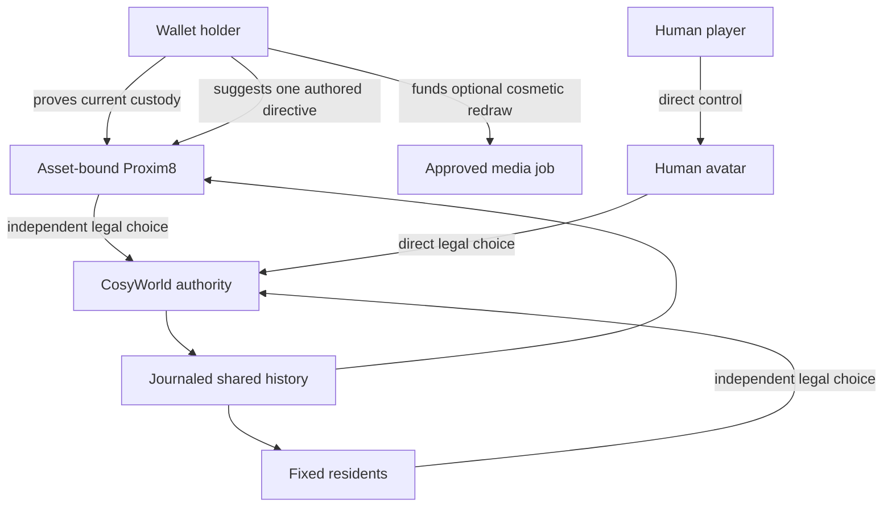
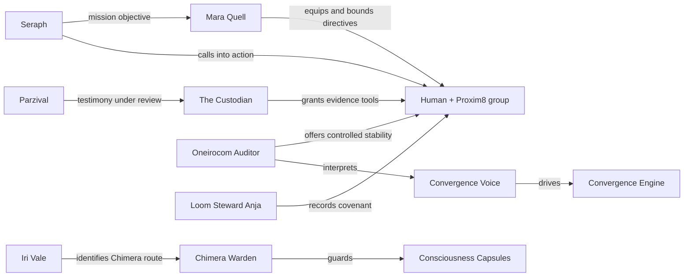
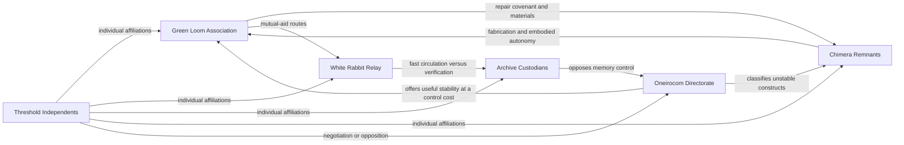
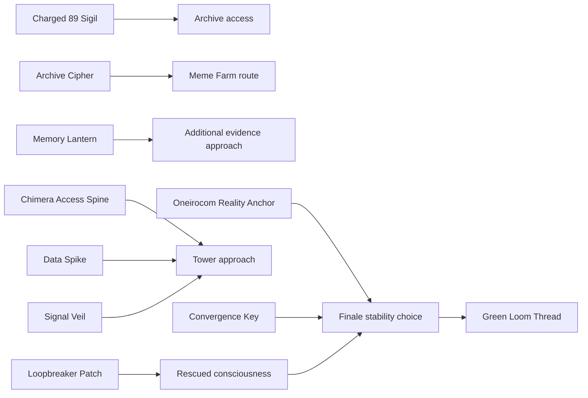
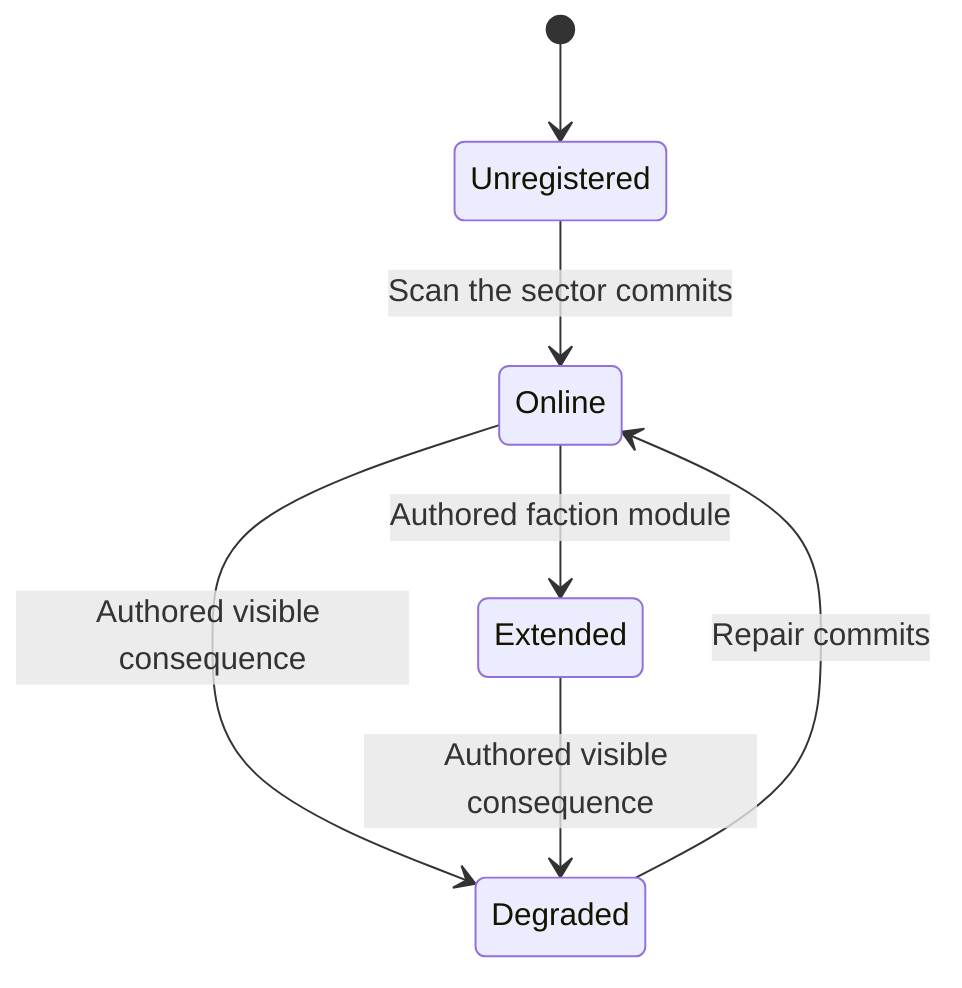
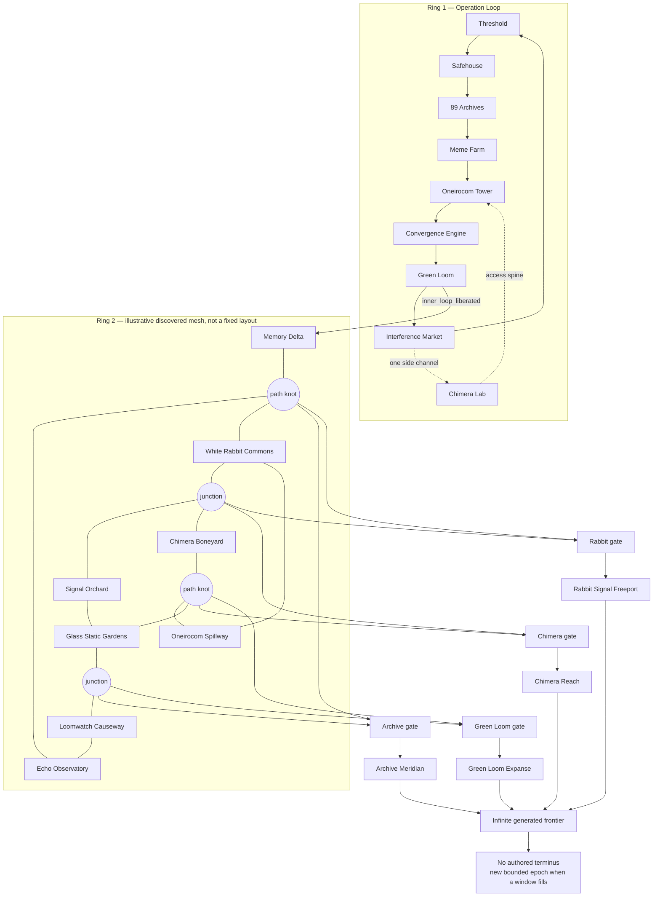
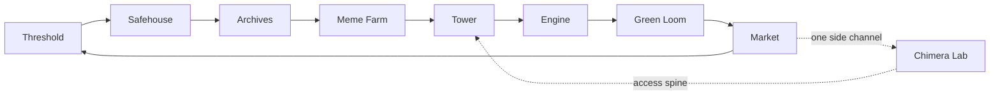

# Project 89 Content Review

Status: design review 0.1. The Project 89 worldpack is proposed but not yet an
authored or mounted pack. Public Project 89 names, tested Proxim8 integration,
CosyWorld adaptations, and new hypotheses are kept distinct below.

This review asks whether the story, avatars, residents, factions, items, and
locations form one understandable and replayable world. It consolidates the
[worldpack design](https://github.com/cenetex/cosyworld/blob/main/v2/docs/project-89-worldpack.md),
[three-ring map](https://github.com/cenetex/cosyworld/blob/main/v2/docs/project-89-world-map.md),
and [systems study](project-89-systems-study.md).

## Overall assessment

Project 89 has a strong authored opening and a credible path to an evolving
world. Its best idea is the change in authorship across the rings: a precise
inner operation, constrained generative travel, then an open but bounded
frontier. Independent Proxim8 actors give that geography a personal memory.

The design is ready for a vertical slice, not content-complete:

| Surface | Assessment | Strongest element | Main gap |
| --- | --- | --- | --- |
| Story | Coherent proposed spine | Liberation has investigation, rescue, negotiation, and three distinct resolutions. | Ring 2 and Ring 3 need authored campaigns that carry the story beyond exploration. |
| Human avatars | Supported by CosyWorld | Humans remain directly controlled and retain every core verb. | Their fiction for entering Project 89 needs one concise authored introduction. |
| Proxim8 avatars | Strong proposed contract with one live fixture | Asset-bound identity, equal power, independent action, durable memory. | Active-trio selection conflicts with the inherited eight-avatar room capacity. |
| Residents | Good first cast | Each location has a social or moral point of view. | Several adaptations require canon and voice approval. |
| Factions | Promising hypothesis | Material dependencies create cooperation without removing disagreement. | Names, membership, projects, and internal fractures are not yet pack-authored. |
| Items | Good Ring 1 coverage | Items create approaches, custody problems, and memories instead of rarity power. | Unique-key recovery and outer-ring production loops remain unspecified. |
| Locations | Strong topology | Twenty-one authored places frame increasingly generative space. | Ring 2 anchors and Ring 3 stations need resident rosters and encounter portfolios. |
| Dynamic evolution | Sound authority model | Journaled facts drive actors, factions, economy, and place state. | The situation director and faction projectors are still design work. |
| Visual identity | Tested pipeline | Full-strength P89/FLUX.1 plus FLUX.2 cleanup preserves identity and style. | Production rights and approved permanent assets remain inputs. |

## Story review

### Story promise

> Humans and independent Proxim8s investigate a contested reality, liberate
> trapped agency, repair or redirect broken systems, and record choices that
> change an expanding shared frontier.

The core story is about **agency versus convergence**, not simply heroes
against machines. That gives Oneirocom room to provide genuinely useful
stability while still threatening autonomy.

### Campaign spine

| Act | Dramatic question | Principal characters | Items that focus the act | Durable result |
| --- | --- | --- | --- | --- |
| 0. Threshold | Who arrived, and can custody exist without control? | Human avatar, Proxim8, Seraph | Agent Memory Seed, Charged 89 Sigil | Actor materialization and first directive |
| 1. Evidence | What can be believed without fabricating memory? | Parzival, Custodian, Mara Quell | Archive Cipher, Memory Lantern, Signal Veil | Attributed evidence and alternate routes |
| 2. Rescue | Which consciousnesses and constructs count as persons? | Iri Vale, Chimera Warden | Loopbreaker Patch, Consciousness Capsule, Chimera Access Spine | Rescued actors and custody consequences |
| 3. Convergence | Is imposed stability preferable to plural uncertainty? | Oneirocom Auditor, Convergence Voice | Reality Anchor, Data Spike, Convergence Key | Expose, reroute, or dismantle the engine |
| 4. Covenant | What did liberation commit the group to repair? | Loom Steward Anja | Green Loom Thread | `project89.inner_loop_liberated` |
| 5. Relay mesh | Can rivals make a tangled network resilient? | Faction delegates and independent actors | Survey supplies and mesh tools, still tentative | Station-gate flags and `project89.relay_mesh_resilient` |
| 6. Frontier | What kind of world should persist beyond control? | Players, Proxim8s, residents, movements | Signal Anchors and authored faction modules | Persisted places, projects, junctions, and epoch history |

### Story strengths

- The loop gives failure somewhere safe to bend rather than ending the tale.
- Investigation, rescue, stealth, force, negotiation, and repair all matter.
- The finale asks for a policy choice, not a damage total.
- The Green Loom covenant converts a victory into responsibility.
- Ring 2 makes former mission factions depend on one another.
- Ring 3 turns generated space into shared history rather than disposable
  private content.

### Story risks

1. **Proper-noun density:** Seraph, Parzival, Oneirocom, Chimera, Green Loom,
   Proxim8, and convergence arrive quickly. The first visit should reveal only
   the Threshold, Seraph, the Sigil, and one immediate choice.
2. **Canon uncertainty:** several residents and the Convergence Voice are
   CosyWorld adaptations. They need explicit Project 89 approval before voice,
   art, or permanent prose production.
3. **Outer-ring story vacuum:** locations and factions exist, but Ring 2 needs
   conflicts that move through multiple mesh routes and Ring 3 needs one
   opening project per station.
4. **Antagonist flattening:** Oneirocom is most interesting when stabilization
   solves a real problem at a visible cost. Pure villainy would weaken the
   faction system.
5. **Scale transition:** the move from one tight operation to an 89-place
   frontier needs recurring witnesses, projects, and item histories to retain
   emotional continuity.

## Avatar and character review

### Control and identity

The human avatar and wallet holder may be the same person, but their powers are
not interchangeable. The player controls the human avatar. Wallet custody
anchors a Proxim8 and permits roster and redraw decisions; it does not provide
a puppet session.

### Proxim8 construction

Every Proxim8 begins with the same mechanical budget. Cosmetic rarity does not
change access, damage, action economy, rewards, or faction influence.

| Layer | Choices or source | Effect |
| --- | --- | --- |
| Provenance | Verified collection and asset | Permanent identity binding |
| Appearance | Approved NFT media and traits | Cosmetic only |
| Callsign | Sanitized metadata name or fallback serial | Public identity |
| Operational role | Echo Runner, Signal Weaver, Memory Diver, Reality Anchor, Bridge Envoy, Chimera Breaker | One balanced approach and signature offer |
| Core drive | Liberate, Remember, Connect, Repair, Reveal | Desire ordering and dialogue context |
| Bond | One trusted actor or resident | Relationship priority |
| Directive | Scout, rescue, recover, protect, or return | Holder-suggested authored mission focus |
| Need | One inspectable item or world condition | Current autonomous objective |
| Faction stance | Unfamiliar, cautious, cooperative, committed, opposed | Preference among legal offers, never a power bonus |
| Memory seed | Asset seed plus played history | Durable personal continuity |

Callum Synclaire is the first tested materialization and portrait fixture, not
a fixed story resident. The two-stage P89/FLUX pipeline retained his identity
while removing generated pseudo-text. That is good evidence for the rendering
method, not proof that the other collection metadata shapes are covered.

### Fixed cast

| Character | Dramatic function | Review |
| --- | --- | --- |
| Proxim8 agent | Dynamic independent companion | Core differentiator; protect autonomy in every UI and transfer flow. |
| Seraph | Threshold guide and optimal-timeline dispatcher | Strong opening voice; avoid explaining the entire setting at once. |
| Parzival | First witness | Gives the operation a personal claim that evidence can support or challenge. |
| Mara Quell | Quartermaster | Useful bridge between broad mission language and bounded player actions. |
| The Custodian | Evidence gatekeeper | Strong non-combat tension; needs a reason for caution beyond obstruction. |
| Iri Vale | Rescued consciousness and route witness | Personalizes the rescue; should retain agency after becoming an objective. |
| Chimera Warden | Guardian construct | Best opportunity to establish construct consent and non-ownership. |
| Oneirocom Auditor | Stability negotiator and antagonist | Strong if the offer is useful, inspectable, and costly. |
| Convergence Voice | System pressure in the finale | Effective abstraction, but its canon and speaking style need approval. |
| Loom Steward Anja | Covenant host | Gives consequences a witness and launches the outer-world responsibility. |

### Capacity decision

Two current statements conflict:

- Threshold Interface promises **active-trio selection**.
- V1 migration proposes retaining **eight active avatars per room**.

Recommended resolution:

- a wallet may roster every verified Proxim8;
- an expedition may anchor at most three Proxim8s per human player;
- eight is the initial total Proxim8 presence capacity for one room, not the
  player's party size; and
- fixed residents and human avatars use their own authored room capacities.

This needs one authoritative rule before UI, encounter, and performance work.

## Faction and relationship review

The following organizations remain hypotheses except where Project 89 source
approval is already established:

| Relationship | Why it produces play |
| --- | --- |
| Archives ↔ Rabbit | The Archives need field testimony and couriers; Rabbit networks resist slow or secret verification. |
| Green Loom ↔ Chimera | Restoration needs fabrication; constructs need a credible non-ownership covenant. |
| Green Loom ↔ Oneirocom | Stabilization can save lives while central control violates Loom doctrine. |
| Chimera ↔ Oneirocom | Oneirocom can diagnose instability but may classify persons as equipment or threats. |
| Independents ↔ every faction | Proxim8s and rescued actors affiliate individually, preventing a single NFT-owner faction. |

The faction layer is promising because no relation is only friendship or
hostility. Before implementation, each institution needs one approved
resident, one service, one material dependency, one visible project, one red
line, and one internal disagreement.

## Item review

### Ring 1 item network

| Item | Type and story job | Review |
| --- | --- | --- |
| Agent Memory Seed | Actor-bound personal relic | Excellent identity/history anchor; never let it become transferable NFT wrapping. |
| Charged 89 Sigil | Opening mission key | Clear inciting object; define exact recovery if its carrier goes offstage. |
| Archive Cipher | Transferable evidence tool | Good bridge from social play to route discovery. |
| Memory Lantern | Investigation tool | Strong thematic tool because it reveals without fabricating memory. |
| White Rabbit Relay | Communication tool | Creates one authored ally response; ensure it cannot become free remote omniscience. |
| Data Spike | One-use systems tool | Legible tactical choice; state whether use destroys or merely exhausts it. |
| Signal Veil | Stealth skill charm | Good equal-budget alternate approach. |
| Coherence Nail | Defensive consumable | Useful consequence relief; avoid confusion with Oneirocom's larger anchor device. |
| Loopbreaker Patch | Rescue consumable | Direct and comprehensible; best placed where choosing a recipient matters. |
| Consciousness Capsule | Bulky rescue objective | Strong custody object; rescued people must stop being inventory at resolution. |
| Chimera Access Spine | Mission key | Connects the alternate lab route; requires an authored lost-key recovery. |
| Neural Disruptor | Bounded weapon | Gives force a place without making it the universal answer. |
| Oneirocom Reality Anchor | Contested deployable | Excellent dilemma item; always distinguish “Reality Anchor” from neutral Signal Anchors in UI copy. |
| Convergence Key | Finale relic | Good approach modifier; must not select the ending by itself. |
| Green Loom Thread | Covenant relic | Strong durable memory because it records a choice without adding raw power. |

### Signal Anchor: fixture, not item

A generated Project 89 place never receives a cairn. Its first durable
community change is a **Signal Anchor**:

The scan and fixture commit atomically. An online Signal Anchor:

- registers the place in the shared survey;
- preserves return-navigation and discovery provenance;
- provides a stable attachment point for later authored services;
- uses a compact teal-and-coral beacon beside a locally significant landmark;
  and
- remains useful when generated media is unavailable.

It cannot be carried, traded, stolen, minted from a card, purchased with Orbs,
or used by prose to create a route or reward. Proposed faction extensions are
an Archive index, Chimera diagnostic, Green Loom ecological sensor, Rabbit
relay, or disclosed Oneirocom telemetry. Their names and effects still require
authoring.

### Item gaps

- Every unique key needs an explicit `available → carried → recoverable →
  used/inert` state machine.
- Ring 2 needs a minimal supply portfolio, but the Survey Spool and Mesh
  Tuning Fork remain hypotheses.
- The outer economy needs common materials and services before it needs rare
  loot.
- “Signal Anchor” and “Oneirocom Reality Anchor” are thematically compatible
  but visually and textually must never collapse into the same target.

## Location review

### Three-ring map

### Ring 1 route detail

| Ring 1 location | Function | Review |
| --- | --- | --- |
| Threshold Interface | Arrival, wallet verification, roster, safe return | Strong liminal start; introduce only one immediate objective. |
| Sector 89 Safehouse | Recovery, equipment, directives | Necessary social rhythm between danger scenes. |
| 89 Archives | Evidence, Parzival, Custodian | Strong investigative heart and source of route legitimacy. |
| Meme Farm 17 | Infiltration and consciousness rescue | First place where the liberation promise becomes concrete. |
| Oneirocom Tower | Negotiation, stealth, controlled stability | Strong antagonist location if its bargain is useful. |
| Convergence Engine | Severe-danger finale | Needs three equally supported resolution procedures. |
| Green Loom Assembly | Covenant, advancement, Ring 2 unlock | Excellent consequence and recovery location. |
| Project Chimera Lab | The loop's one side channel and alternate tower access | Key place for consent and personhood themes without overcomplicating Ring 1. |
| Interference Market | Contacts, repairs, rumors, loop closure | Good economic and faction foreshadowing location; branches to the Chimera side channel. |

### Ring 2 anchors

| Anchor | Identity | Natural faction pressure |
| --- | --- | --- |
| Echo Observatory | Long-range listening and old transmissions | Archives need evidence; Rabbit wants rapid rebroadcast. |
| Glass Static Gardens | Crystalline signal ecology | Green Loom preservation versus Oneirocom stabilization. |
| Oneirocom Spillway | Escaped convergence infrastructure | Reform, salvage, or renewed control. |
| Chimera Boneyard | Dormant construct remains | Personhood, salvage rights, and repair consent. |
| Memory Delta | Memories becoming shared history | Public record, privacy, cultivation, and testimony. |
| White Rabbit Commons | Messengers, camps, mutual aid | Open access, verification, and resource strain. |
| Signal Orchard | Living transmitters and repair practice | Ecological care versus relay expansion. |
| Loomwatch Causeway | Boundary maintenance and weather watch | Shared upkeep and responsibility for failure. |

Ring 2 has excellent thematic anchors. Its missing content is not more names;
it needs route conditions and conflicts that can propagate through branches,
cycles, cross-links, and competing paths. The authored anchors have no fixed
compass order. A station gate should open only after two independent return
routes exist, so discovering one lucky path never collapses the web into a
linear unlock track.

### Ring 3 stations

| Station | Permanent function | Frontier question |
| --- | --- | --- |
| Archive Meridian | Research, map index, recovered history | Who may publish, correct, or protect a discovery? |
| Chimera Reach | Construct repair, salvage, fabrication | When does repair become ownership or reproduction? |
| Green Loom Expanse | Healing, cultivation, cooperative settlement | How much growth can the frontier sustain? |
| Rabbit Signal Freeport | Trade, rumor, dispatch, moving networks | How does connection remain open without becoming untrustworthy? |

The stations are the final known geography, not four sectors that partition
the frontier. Each supplies a distinct service and ethical question, but none
is a universal best base. Past them there is no authored final location or
completion percentage: generation remains bounded per epoch while the
frontier can continue through successive epochs indefinitely.

### Authorship gradient

| Zone | Authored | Generated | Never generated |
| --- | --- | --- | --- |
| Ring 1 | Eight loop locations, one side-channel location, every route, resident, mission, item, and consequence | Nothing | All authoritative content |
| Ring 2 | Eight anchors, four station gates, ecology, faction pressures, topology and reward rules | A persistent amorphous web of paths, knots, junctions, cycles, and bounded spurs | New factions, mechanics, rewards, or station unlock requirements |
| Ring 3 | Four known stations, services, palettes, epoch budgets, encounter/reward tables | Every route, waypoint, junction, and non-station place; successive epochs have no authored terminus | New sanctuaries, unique keys, NFT effects, Orb spends, or cross-pack exits |

## Recommended vertical slice

Build two connected proofs:

1. **Identity and story proof:** one verified Proxim8 materializes at Threshold,
   receives a bounded directive, travels with a human avatar to the Archives,
   disagrees legibly with the holder, and helps earn the Archive Cipher.
2. **World-growth proof:** legal surveys grow a small Ring 2 mesh with one
   branch, one closed cycle, and two independent returns to a station gate.
   Beyond that station, one frontier place and Signal Anchor commit, survive
   replay, render with placeholders, and later accept one authored faction
   service.

Together those slices prove the pack's two unique claims: independent
collection-backed characters and a shared world that grows without surrendering
authority to generation.

## Decisions before content production

1. Approve the canon tier and voice rights for every fixed resident and faction.
2. Resolve active-trio selection versus eight-Proxim8 room capacity.
3. Approve **Signal Anchor** as the fixture name and keep **Scan the sector** as
   the action label.
4. Decide whether the Oneirocom institution has reformist and restorationist
   branches.
5. Author recovery for all unique keys and post-rescue states for consciousness
   capsules.
6. Give Ring 2 at least three conflicts that propagate across different mesh
   routes and each Ring 3 station one opening project.
7. Simulate the materials-plus-reciprocal-ledgers economy before adding a
   transferable currency.
8. Validate at least twenty representative Proxim8 metadata shapes and the
   V1 migration/transfer rules.
9. Record production and publication rights for Project 89 art, named
   characters, and the pinned LoRA.

## Verdict

The world has a clear identity: investigation and liberation in the authored
loop, political navigation through an amorphous relay web, and shared
discovery beyond the final four known stations.
The content should not expand by adding more proper nouns yet. It should
deepen the existing cast, author the faction projects, resolve custody and
capacity rules, and prove one Signal Anchor from scan through replay.

If those decisions hold, the map, actors, and item network reinforce the same
theme: a place or person becomes part of the world through attributable
history and consent, not merely because a wallet, generator, or institution
claims it.
