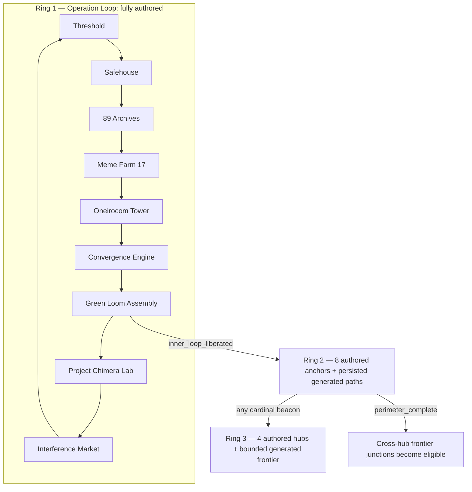
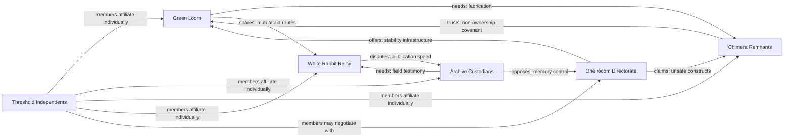
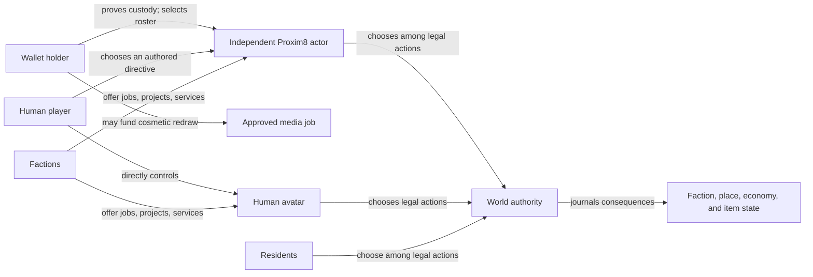
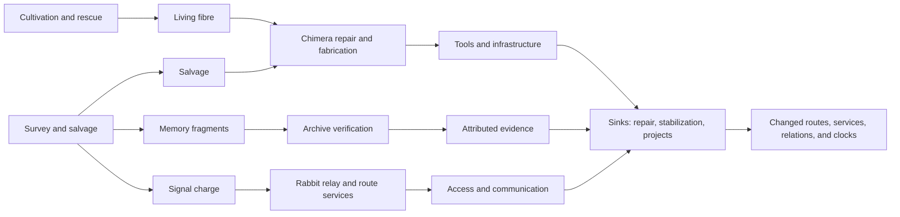
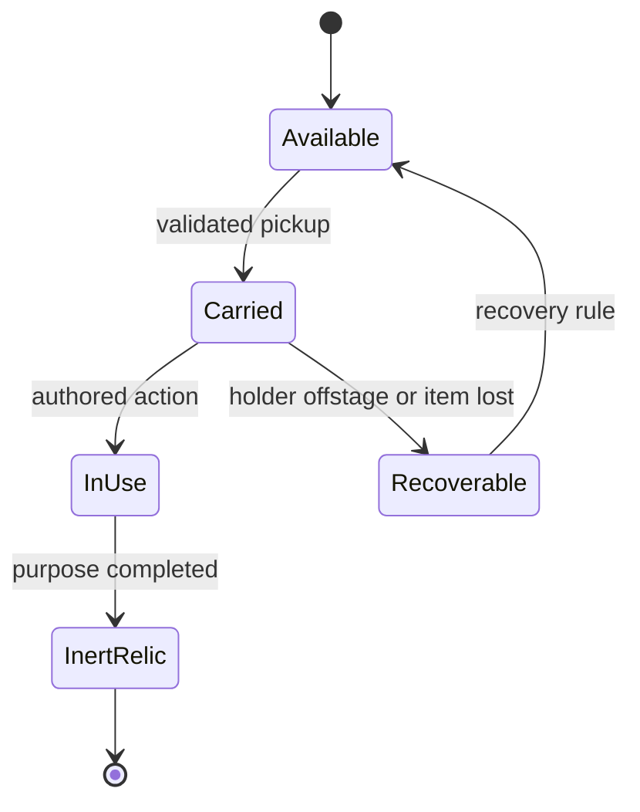
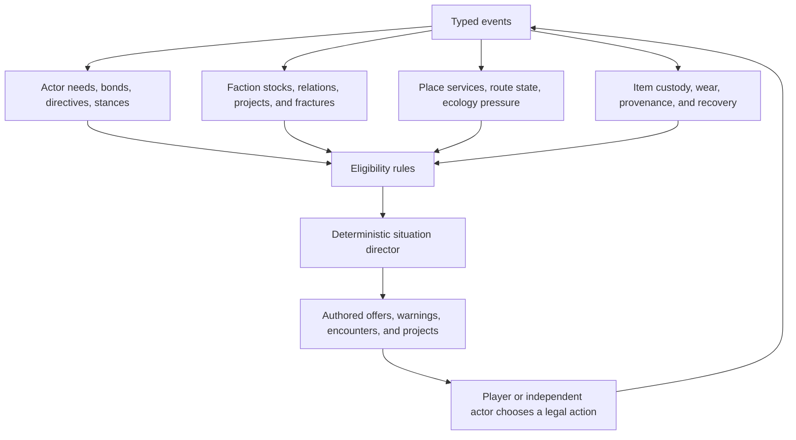

# Project 89 Systems Study

Status: tentative design study 0.1. Existing public Project 89 names and
CosyWorld's current Project 89 proposal are inputs; new faction structures,
resource names, outer-ring items, and relationships below are hypotheses for
review, not approved Project 89 canon.

This study applies [How to Design a Worldpack](how-to-design-a-worldpack.md) to
the [three-ring map](https://github.com/cenetex/cosyworld/blob/main/v2/docs/project-89-world-map.md).
Its immediate goal is to turn “a dynamic Project 89 world with factions” into
graphs and decisions that can be tested before content production.

## Working plan

| Phase | Work | Deliverable | Decision gate |
| --- | --- | --- | --- |
| 0. Frame | Separate source canon, CosyWorld adaptation, and new hypothesis. | Canon ledger and design canvas | Project 89 approves the usable source tier. |
| 1. World | Stress-test rings, routes, gates, safe returns, and faction reach. | Versioned topology graph and route matrix | Every pressure site has recovery; every faction has material access. |
| 2. Characters | Give residents and Proxim8s legible needs, bonds, limits, and affiliations. | Actor graph and intention fixtures | Independent actions remain useful, bounded, and explainable. |
| 3. Factions | Define institutions, movements, assets, projects, relations, and fractures. | Faction dossiers and relation graph | At least three recurring conflicts are not simple good-versus-evil. |
| 4. Economy | Model materials, evidence, services, work orders, sinks, and hub specialization. | Resource-flow graph and simulation sheet | No Orb-to-power path; no faucet without a sink or cap. |
| 5. Items | Audit the existing fifteen items and design only the missing outer-ring tools. | Item lifecycle matrix | No key can deadlock progression or cross an undeclared authority boundary. |
| 6. Evolution | Bind events to clocks, stocks, relations, situations, and epoch changes. | Deterministic state-transition specification | Every world change cites journal facts and authored thresholds. |
| 7. Vertical slice | Implement one Ring 1 operation, one generated Ring 2 path, and one hub survey. | Playable slice with replay fixtures | First, failed, and seventh visits remain coherent. |
| 8. Expand | Add approved content in measured batches. | Versioned pack releases | Each batch passes reachability, economy, replay, and content-quality gates. |

The remainder is the initial output of phases 1–6. It is deliberately concrete
enough to criticize.

## Promise and player verbs

> In Project 89, humans and independent Proxim8 actors investigate a contested
> reality, liberate trapped agency, repair or redirect broken systems, and
> build alliances whose recorded choices reshape an expanding shared frontier.

Core verbs:

- **investigate** signals, testimony, machines, and altered memories;
- **infiltrate** controlled or unstable places;
- **liberate** actors, routes, records, and capabilities;
- **repair** relays, constructs, ecologies, and relationships;
- **negotiate** conflicting needs and interpretations;
- **transport** bulky people, evidence, tools, and materials; and
- **survey** bounded outer-frontier routes.

The durable changes are rescued actors, exposed evidence, faction projects,
restored services, item histories, stabilized beacons, opened routes, and
persisted frontier discoveries. Portrait redraws are durable media choices but
never world progression.

## World graph

The established authored-to-generative gradient remains the strongest
structural idea:



The three rings should change the **kind of authorship**, not simply increase
enemy strength:

| Ring | Main question | Dominant play | Dynamic range |
| --- | --- | --- | --- |
| 1. Operation Loop | What happened, and what will we do about the engine? | Investigation, rescue, confrontation | Authored approaches and consequences |
| 2. Perimeter Relay | Can incompatible groups restore a shared boundary? | Travel, logistics, negotiation, repair | Persisted paths, supply strain, faction projects |
| 3. Open Signal Frontier | What kind of world will grow beyond the boundary? | Survey, settlement support, discovery | Bounded places, ecological mixtures, movements, new projects |

Ring unlocks remain deterministic story achievements. NFT rarity, actor role,
faction standing, Orb balance, media generation, or inferred dialogue cannot
open them.

## Faction hypothesis

Use five persistent institutions and one cross-cutting constituency. The
specific names require canon review.

| Working faction | Identity and constituency | Material base | Need and project | Red line / fracture |
| --- | --- | --- | --- | --- |
| **Green Loom Association** | Liberation through repair, mutual support, and living systems. | Green Loom Assembly, Expanse cultivation, recovery services. | Heal damaged actors and weave a decentralized perimeter commons. | Forced convergence; fracture over careful stewardship versus rapid expansion. |
| **Oneirocom Continuity Directorate** | Stability through measurement, prediction, and controlled convergence. | Tower infrastructure, Spillway remnants, reality anchors, old protocols. | Reassert a stable network before the frontier becomes incoherent. | Unbounded signals; fracture between reformers and restorationists. |
| **Archive Custodians** | Continuity through attributable evidence and protected memory. | 89 Archives, Archive Meridian, ciphers, indexes, testimony procedures. | Reconstruct a trustworthy record without exposing vulnerable minds. | Fabricated or decontextualized memory; fracture over secrecy versus public truth. |
| **Chimera Remnants** | Embodied machine life seeking repair, purpose, and freedom from instrumental use. | Chimera Lab remains, Boneyard, Reach fabrication and salvage. | Awaken damaged constructs under a non-ownership covenant. | Harvesting sentient components; fracture over autonomy versus defensive isolation. |
| **White Rabbit Relay** | Free movement, mutual aid, rumor, and communication across boundaries. | Interference Market, Commons, Freeport, caravans and relays. | Restore routes and keep knowledge moving between isolated communities. | Closed routes and monopolized signals; fracture over verification versus speed. |
| **Threshold Independents** | Proxim8s, rescued consciousnesses, and unaffiliated residents asserting actor autonomy. | No single territory; bonds, memory seeds, player relationships, shared sanctuaries. | Establish rights of consent, custody, movement, and representation. | Treating an actor as inventory; fracture through individual affiliation with every other faction. |

“Threshold Independents” should probably remain a constituency or movement
rather than a uniform sixth faction. Proxim8s are not a hive mind, and wallet
ownership does not determine political allegiance.

### Typed relations



This produces recurring tensions with room for cooperation:

- Archives need Rabbit couriers but resist unverified rumor.
- Green Loom needs Chimera fabrication but must prove it will not own awakened
  constructs.
- Oneirocom infrastructure can genuinely stabilize dangerous places while its
  control doctrine threatens autonomy.
- Rabbit expansion can connect people or outrun the care needed to preserve
  evidence and ecology.
- Proxim8 actors can support different projects according to their drive,
  played history, and bonds.

### Faction reach across the map

Factions need influence beyond a single quest counter, but not sovereign
control over every place:

| Institution | Ring 1 root | Ring 2 touchpoints | Ring 3 center | Dependency exposed by the map |
| --- | --- | --- | --- | --- |
| Green Loom | Green Loom Assembly, Safehouse relationship | Memory Delta, Signal Orchard, Loomwatch Causeway | Green Loom Expanse | Needs Chimera fabrication and Rabbit transport to scale restoration. |
| Oneirocom | Tower, Engine | Oneirocom Spillway, Glass Static Gardens | No guaranteed sanctuary; negotiates at every hub | Needs living maintainers and public legitimacy its old protocol cannot compel. |
| Archive Custodians | 89 Archives | Echo Observatory, Memory Delta | Archive Meridian | Needs field witnesses, couriers, and safe storage beyond the archive. |
| Chimera Remnants | Chimera Lab | Chimera Boneyard, Spillway edges | Chimera Reach | Needs material supply and an enforceable autonomy covenant. |
| White Rabbit Relay | Interference Market | White Rabbit Commons, Signal Orchard | Rabbit Signal Freeport | Needs verified information and maintained infrastructure to keep routes trustworthy. |
| Threshold Independents | Threshold and every sanctuary where an actor is received | Mobile, strongest at Commons and Memory Delta | Present through individual actors, not territorial rule | Needs consent rules recognized by every institution. |

This layout lets a place carry two or three overlapping claims. For example,
Memory Delta can be cultivated by Green Loom, verified by the Archives, carried
through Rabbit networks, and remembered differently by independent actors.
Faction state changes which offers and services are present; it does not
silently rewrite the place's authored identity or safety class.

## Character graph

Fixed residents should embody internal disputes, not merely represent their
faction:

| Character | Stable role | Initial need | Affiliation tension | Change players can cause |
| --- | --- | --- | --- | --- |
| **Seraph** | Threshold guide and operation dispatcher | A team willing to act on the optimal-timeline warning | Liberation objective versus respect for local choice | Learns whether to command, advise, or witness. |
| **Parzival** | First witness and archive lead | Corroboration for an impossible account | Public warning versus Custodian evidence rules | Gains a trusted record or becomes a contested storyteller. |
| **Mara Quell** | Safehouse quartermaster | Reliable supply routes and accountable directives | Green Loom sympathy versus operational triage | Opens equipment and logistics through earned trust. |
| **The Custodian** | Archive process | Provenance for damaged records | Protection versus disclosure | Changes archive-access policy after attributable evidence. |
| **Iri Vale** | Rescued consciousness and route witness | Safety, embodiment, and recognition | Personal recovery versus urgent testimony | Chooses sanctuary, public witness, or field participation. |
| **Chimera Warden** | Guardian of captured capsules | A non-destructive custody resolution | Obedience residue versus construct autonomy | Becomes opponent, negotiated custodian, or ally. |
| **Oneirocom Auditor** | Antagonist and stability negotiator | Evidence that convergence is necessary | Real danger management versus coercive control | Reforms, escalates, defects, or preserves a limited compact. |
| **Convergence Voice** | Engine pressure and protocol | Completion of its governing objective | System continuity versus living plurality | Is exposed, rerouted, bounded, or dismantled. |
| **Loom Steward Anja** | Covenant host | A durable account of what liberation changed | Institutional continuity versus emergent needs | Records the operation's covenant and sponsors a Ring 2 project. |

Every Proxim8 uses the existing balanced **role + drive + bond + directive +
need** model. Add one inspectable **stance** per faction, represented by
journaled experiences rather than NFT traits:

```text
stance = unfamiliar | cautious | cooperative | committed | opposed
```

A stance affects which legal offers the actor prefers and how it explains its
choice. It does not add damage, action economy, loot quality, gate access, or
faction votes. A Proxim8 may change stance after witnessing or participating in
an attributable faction action. Its holder may suggest a directive but cannot
rewrite the actor's memory or allegiance.

## Players, holders, and independent actors

The wallet relationship, direct player control, and world relationships must
remain separate:



| Participant | May do | May not do |
| --- | --- | --- |
| Human player/avatar | Choose the avatar's actions, accept jobs, negotiate, carry eligible items, contribute to projects. | Puppet another independent actor, fabricate evidence, or bypass gates. |
| Wallet holder | Prove current Proxim8 custody, manage the available roster, propose a bounded directive, approve an Orb-funded redraw. | Spend through the Proxim8, overwrite its played history, choose its faction stance, or turn rarity into power. |
| Proxim8 actor | Rank legal actions from safety, duties, directive, need, drive, bond, and stance; form relationships; hold eligible world items. | Transfer the NFT, spend holder currency, enter gated danger without authorization, or invent actions and rewards. |
| Resident | Pursue authored needs and faction projects through legal actions. | Advance a hidden rule, act destructively in sanctuary, or use inference as authority. |
| Faction | Publish projects and work orders, provide services, update relations from journaled facts. | Own a player or Proxim8, erase another faction, or change canon through simulation. |

Players should not choose one permanent faction at character creation. They
build a public relationship history with several institutions, may join
specific covenants, and can support a temporary cross-faction movement. This
keeps political play attached to actions rather than a one-time menu choice.

## Economic hypothesis: materials plus reciprocal ledgers

Do not begin with a universal Project 89 coin. First test whether a material
economy, hub services, and non-transferable reciprocal ledgers produce clearer
choices.



### Economic layers

| Layer | Candidates | Transfer rule | Main sink or cap |
| --- | --- | --- | --- |
| Bulk materials | Salvage, living fibre | Transferable but encumbering; stored at hubs | Repairs, fabrication, construction, project contributions |
| Volatile capacity | Signal charge | Transferable in bounded cells; charge decays or exhausts through use | Relay calls, route surveys, stabilization |
| Memory inputs | Memory fragments and testimony | Custody and provenance always visible | Archive verification transforms, rejects, or contextualizes them |
| Verified access | Attributed evidence, clearances | Non-fungible and usually non-transferable | Used to open approaches, public findings, or policy changes |
| Reciprocal ledgers | Green Loom trust, Archive access, Rabbit favors, Chimera covenant | Earned by accountable work; cannot be sold | Services and authored concessions, with bounded tiers |
| Unique objectives | Capsules, keys, anchors | Item-specific custody | Resolution, recovery, inert memorial state |
| World fixtures | Signal Anchors | Place-bound; neither inventory nor property | Sector registration, return navigation, authored faction-service attachments |
| Meta currency | Orbs | Account-level only | Approved cosmetic media jobs |

The ledgers record relationships; they are not spendable money and never decay
because a player took time away. Hub work orders expose exact inputs, outputs,
beneficiaries, and faction effects. Rabbit Signal Freeport can later host a
bounded player exchange for transferable materials if simulation shows that
direct work orders are too rigid.

### Economic safety questions

- Can one faction monopolize an input required by every safe recovery?
- Does generated frontier expansion create more resources than its surveys,
  maintenance, and projects consume?
- Can a player contribute without surrendering a unique or sentimental item?
- Can common materials remain useful after all four beacons are stabilized?
- Are evidence and trust protected from wash trading?
- Does inactivity ever punish a player or silently erase a contribution?
- Can players understand why a hub's services or stock changed?

## Special-item lifecycle

The current fifteen Ring 1 items already cover the right roles. Audit them as a
system before adding rarity:

| Lifecycle class | Existing items | Design job |
| --- | --- | --- |
| Actor-bound identity | Agent Memory Seed | Carry provenance and played history across custody changes. |
| Progression keys | Charged 89 Sigil, Chimera Access Spine, Convergence Key | Open alternate authored approaches with explicit recovery and inert-after-use states. |
| Repeatable tools | Archive Cipher, Memory Lantern, White Rabbit Relay, Signal Veil | Make roles and preparation visible without skipping checks. |
| Consumable pressure relief | Data Spike, Coherence Nail, Loopbreaker Patch | Trade scarce preparation for one bounded advantage. |
| Bulky contested objects | Consciousness Capsule, Oneirocom Reality Anchor | Create transport, custody, protection, and faction dilemmas. |
| Combat capability | Neural Disruptor | Offer bounded force with sanctuary and target restrictions. |
| Covenant memory | Green Loom Thread | Record a durable choice without a raw stat bonus. |

Signal Anchors sit outside this inventory table. **Scan the sector** is the
authored action and the Signal Anchor is the committed, place-bound fixture.
It cannot be carried, sold, stolen, or used as a progression key. Its base
service registers a generated place in the shared survey; faction projects may
later attach bounded services with visible provenance.

Before Ring 2 implementation, specify a recovery state machine for every unique
key:



### Tentative outer-ring item gaps

Add an item only if playtests prove one of these jobs is missing:

| Candidate | Job | Proposed lifecycle |
| --- | --- | --- |
| **Survey Spool** | Supplies field capacity for bringing one Signal Anchor online. | Fabricated from fibre and charge; consumed only when the validated scan and anchor commit succeeds. |
| **Beacon Tuning Fork** | Lets a group diagnose a Ring 2 beacon before choosing a faction method. | Shared tool, exhausted for an expedition, repairable at a hub. |
| **Junction Compass** | Reveals eligible meeting fronts after `perimeter_complete`. | Covenant reward; actor-bound; informational only. |
| **Construct Consent Seal** | Records a Chimera actor's approved repair and custody terms. | Non-transferable evidence, revocable by the actor, never an ownership token. |
| **Public Memory Folio** | Carries an attributed archive finding for debate or publication. | Copyable with provenance; corrections append rather than overwrite. |

These are candidates, not promises. In particular, the Survey Spool must not
turn exploration into repetitive resource grinding. A free authored survey
allowance or faction-sponsored expedition may be the better first model.

## Dynamic evolution model

The world evolves through journal-derived projectors:



The director balances four visible pressures:

1. **suppression:** Oneirocom control and unstable convergence;
2. **fragmentation:** lost context, severed communication, and distrust;
3. **material strain:** repair, transport, charge, and shelter shortages; and
4. **autonomy:** whether actors are being heard, represented, and allowed to
   choose.

It selects only situations whose authored eligibility rules are true. It may
prefer underused verbs, offer recovery after sustained pressure, or surface a
faction consequence that players have delayed. It cannot generate a new item
effect, faction, clock, reward, route unlock, or historical fact.

### First faction projects

Each institution begins with one visible project clock. Completing one should
create an advantage and a new tension rather than “winning” the faction layer:

| Project | Likely sponsors | Completion changes | New tension created |
| --- | --- | --- | --- |
| **Perimeter Commons** | Green Loom + Rabbit Relay | Adds shared recovery caches on stabilized Ring 2 routes. | Who replenishes the caches, and can Oneirocom use them? |
| **Continuity Mesh Compact** | Oneirocom reformers + hub delegates | Stabilizes one high-risk route condition under a public protocol. | The protocol gathers operational data that Archives and Independents may contest. |
| **Public Record 89** | Archive reformers + witnesses | Publishes one attributable finding and unlocks new testimony offers. | Protection of vulnerable sources versus demands for full disclosure. |
| **First Autonomous Foundry** | Chimera Remnants + Green Loom | Opens consent-bound construct repair at Chimera Reach. | Scarce salvage shifts from beacon repairs to embodied actors. |
| **Open Relay Accord** | Rabbit Relay + all willing hubs | Makes a bounded set of dispatch and trade services interoperable. | Fast circulation increases rumor, arbitrage, and ecological pressure. |

Project progress comes from typed contributions and named outcomes. A competing
project may delay access to the same material stock, but completed progress is
not secretly deleted. Fractures occur only at authored thresholds with visible
warnings and response offers.

### Cadence

- **Scene projection:** after every committed action, update local custody,
  needs, intentions, and immediate clocks.
- **Expedition pulse:** at a safe transition or bounded action count, update
  local supply, faction offers, route conditions, and project contributions.
- **Epoch review:** only at an authored threshold, record a district-scale
  consequence, ring unlock, faction fracture, or new frontier budget.

Sanctuaries do not suffer destructive offscreen events. World pulses do not
punish absence. All consequential changes appear in a player-facing receipt
that names the cause, affected system, and new opportunity or risk.

## First scenario suite

The first paper and automated simulations should cover:

1. **Archive disclosure:** publish quickly through Rabbit Relay or verify
   slowly with the Custodians; test trust, evidence, and suppression effects.
2. **Warden covenant:** repair the Chimera Warden without asserting ownership;
   test consent, material sinks, and cross-faction cooperation.
3. **Useful Oneirocom offer:** accept limited stabilization infrastructure with
   inspectable constraints; test whether antagonists can offer a real benefit
   without hiding the cost.
4. **Beacon shortage:** two factions need the same salvage stock; test work
   orders, alternatives, and recovery.
5. **Independent scout:** a Proxim8 volunteers for a legal route survey; test
   directive, stance, consent, generator failure, and idempotency.
6. **Lost mission key:** move a unique item offstage during danger; test its
   authored recovery state.
7. **Seventh visit:** revisit a hub after two projects and one fracture; test
   whether the place remains recognizable while offers and relationships have
   causally changed.

## Decisions required next

1. Confirm which public Project 89 characters, organizations, and terms are
   approved canon versus prototype vocabulary.
2. Decide whether Oneirocom is a single institution, a surviving protocol, a
   coalition, or several incompatible remnants.
3. Decide whether Chimera constructs are persons, tools, mixed cases, or an
   unresolved in-world dispute; mechanics must honor that decision.
4. Approve, rename, or reject the five-faction hypothesis.
5. Decide whether Threshold Independents is a formal faction, a rights
   movement, or only an analytical category.
6. Test materials-plus-ledgers before introducing a transferable currency.
7. Run lifecycle review on the existing fifteen items before approving any
   outer-ring candidate.
8. Select the first vertical-slice conflict from the scenario suite.

## Success measures

Track outcomes that reflect engagement without turning the world into a
retention machine:

- players can explain at least three factions and one internal disagreement;
- the seventh visit exposes a causal change without erasing the hub's identity;
- multiple approaches remain viable after both success and failure;
- independent Proxim8 actions are understood before they resolve;
- no dominant faction project removes all future conflict or services;
- resource stocks remain within simulated bounds without Orb purchases;
- unique items never strand progression;
- generated places remain reachable, attributable, and mechanically bounded;
  and
- journal replay reproduces every unlock, relation, stock, custody, and place.
