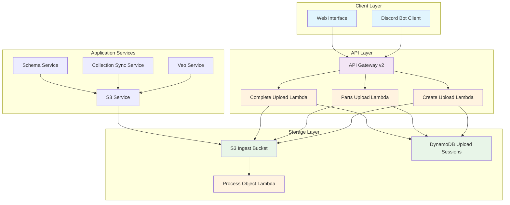
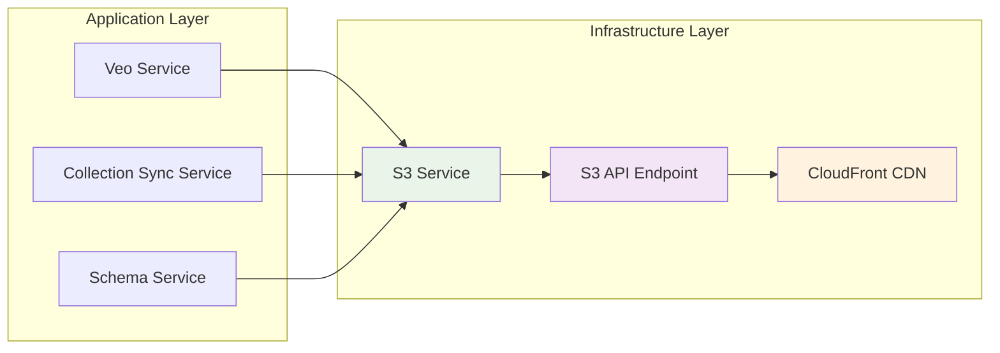

# CoSyWorld Infrastructure Documentation

## Overview

This directory contains the complete infrastructure setup for CoSyWorld, an AI Avatar Discord bot with persistent memory, turn-based combat, and Crossmint NFT support. The infrastructure is built using Terraform and AWS services to support video upload, media processing, and general application hosting.

## Architecture Overview



## Directory Structure

```
infra/
├── README.md                    # This file
├── lambdas/                     # Lambda function source code
│   ├── cleanup/                 # Cleanup function for expired sessions
│   ├── complete-upload/         # Complete multipart upload
│   ├── create-upload/           # Create upload session
│   └── process-object/          # Process uploaded objects
└── terraform/                   # Terraform infrastructure as code
    ├── main.tf                  # Main infrastructure resources
    ├── variables.tf             # Input variables
    ├── outputs.tf               # Output values
    ├── versions.tf              # Provider versions and configuration
    ├── build/                   # Generated Lambda ZIP files
    └── .terraform/              # Terraform state and cache
```

## Infrastructure Components

### AWS Services Used

#### S3 Bucket (Ingest)
- **Purpose**: Primary storage for uploaded video files
- **Configuration**: 
  - Private bucket with public access blocked
  - CORS enabled for PUT operations from any origin
  - 180-day lifecycle policy for automatic cleanup
  - Object prefix: `uploads/YYYY-MM-DD/`

#### DynamoDB Table (UploadSessions)
- **Purpose**: Track upload session state and metadata
- **Configuration**:
  - Table name: `UploadSessions`
  - Primary key: `uploadSessionId` (String)
  - Billing mode: Pay-per-request
  - TTL enabled on `ttl` attribute for automatic cleanup

#### Lambda Functions

##### 1. Create Upload (`video-upload-create`)
- **Purpose**: Initialize new upload sessions
- **Trigger**: API Gateway POST `/video/upload/create`
- **Functionality**:
  - Validates file size and content type
  - Creates single-part upload for files ≤ 25MB
  - Creates multipart upload for larger files
  - Generates presigned URLs for direct S3 upload
  - Stores session metadata in DynamoDB

##### 2. Parts Upload (`video-upload-parts`)
- **Purpose**: Generate presigned URLs for multipart upload parts
- **Trigger**: API Gateway POST `/video/upload/parts`
- **Functionality**:
  - Validates upload session exists
  - Generates presigned URLs for specified part numbers
  - Returns URLs with expiration time

##### 3. Complete Upload (`video-upload-complete`)
- **Purpose**: Finalize upload sessions
- **Trigger**: API Gateway POST `/video/upload/complete`
- **Functionality**:
  - Completes multipart uploads by assembling parts
  - Updates session status to 'uploaded'
  - Returns final object key

##### 4. Process Object (`video-upload-process`)
- **Purpose**: Handle post-upload processing
- **Trigger**: S3 ObjectCreated events on `uploads/` prefix
- **Functionality**:
  - Currently a stub for future processing logic
  - Can be extended for video transcoding, thumbnails, etc.

##### 5. Cleanup (`cleanup` - not deployed via Terraform)
- **Purpose**: Clean up expired sessions and orphaned objects
- **Trigger**: Scheduled (external setup required)

#### API Gateway v2 (HTTP)
- **Purpose**: RESTful API for upload operations
- **Configuration**:
  - Protocol: HTTP
  - Stage: `prod` with auto-deploy
  - CORS enabled for cross-origin requests

### Security & Permissions

#### IAM Role: `video-upload-lambda-role`
**Permissions**:
- Basic Lambda execution (CloudWatch Logs)
- S3 operations on ingest bucket:
  - `s3:PutObject`
  - `s3:AbortMultipartUpload`
  - `s3:CreateMultipartUpload`
  - `s3:UploadPart`
  - `s3:CompleteMultipartUpload`
  - `s3:ListBucketMultipartUploads`
- DynamoDB operations on UploadSessions table:
  - `dynamodb:PutItem`
  - `dynamodb:GetItem`
  - `dynamodb:UpdateItem`
  - `dynamodb:DeleteItem`

## Lambda Function Details

### Implementation Architecture

```mermaid
sequenceDiagram
    participant Client
    participant API as API Gateway
    participant Create as Create Lambda
    participant Parts as Parts Lambda
    participant Complete as Complete Lambda
    participant S3
    participant DDB as DynamoDB
    participant Process as Process Lambda

    Note over Client,Process: Video Upload Flow

    Client->>API: POST /video/upload/create
    API->>Create: Invoke
    Create->>DDB: Store session metadata
    Create->>S3: Generate presigned URL(s)
    Create->>Client: Return upload details

    alt Multipart Upload
        Client->>API: POST /video/upload/parts
        API->>Parts: Invoke
        Parts->>DDB: Validate session
        Parts->>S3: Generate part URLs
        Parts->>Client: Return presigned URLs
        
        loop For each part
            Client->>S3: PUT part data
        end
        
        Client->>API: POST /video/upload/complete
        API->>Complete: Invoke
        Complete->>S3: Complete multipart upload
        Complete->>DDB: Update session status
        Complete->>Client: Return success
    else Single Part Upload
        Client->>S3: PUT file directly
    end

    S3->>Process: ObjectCreated event
    Process->>Process: Process uploaded file
```

### Source Code Documentation

#### Create Upload Lambda
```javascript
// Location: infra/lambdas/create-upload/index.js
// Current: Stub implementation
// Production: Inline in main.tf with minified code
```

**Key Features**:
- File size validation
- Content type validation
- UUID generation for session IDs
- Automatic single vs multipart upload decision
- Presigned URL generation with configurable expiry

#### Complete Upload Lambda  
```javascript
// Location: infra/lambdas/complete-upload/index.js
// Current: Stub implementation
// Production: Inline in main.tf with minified code
```

**Key Features**:
- Session validation
- Multipart upload completion
- Status tracking
- Error handling for malformed requests

#### Process Object Lambda
```javascript
// Location: infra/lambdas/process-object/index.js
// Current: Stub implementation - logs events only
```

**Extension Points**:
- Video transcoding integration
- Thumbnail generation
- Metadata extraction
- Content moderation
- Database updates

#### Cleanup Lambda
```javascript
// Location: infra/lambdas/cleanup/index.js
// Current: Stub implementation
// Purpose: Scheduled cleanup of expired resources
```

**Intended Functionality**:
- Clean up expired DynamoDB sessions
- Remove orphaned S3 objects
- Abort incomplete multipart uploads

## Configuration Variables

| Variable | Default | Description |
|----------|---------|-------------|
| `bucket_name` | `""` | Custom S3 bucket name (auto-generated if empty) |
| `single_max_bytes` | `26214400` | Maximum size for single-part upload (25MB) |
| `part_size` | `5242880` | Multipart upload part size (5MB minimum) |
| `url_expiry_seconds` | `300` | Presigned URL expiration time (5 minutes) |
| `enable_notifications` | `false` | Auto-configure S3→Lambda notifications |

## Deployment Guide

### Prerequisites

1. **AWS CLI configured** with appropriate credentials
2. **Terraform >= 1.5.0** installed
3. **AWS Region** set via environment variable:
   ```bash
   export AWS_REGION=us-east-1
   export AWS_DEFAULT_REGION=us-east-1
   ```

### Initial Deployment

```bash
# Navigate to terraform directory
cd infra/terraform

# Initialize Terraform
terraform init

# Review the plan
terraform plan

# Deploy infrastructure
terraform apply -auto-approve
```

### Post-Deployment Configuration

#### Option 1: Manual S3 Notifications Setup
```bash
# Get outputs
BUCKET_NAME=$(terraform output -raw bucket_name_out)
LAMBDA_ARN=$(terraform output -raw process_object_fn_arn)

# Configure S3 notifications (requires AWS CLI)
aws s3api put-bucket-notification-configuration \
  --bucket "$BUCKET_NAME" \
  --notification-configuration '{
    "LambdaConfigurations": [{
      "Id": "process-uploads",
      "LambdaFunctionArn": "'$LAMBDA_ARN'",
      "Events": ["s3:ObjectCreated:*"],
      "Filter": {"Key": {"FilterRules": [{"Name": "prefix", "Value": "uploads/"}]}}
    }]
  }'
```

#### Option 2: Automated Setup via Terraform
```bash
terraform apply -var enable_notifications=true
```

### Outputs

After successful deployment:
- **API Base URL**: `https://{api-id}.execute-api.{region}.amazonaws.com/prod`
- **S3 Bucket Name**: Auto-generated or custom name
- **Process Lambda ARN**: For manual notification setup

## Runbook

### Common Operations

#### 1. Checking System Health

```bash
# Check API Gateway health
API_URL=$(terraform output -raw api_base_url)
curl -X POST "$API_URL/video/upload/create" \
  -H "Content-Type: application/json" \
  -d '{"fileSizeBytes": 1000000, "contentType": "video/mp4"}'

# Check Lambda function logs
aws logs describe-log-groups --log-group-name-prefix "/aws/lambda/video-upload"

# Check DynamoDB table status
aws dynamodb describe-table --table-name UploadSessions

# Check S3 bucket
BUCKET=$(terraform output -raw bucket_name_out)
aws s3 ls s3://$BUCKET/uploads/ --human-readable --summarize
```

#### 2. Monitoring Upload Sessions

```bash
# List active sessions
aws dynamodb scan --table-name UploadSessions \
  --filter-expression "#status = :status" \
  --expression-attribute-names '{"#status": "status"}' \
  --expression-attribute-values '{":status": {"S": "created"}}'

# Check failed uploads
aws dynamodb scan --table-name UploadSessions \
  --filter-expression "#status = :status" \
  --expression-attribute-names '{"#status": "status"}' \
  --expression-attribute-values '{":status": {"S": "failed"}}'
```

#### 3. Cleaning Up Resources

```bash
# Manual cleanup of old uploads (optional)
BUCKET=$(terraform output -raw bucket_name_out)
aws s3 rm s3://$BUCKET/uploads/ --recursive \
  --exclude "*" --include "*/$(date -d '30 days ago' '+%Y-%m-%d')/*"

# Cleanup incomplete multipart uploads
aws s3api list-multipart-uploads --bucket $BUCKET
aws s3api abort-multipart-upload --bucket $BUCKET --key "key" --upload-id "id"
```

#### 4. Scaling Considerations

```bash
# Increase Lambda concurrency if needed
aws lambda put-provisioned-concurrency-config \
  --function-name video-upload-create \
  --provisioned-concurrency-config ProvisionedConcurrencyConfig=100

# Monitor DynamoDB consumption
aws cloudwatch get-metric-statistics \
  --namespace AWS/DynamoDB \
  --metric-name ConsumedReadCapacityUnits \
  --dimensions Name=TableName,Value=UploadSessions \
  --start-time $(date -u -d '1 hour ago' +%Y-%m-%dT%H:%M:%S) \
  --end-time $(date -u +%Y-%m-%dT%H:%M:%S) \
  --period 300 \
  --statistics Sum
```

### Troubleshooting

#### Common Issues

1. **CORS Errors**
   - Verify API Gateway CORS configuration
   - Check browser developer tools for preflight requests
   - Ensure correct Content-Type headers

2. **Permission Denied**
   - Verify IAM role has required permissions
   - Check Lambda execution role policy
   - Validate S3 bucket policy

3. **Timeout Issues**
   - Increase Lambda timeout (currently 10-15 seconds)
   - Check network connectivity to S3
   - Monitor CloudWatch logs for performance issues

4. **Multipart Upload Failures**
   - Verify part size meets S3 requirements (5MB minimum)
   - Check part number sequence
   - Validate ETag format in completion request

#### Debug Commands

```bash
# View Lambda logs
aws logs tail /aws/lambda/video-upload-create --follow

# Check API Gateway access logs (if enabled)
aws logs tail /aws/apigateway/{api-id} --follow

# Monitor S3 access patterns
aws s3api get-bucket-logging --bucket $BUCKET_NAME

# Validate Terraform state
terraform state list
terraform state show aws_lambda_function.create
```

### Security Considerations

1. **API Rate Limiting**: Consider implementing rate limiting at API Gateway level
2. **Content Validation**: Add virus scanning and content type validation
3. **Access Control**: Implement authentication/authorization for upload endpoints
4. **Encryption**: Enable S3 bucket encryption at rest
5. **Network Security**: Consider VPC endpoints for Lambda-S3 communication

### Cost Optimization

1. **S3 Storage Classes**: Implement lifecycle policies for Intelligent Tiering
2. **Lambda Memory**: Optimize memory allocation based on actual usage
3. **DynamoDB**: Monitor and adjust read/write capacity as needed
4. **API Gateway**: Consider REST vs HTTP API based on feature requirements

### Backup and Recovery

1. **Infrastructure**: Terraform state is stored locally (consider remote backend)
2. **Application Data**: S3 has built-in durability and versioning capability
3. **Database**: DynamoDB point-in-time recovery can be enabled
4. **Lambda Code**: Source code versioning through inline definitions

## Integration with CoSyWorld Application

### S3Service Integration

The application includes an `S3Service` class that integrates with the infrastructure:



**Key Integration Points**:
- Video upload from Veo AI service
- Avatar image processing and storage
- NFT metadata and asset management
- Media serving through CloudFront CDN

### Environment Variables Required

```bash
# S3 Service Configuration
S3_API_KEY=your_api_key_here
S3_API_ENDPOINT=https://your-endpoint.com/upload
CLOUDFRONT_DOMAIN=https://your-cdn-domain.com
```

## Future Enhancements

1. **CDN Integration**: Direct CloudFront invalidation after uploads
2. **Video Processing**: Automatic transcoding and thumbnail generation
3. **Content Moderation**: AI-powered content screening
4. **Analytics**: Upload metrics and usage tracking
5. **Multi-Region**: Cross-region replication for global availability
6. **Backup Strategy**: Automated backup to secondary regions

---

*Last Updated: August 21, 2025*
*Version: 1.0.0*
