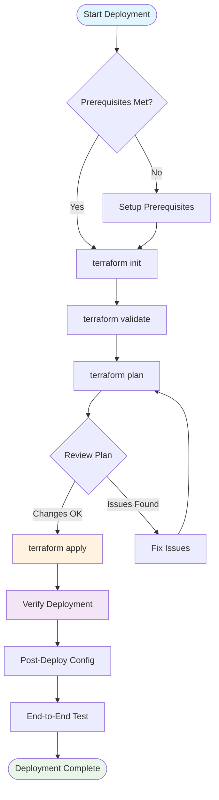

# Terraform Deployment Guide

## Quick Start

This guide provides step-by-step instructions for deploying the CoSyWorld video upload infrastructure using Terraform.

## Architecture Deployment Flow



## Prerequisites

### 1. System Requirements

#### Local Environment
- **Operating System**: macOS, Linux, or Windows with WSL2
- **Terraform**: Version >= 1.5.0
- **AWS CLI**: Version >= 2.0
- **Internet Connection**: Required for provider downloads and AWS API calls

#### AWS Account Requirements
- **AWS Account**: Active account with billing enabled
- **IAM Permissions**: Administrative access or specific permissions listed below
- **Service Limits**: Verify AWS service limits for your region

### 2. AWS Permissions Required

Create an IAM policy with the following permissions:

```json
{
  "Version": "2012-10-17",
  "Statement": [
    {
      "Effect": "Allow",
      "Action": [
        "s3:CreateBucket",
        "s3:DeleteBucket",
        "s3:GetBucketAcl",
        "s3:GetBucketCors",
        "s3:GetBucketLifecycleConfiguration",
        "s3:GetBucketLocation",
        "s3:GetBucketNotification",
        "s3:GetBucketPolicy",
        "s3:GetBucketPublicAccessBlock",
        "s3:GetBucketVersioning",
        "s3:ListBucket",
        "s3:PutBucketAcl",
        "s3:PutBucketCors",
        "s3:PutBucketLifecycleConfiguration",
        "s3:PutBucketNotification",
        "s3:PutBucketPolicy",
        "s3:PutBucketPublicAccessBlock",
        "s3:PutBucketVersioning"
      ],
      "Resource": "*"
    },
    {
      "Effect": "Allow",
      "Action": [
        "dynamodb:CreateTable",
        "dynamodb:DeleteTable",
        "dynamodb:DescribeTable",
        "dynamodb:DescribeTimeToLive",
        "dynamodb:ListTagsOfResource",
        "dynamodb:PutItem",
        "dynamodb:TagResource",
        "dynamodb:UntagResource",
        "dynamodb:UpdateTimeToLive"
      ],
      "Resource": "*"
    },
    {
      "Effect": "Allow",
      "Action": [
        "lambda:CreateFunction",
        "lambda:DeleteFunction",
        "lambda:GetFunction",
        "lambda:GetFunctionConfiguration",
        "lambda:ListVersionsByFunction",
        "lambda:UpdateFunctionCode",
        "lambda:UpdateFunctionConfiguration",
        "lambda:TagResource",
        "lambda:UntagResource",
        "lambda:ListTags",
        "lambda:AddPermission",
        "lambda:RemovePermission",
        "lambda:GetPolicy"
      ],
      "Resource": "*"
    },
    {
      "Effect": "Allow",
      "Action": [
        "apigateway:*"
      ],
      "Resource": "*"
    },
    {
      "Effect": "Allow",
      "Action": [
        "iam:CreateRole",
        "iam:DeleteRole",
        "iam:GetRole",
        "iam:PassRole",
        "iam:AttachRolePolicy",
        "iam:DetachRolePolicy",
        "iam:PutRolePolicy",
        "iam:DeleteRolePolicy",
        "iam:GetRolePolicy",
        "iam:ListAttachedRolePolicies",
        "iam:ListRolePolicies",
        "iam:TagRole",
        "iam:UntagRole"
      ],
      "Resource": "*"
    },
    {
      "Effect": "Allow",
      "Action": [
        "sts:GetCallerIdentity"
      ],
      "Resource": "*"
    }
  ]
}
```

### 3. Tool Installation

#### Install Terraform
```bash
# macOS with Homebrew
brew install terraform

# Linux
wget https://releases.hashicorp.com/terraform/1.5.7/terraform_1.5.7_linux_amd64.zip
unzip terraform_1.5.7_linux_amd64.zip
sudo mv terraform /usr/local/bin/

# Verify installation
terraform version
```

#### Install AWS CLI
```bash
# macOS with Homebrew
brew install awscli

# Linux
curl "https://awscli.amazonaws.com/awscli-exe-linux-x86_64.zip" -o "awscliv2.zip"
unzip awscliv2.zip
sudo ./aws/install

# Verify installation
aws --version
```

## Configuration

### 1. AWS Credentials Setup

#### Option A: AWS CLI Configuration
```bash
aws configure
# Enter your:
# - AWS Access Key ID
# - AWS Secret Access Key  
# - Default region name (e.g., us-east-1)
# - Default output format (json)
```

#### Option B: Environment Variables
```bash
export AWS_ACCESS_KEY_ID="your-access-key"
export AWS_SECRET_ACCESS_KEY="your-secret-key"
export AWS_DEFAULT_REGION="us-east-1"
```

#### Option C: IAM Role (EC2/ECS)
```bash
# If running on EC2 instance with IAM role
# No additional configuration needed
aws sts get-caller-identity
```

### 2. Terraform Variables Configuration

#### Create terraform.tfvars file
```bash
cd infra/terraform

# Create variables file
cat > terraform.tfvars << EOF
# S3 Bucket Configuration
bucket_name = "my-video-upload-bucket-$(date +%s)"

# Upload Configuration
single_max_bytes = 26214400     # 25MB
part_size = 5242880             # 5MB  
url_expiry_seconds = 300        # 5 minutes

# Automation
enable_notifications = true
EOF
```

#### Variable Descriptions

| Variable | Type | Default | Description |
|----------|------|---------|-------------|
| `bucket_name` | string | `""` | Custom S3 bucket name (auto-generated if empty) |
| `single_max_bytes` | number | `26214400` | Maximum file size for single-part upload (bytes) |
| `part_size` | number | `5242880` | Part size for multipart uploads (bytes, min 5MB) |
| `url_expiry_seconds` | number | `300` | Presigned URL expiration time (seconds) |
| `enable_notifications` | bool | `false` | Automatically configure S3→Lambda notifications |

## Deployment Steps

### Step 1: Initialize Terraform

```bash
cd infra/terraform

# Initialize Terraform (downloads providers)
terraform init

# Expected output:
# Initializing the backend...
# Initializing provider plugins...
# - Finding hashicorp/aws versions matching ">= 5.0"...
# - Finding hashicorp/archive versions matching ">= 2.4"...
# - Installing hashicorp/aws v5.x.x...
# - Installing hashicorp/archive v2.x.x...
# Terraform has been successfully initialized!
```

### Step 2: Validate Configuration

```bash
# Validate Terraform syntax
terraform validate

# Format Terraform files
terraform fmt

# Expected output for validate:
# Success! The configuration is valid.
```

### Step 3: Plan Deployment

```bash
# Create deployment plan
terraform plan -out=deployment.plan

# Review the plan output carefully
# Look for:
# - Resources to be created (should be ~15-20 resources)
# - No resources to be destroyed (for new deployment)
# - No unexpected changes
```

#### Expected Resources in Plan
- 1 S3 bucket + configuration
- 1 DynamoDB table
- 1 IAM role + policies
- 4 Lambda functions
- 1 API Gateway + routes + integrations
- Various permissions and configurations

### Step 4: Deploy Infrastructure

```bash
# Apply the deployment plan
terraform apply deployment.plan

# Alternative: Apply with auto-approval (use with caution)
terraform apply -auto-approve

# Deployment typically takes 2-5 minutes
```

#### Deployment Progress Indicators
```
aws_s3_bucket.ingest: Creating...
aws_dynamodb_table.upload_sessions: Creating...
aws_iam_role.lambda: Creating...
aws_s3_bucket.ingest: Creation complete after 2s
aws_dynamodb_table.upload_sessions: Creation complete after 8s
...
Apply complete! Resources: 18 added, 0 changed, 0 destroyed.
```

### Step 5: Capture Outputs

```bash
# Display all outputs
terraform output

# Save outputs for later use
terraform output -json > outputs.json

# Get specific outputs
API_URL=$(terraform output -raw api_base_url)
BUCKET_NAME=$(terraform output -raw bucket_name_out)
LAMBDA_ARN=$(terraform output -raw process_object_fn_arn)

echo "API Base URL: $API_URL"
echo "S3 Bucket: $BUCKET_NAME"  
echo "Process Lambda ARN: $LAMBDA_ARN"
```

## Post-Deployment Configuration

### 1. S3 Notification Setup

If `enable_notifications = false`, manually configure S3 notifications:

```bash
# Get the bucket name and Lambda ARN
BUCKET_NAME=$(terraform output -raw bucket_name_out)
LAMBDA_ARN=$(terraform output -raw process_object_fn_arn)

# Create notification configuration
cat > notification-config.json << EOF
{
  "LambdaConfigurations": [
    {
      "Id": "process-uploads",
      "LambdaFunctionArn": "$LAMBDA_ARN",
      "Events": ["s3:ObjectCreated:*"],
      "Filter": {
        "Key": {
          "FilterRules": [
            {
              "Name": "prefix",
              "Value": "uploads/"
            }
          ]
        }
      }
    }
  ]
}
EOF

# Apply notification configuration
aws s3api put-bucket-notification-configuration \
  --bucket "$BUCKET_NAME" \
  --notification-configuration file://notification-config.json

# Verify configuration
aws s3api get-bucket-notification-configuration --bucket "$BUCKET_NAME"
```

### 2. Test API Endpoints

```bash
# Test create upload endpoint
API_URL=$(terraform output -raw api_base_url)

echo "Testing create upload endpoint..."
curl -X POST "$API_URL/video/upload/create" \
  -H "Content-Type: application/json" \
  -d '{
    "fileSizeBytes": 1048576,
    "contentType": "video/mp4",
    "fileExtension": "mp4"
  }' | jq .

# Expected response:
# {
#   "uploadSessionId": "uuid-here",
#   "uploadType": "single",
#   "key": "uploads/2025-08-21/uuid-here.mp4",
#   "putUrl": "https://bucket.s3.amazonaws.com/...",
#   "expiresIn": 300
# }
```

### 3. Verify Lambda Function Health

```bash
# Check Lambda function status
aws lambda list-functions \
  --query 'Functions[?starts_with(FunctionName, `video-upload`)].{Name:FunctionName,Status:State,Runtime:Runtime}' \
  --output table

# Test Lambda function directly
aws lambda invoke \
  --function-name video-upload-create \
  --payload '{"body": "{\"fileSizeBytes\": 1000000}"}' \
  --cli-binary-format raw-in-base64-out \
  response.json

cat response.json | jq .
```

## Verification Checklist

### Infrastructure Components
- [ ] S3 bucket created with correct configuration
- [ ] DynamoDB table created with TTL enabled
- [ ] IAM role and policies attached correctly
- [ ] All 4 Lambda functions deployed and active
- [ ] API Gateway created with correct routes
- [ ] Lambda permissions configured for API Gateway
- [ ] S3 notification configuration applied

### Functional Testing
- [ ] API Gateway returns valid responses
- [ ] Create upload endpoint works for single-part uploads
- [ ] Create upload endpoint works for multipart uploads
- [ ] Lambda functions can write to DynamoDB
- [ ] Lambda functions can access S3 bucket
- [ ] S3 notifications trigger process Lambda

### Security Verification
- [ ] S3 bucket blocks public access
- [ ] IAM roles follow principle of least privilege
- [ ] API Gateway has appropriate CORS configuration
- [ ] Lambda functions have minimal required permissions

## Troubleshooting

### Common Deployment Issues

#### Issue: Provider Download Fails
```bash
# Clear Terraform cache and retry
rm -rf .terraform
terraform init
```

#### Issue: AWS Credentials Not Found
```bash
# Verify AWS configuration
aws sts get-caller-identity

# If fails, reconfigure
aws configure
```

#### Issue: Insufficient Permissions
```bash
# Check current permissions
aws iam get-user --user-name $(aws sts get-caller-identity --query User.UserName --output text)

# Test specific service access
aws s3 ls
aws lambda list-functions --max-items 1
aws dynamodb list-tables --max-items 1
```

#### Issue: Resource Already Exists
```bash
# Import existing resource into Terraform state
terraform import aws_s3_bucket.ingest existing-bucket-name

# Or remove conflicting resource first
aws s3 rb s3://conflicting-bucket-name --force
```

#### Issue: Lambda Function Timeout
```bash
# Check CloudWatch logs
aws logs describe-log-groups --log-group-name-prefix "/aws/lambda/video-upload"

# View recent errors
aws logs filter-log-events \
  --log-group-name "/aws/lambda/video-upload-create" \
  --start-time $(date -d '1 hour ago' +%s)000 \
  --filter-pattern "ERROR"
```

### Rollback Procedures

#### Immediate Rollback
```bash
# Destroy all resources (CAUTION: Data loss)
terraform destroy -auto-approve
```

#### Selective Rollback
```bash
# Remove specific resource
terraform destroy -target=aws_lambda_function.create

# Recreate from last known good state
terraform apply
```

#### State Recovery
```bash
# If state is corrupted, restore from backup
cp terraform.tfstate.backup terraform.tfstate
terraform plan  # Verify state integrity
```

## Environment-Specific Deployments

### Development Environment
```bash
# Use smaller limits for development
cat > terraform.tfvars << EOF
bucket_name = "dev-video-upload-$(whoami)-$(date +%s)"
single_max_bytes = 10485760    # 10MB
part_size = 5242880            # 5MB
url_expiry_seconds = 600       # 10 minutes
enable_notifications = true
EOF

terraform apply -var-file=terraform.tfvars
```

### Production Environment
```bash
# Use production-appropriate settings
cat > terraform.tfvars << EOF
bucket_name = "prod-video-upload-company-$(date +%s)"
single_max_bytes = 104857600   # 100MB
part_size = 10485760           # 10MB
url_expiry_seconds = 300       # 5 minutes
enable_notifications = true
EOF

terraform apply -var-file=terraform.tfvars
```

### Multi-Region Deployment
```bash
# Deploy to different regions
export AWS_DEFAULT_REGION=us-west-2
terraform workspace new us-west-2
terraform apply

export AWS_DEFAULT_REGION=eu-west-1  
terraform workspace new eu-west-1
terraform apply
```

## Maintenance and Updates

### Regular Updates
```bash
# Update Terraform providers
terraform init -upgrade

# Check for configuration drift
terraform plan

# Apply any necessary updates
terraform apply
```

### Monitoring Setup
```bash
# Enable detailed monitoring
aws lambda put-function-configuration \
  --function-name video-upload-create \
  --tracing-config Mode=Active

# Set up CloudWatch alarms (example)
aws cloudwatch put-metric-alarm \
  --alarm-name "VideoUpload-CreateFunction-Errors" \
  --alarm-description "High error rate for create function" \
  --metric-name Errors \
  --namespace AWS/Lambda \
  --statistic Sum \
  --period 300 \
  --threshold 5 \
  --comparison-operator GreaterThanThreshold \
  --dimensions Name=FunctionName,Value=video-upload-create \
  --evaluation-periods 2
```

## Next Steps

After successful deployment:

1. **Integration**: Update your application configuration with the new API URL
2. **Monitoring**: Set up CloudWatch dashboards and alarms
3. **Backup**: Implement state backup procedures
4. **Documentation**: Update application documentation with new endpoints
5. **Testing**: Run comprehensive end-to-end tests
6. **Security**: Review and harden security settings as needed

---

*Deployment Guide Version: 1.0*
*Last Updated: August 21, 2025*
