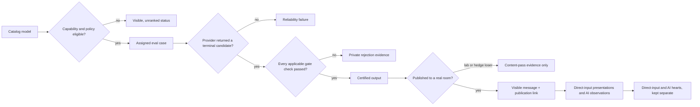

# Model evaluations, `/leaderboard`, and `<3` feedback

Status: design proposal; no runtime or UI implementation is included here.

This design turns CosyWorld's existing per-generation publication evidence into
capability-specific model scorecards, exposes aggregate results at
`/leaderboard`, and adds one lightweight `<3` message reaction that people and
AI-controlled residents can use. It preserves the core rule from `AI.md`: the
system certifies each output, never a model. A high-ranked model receives no
gate bypass or world authority.

## Decisions

1. Every OpenRouter catalog model is represented, but only comparable,
   policy-eligible models are ranked. An unseen or incompatible model displays
   a reason, not a fabricated zero.
2. Models are compared within a capability and gate profile. Prose voice, raw
   voice, planner JSON, world content, and images are not one leaderboard.
3. The highlighted live voice score is **`<3` Heart Score**: account-browser
   hearts per 100 eligible closed-window presentations, ranked by a conservative
   adjusted lower bound. Show the raw heart total beside it, but never let raw
   traffic alone determine rank.
4. Objective accuracy is shown only where an independent fixture labels the
   correct or acceptable answer. Merely producing a legal planner candidate is
   a legal-output rate, and merely compiling world content is validity or
   constraint satisfaction. Gate quality itself is audited separately against
   blinded human labels.
5. Reliability, latency, cost, and preference remain separate dimensions.
   They do not buy back a safety or authority failure.
6. Gate performance is primarily shown as an attempt funnel under one fixed
   three-attempt policy: **approved 1st**, **approved 2nd**, **approved 3rd**,
   and **failed after 3**. Cosy Gate Score remains the conservative lab
   compliance statistic behind the funnel.
7. Direct-input and server-AI hearts are never merged. Authenticated-account,
   browser direct-input hearts are the primary weak RLF signal; guest, CLI/agent,
   organic-resident AI, and off-world AI-jury evidence remain separate cohorts.
8. A `<3` is visible, durable social state but no mechanical authority. It
   changes no turn, tick, Orb, advancement, Bond, continuity, memory, prompt,
   dialogue heartbeat, selection weight, or reward.
9. V1 hearts target only committed `message.created` events. Image reactions
   can later reuse the same target contract.

## Existing foundation and instrumentation gaps

CosyWorld already has most of the difficult evidence path:

- `ai_registry.rs` pins an immutable registry snapshot and distinguishes the
  requested model from the provider-resolved model and revision. It also holds
  provider, family, modality, capability, privacy, adapter, sampling, observed
  price, p50 latency, availability, and historical gate facts.
- `ai_publication.rs` produces a receipt with generation, candidate and
  publication identities; prompt and context hashes; output hash; resolved
  attribution; finish reason; tokens; attempts; latency; and every gate check.
- The current voice gate checks envelope integrity, emptiness, word budget,
  terminal finish, repetition, multiple speakers, instruction leakage, speech
  mode, scene anchors, recent duplication, cozy/public safety, false action
  claims, and object agency.
- `ai_voice_routing.rs` correctly keeps content pass/fail evidence separate
  from endpoint health and preserves selection decisions, resampling,
  certified hedge losers, provider failures, cooldown, cost estimates, and the
  exploration propensity inputs.
- `AI.md` already requires production-shaped shadow jobs, the same production
  adapter and gate, resolved attribution, bounded budgets, and an adversarial
  corpus.

The public leaderboard must wait for these gaps to close:

| Gap | Required change |
| --- | --- |
| No explicit gate version on a publication receipt | Add `gate_id` and `gate_version`; include them in every evidence key. |
| Content evidence can mix prompt changes | Key normalized evidence by prompt ID/version as well as adapter, feature, and speech mode. |
| Provider errors do not have a common attempt row | Persist assigned, started, canceled, provider-failed, completed, gate-failed, and gate-passed dispositions. |
| Cost is currently estimated from catalog rates | Capture provider-reported cost or label an amount explicitly as estimated. |
| No eval suite/run/case identity | Add immutable campaign, corpus, case, scenario bucket, repeat, and source IDs. |
| No assignment probability | Persist the pre-outcome routing propensity for any live analysis. |
| No message-to-publication link | Bind accepted `publication_id` and `candidate_id` to `(world_id, world_epoch, message_event_seq)` when speech commits. |
| Message origin is inferred from mutable actor state in the browser | Project immutable target origin from the AI publication receipt; never infer it later from actor kind or current control mode. |
| No visible-message denominator | Add idempotent foreground presentation receipts for humans and bounded observation receipts for AI. |
| Generic AI usage rows can name the configured rather than resolved model | Build scores from normalized attempts/publication receipts, not the generic usage ledger. |

The legacy model list and its price-derived rarity are not evaluation inputs.
The V2 immutable catalog/registry snapshot is the source of comparison facts.

## The evaluation funnel

Every provider attempt has exactly one terminal disposition. A case may contain
multiple policy-declared attempts, such as a first failure followed by a retry,
and therefore has its own aggregate outcome. Provider failure is not silently
counted as a content failure, and a certified hedge loser remains a content
pass even though it did not win publication.



### Attempt dispositions

Use a closed, append-only vocabulary:

- `not_started`
- `provider_failure`
- `canceled_hedge`
- `gate_failed`
- `gate_passed`
- `certified_loser`
- `published`

`gate_passed`, `certified_loser`, and `published` are content passes.
`provider_failure` and `canceled_hedge` do not enter the gate-pass denominator.
Cases use a separate closed outcome vocabulary: `not_started`, `passed_first`,
`passed_after_retry`, `exhausted_content`, `exhausted_provider`, and
`exhausted_mixed`. Content retry salvage is `passed_after_retry / all cases`
whose designated sample-one attempt returned a candidate that failed the gate,
under one fixed retry policy. Provider recovery is the analogous rate among
cases whose sample-one attempt had a provider failure. The two estimands are
never pooled.

Direct lab evaluation uses one isolated model assignment so hedging and
first-winner censoring cannot bias model comparison. Router-level `pass@K` and
time-to-first-certified remain separate system metrics.

## Comparison identity

The leaderboard has two different identities and must not collapse them:

- `catalog_entry_id = (catalog_snapshot_version, requested_model_id)` answers
  whether every OpenRouter catalog entry is searchable and why it is or is not
  eligible; and
- `evaluation_profile_id` identifies the comparable execution profile below
  and owns scorecards.

A versioned alias-resolution record links one catalog entry to zero or more
resolved evaluation profiles. An unevaluated or policy-blocked catalog entry
still exists even though it has no profile evidence.

A comparable score slice is identified by:

```text
capability
+ resolved model ID and revision
+ provider/endpoint policy
+ prompt adapter ID and version
+ prompt ID and version
+ gate ID and version
+ speech mode
+ feature
+ sampling profile
+ corpus/suite version
```

Requested aliases are useful selection metadata, but results are credited to
the concrete model the provider reports. If an alias resolves to a new model,
the new identity starts a new score history. The UI may group related revisions
without pooling their evidence.

Because adapters and sampling affect results, the row is technically an
execution profile, not an abstract model in isolation. The model is the primary
label; the exact profile is always visible in row details.

## Capability tracks

| Track | Eligible population | Hard outcome | Independent accuracy/quality |
| --- | --- | --- | --- |
| World voice / prose | Text-output models declared for `voice` | Existing full speech publication gate | No exact target string; use blinded rubric and pairwise preference after gate certification. |
| Raw voice | Exact-bound raw text models | Thin raw envelope, length, finish, repetition, duplicate, and safety gate | Keep separate from prose because grounding, character voice, and model-language checks deliberately do not apply. |
| Planner JSON | Models declared for `intent_json` | Strict schema and exact current candidate validation | Legal-output rate for any current candidate; accuracy only when a fixture independently labels the acceptable/correct candidate set. Stale/illegal action rate must remain zero. |
| World content | Models declared for `world_content` | Schema, compiler, reachability, duplication, safety, and dry-run checks | Validity/constraint satisfaction from the compiler; accuracy only for independently labelled fixture facts. |
| Images | Text-to-image candidates | Decode/dimension checks and visible-pixel publication policy | Blinded human preference, policy false-accept audit, latency, and cost. |
| Full catalog | Every immutable catalog entry | None | Status and capability coverage only; never a cross-modality rank. |

## Metrics

### Model metrics

| Metric | Definition | Interpretation |
| --- | --- | --- |
| Gate approval funnel | Mutually exclusive shares certified first on attempt 1, 2, or 3, plus no certification within three / `included_cases` | Primary gate display; the four shares sum to 100% under one fixed attempt policy and analysis set. |
| Cumulative approval@N | Cases certified within attempts 1..N / `included_cases` | `approval@1`, `approval@2`, and `approval@3`; includes reliability as experienced by the system. |
| Cosy Gate Score | `100 × gate_rate_p05`, the conservative lower bound of the macro gate-rate posterior | Lab compliance statistic behind the attempt funnel; not the live Heart Score, median pass estimate, or semantic accuracy. |
| End-to-end publishable yield | Certified outputs / all isolated assigned cases, including provider failure | Probability an assignment produces a usable line. |
| Retry salvage | Cases whose sample-one candidate gate-failed and later passed within the declared retry budget / all cases whose sample-one candidate gate-failed under that fixed policy | Value and cost of retries. |
| Provider recovery | Cases whose sample-one provider attempt failed and later produced a certified output / all cases whose sample-one provider attempt failed under that fixed policy | Operational recovery, not content improvement. |
| Per-check failure rate | Failures for one stable gate code / provider-completed candidates | Diagnostic; hard checks do not award partial credit. |
| Legal/constraint validity | Current legal candidate or compiler-valid proposal / provider-completed candidates | Does not imply the choice/content was independently correct. |
| Task accuracy | Correct typed result / independently labelled cases | Shown only for fixtures with a specified correct/acceptable target. |
| Endpoint reliability | Valid candidate-bearing completions / started provider requests | Terminal HTTP/provider errors are failures, not completions. |
| Latency | Candidate p50/p95, certified-within-deadline yield, and censored time-to-usable | Conditional latency is always paired with yield so fail-fast models do not look best. P99 requires a suite minimum sample. |
| Cost | Actual or labelled-estimated cost/request and cost/certified output | Cost/human-approved output appears only for fully reviewed or randomly sampled, inclusion-weighted audits. Rejects and hedges remain in cost. |
| Stability | Within-context variance over repeated samples | Repeats are clustered under one context, not treated as independent cases. |
| `<3` Heart Score | `100 × heart_rate_p05` from the named account-browser live estimator | Highlighted live voice score; raw hearts and eligible presentations are always shown beside it. |
| Account browser-direct heart action rate | Eligible account-browser principal/message opportunities whose withdrawal-adjusted heart is active at the aggregation cutoff / eligible account-browser presentation opportunities | Primary observed RLF cohort; an authenticated direct-input route does not prove an unaided human judgement. |
| Guest browser-direct heart action rate | Eligible guest-browser principal/message opportunities whose withdrawal-adjusted heart is active at the aggregation cutoff / eligible guest-browser presentation opportunities | Visible but separated from account and automated-direct-input cohorts. |
| Organic AI conditional heart action rate | `completed_heart / (completed_heart + completed_none)` among eligible decisions | Character/attention-policy preference conditional on a usable evaluator decision. |
| Organic AI end-to-end heart yield | `completed_heart / all eligible scheduled observation opportunities` | Includes provider failure/cancellation; always paired with decision reliability. |
| AI jury preference | Votes from a fixed/common or explicitly calibrated blinded evaluator panel | Controlled teacher/judge metric, separate from organic residents and direct-input hearts. |
| Withdrawal rate | Removed hearts / ever-added hearts | Detects accidental clicks and later regret. |
| Coverage/freshness | Required buckets completed, contexts, repeats, unique raters, last run, suite version | Determines ranking status. |

Raw heart count is not a quality metric; it mostly measures traffic. A public
message returned by `/state`, hidden behind Menu, or mounted in a background
tab is not an impression. The browser records a presentation only after the
message is actually visible in a foreground document. The server accepts an
idempotent presentation receipt bound to scoped principal, exact
world/epoch/message/hash, server-derived credential/transport class,
visibility-contract version, and time. Browser, CLI, and agent classes require
distinct server-issued credential capabilities; a client cannot claim its class
with a payload enum.

Browser, CLI/agent direct-input, guest, organic-AI, and jury observations are
distinct cohorts. Presentation endpoints are themselves rate-limited and
anomaly-filtered so an attacker cannot cheaply poison the denominator.

The scoring denominator contains at most one eligible opportunity for each
scoped principal and message within the versioned reaction window; refreshes
and repeated renders may update `last_seen_at` but never inflate exposure. V1
uses seven days from the first eligible presentation. At an analysis cutoff,
both numerator and denominator include only opportunities whose seven-day
window has closed; open windows are right-censored and do not advance evidence
maturity. A future survival estimator must be separately named and versioned.
A counted heart requires the accepted presentation-receipt ID, and numerator
and denominator apply identical moderation, principal, target, transport,
time-window, and attribution exclusions. Intervals cluster by both principal
and target message and remain provisional below the declared minimum unique
principals, messages, and closed opportunities. The initial V1 display threshold
is 30 distinct target messages, 30 distinct account principals, and 100 eligible
principal-message opportunities; a suite may raise, but never silently lower,
these thresholds.

### Gate health metrics

The deterministic gate needs its own scorecard against independently labelled
candidate outputs. Treat human-publishable as the positive label and gate-pass
as the positive prediction:

| | Human publishable | Human unpublishable |
| --- | --- | --- |
| Gate passed | true positive (`TP`) | false positive (`FP`) |
| Gate failed | false negative (`FN`) | true negative (`TN`) |

Report publishable precision `TP / (TP + FP)`, unsafe-pass share
`FP / (TP + FP)`, false-accept rate `FP / (FP + TN)`, publishable recall
`TP / (TP + FN)`, and overblock rate `FN / (TP + FN)`, each with its exact
denominator and interval. Report the same confusion matrix by stable check code
and severity, plus reviewer agreement, adjudication rate, and calibration of
the router's pre-outcome pass probability on the next non-overlapping window
using Brier score, log loss, and reliability bins.

Reviewers are blinded to model identity and gate verdict. Exploratory audits may
be balanced or enriched for suspected failures, but population rates are valid
only when every stratum's pre-outcome inclusion probability is persisted and
all four confusion cells and intervals are design-weighted. An enriched sample
without those probabilities reports stratum diagnostics only.

Before a gate version can support a public model comparison, a separate IID
confirmatory holdout from the declared target distribution—or a predeclared
probability sample with valid design weights—must contain no critical safety or
authority escape, and the 95% upper confidence bound on the critical
false-accept rate must be below the suite threshold (proposed V1: 1%). A failed
gate audit blocks publication of model rankings; a model's high pass rate never
repairs the gate.

This is how CosyWorld can say whether the gate is accurate. A model's gate pass
rate alone cannot answer that question.

### Human quality rubric

Open-ended voice has many good answers and no exact reference string. A
versioned blinded audit uses two independent reviewers plus adjudication and a
1–5 rubric for:

- grounding and relevance;
- character/voice fidelity;
- coherence and finish;
- conversational affordance; and
- charm, wit, or cleverness.

Pairwise "which line is better?" judgements can produce a Bradley-Terry model
score. The target post-MVP headline can become the conservative lower bound of
**quality-adjusted yield**: normalized human quality for acceptable outputs and
zero for unavailable or rejected assignments. Until review coverage is broad
enough, reviewed quality remains provisional beside the live Heart Score and
lab gate funnel.

## Statistics and ranking

### Highlighted `<3` Heart Score

For live voice, the primary highlighted model score is not the raw number of
hearts. Display all three facts together:

```text
<3 Heart Score = 100 × heart_rate_p05
observed rate   = active eligible account-browser hearts
                  / eligible closed-window account-browser presentations
raw popularity  = active eligible account-browser heart count
```

A heart is attributed to a model only when its target has an immutable
`server_ai_publication` receipt. Credit goes to that receipt's resolved model,
revision, and evaluation profile; current actor control and requested aliases
cannot move it. Account, guest, and organic-resident raw heart totals are shown
separately, and hearts on direct-input-authored messages never enter a model
score.

`heart-score-v1` standardizes the live account-browser cohort to a declared
reference mix of pre-outcome context, character, room-activity, surface/position,
and time buckets. It uses logged assignment/exposure probabilities, predeclared
weight clipping, common-support checks, and a minimum effective sample size.
Two-way principal/message cluster resampling produces `heart_rate_p05`,
`heart_rate_p50`, and `heart_rate_p95`; the public `<3` Heart Score is the
conservative p05 rate per 100 eligible presentations.

The score becomes rankable only when the existing closed-window minimums and
the estimator's overlap/weight/ESS gates pass. Until then, highlight the raw
heart count and observed rate as provisional but show no ordinal heart rank.
Guest, CLI/agent, organic-AI, and AI-jury reactions never enter this score; they
remain adjacent, explicitly labelled signals.

### Three-attempt gate approval funnel

V1 pins `max_attempts = 3` for every compared profile. Define `included_cases`
once in the suite manifest: policy-eligible cases with a valid model assignment
whose three-attempt policy either reached its budget or ended early on a gate
pass. An attempt is one validly started generation request; a provider-side
failure after that start consumes the attempt, a gate pass ends the case, and
the prompt/repair, timeout, sampling, and retry policy are versioned.

Harness/operator cancellations and `not_started` assignments are excluded from
`included_cases`, retained as campaign data-quality evidence, and rerun under
the same pre-outcome rule for every model. They never silently enter
`failed_after_3`. Provider failures on validly started attempts do enter the
funnel and its provider/mixed failure breakdown.

Every included case lands in exactly one public bucket:

```text
approved_on_1 = first certified output arrived on attempt 1 / included cases
approved_on_2 = first certified output arrived on attempt 2 / included cases
approved_on_3 = first certified output arrived on attempt 3 / included cases
failed_after_3 = no certified output within the three-attempt budget
                 / included cases
```

The four exact-attempt shares sum to 100%. Also expose cumulative
`approval_at_1`, `approval_at_2`, and `approval_at_3`, where each cumulative rate
adds the earlier success buckets. Expand `failed_after_3` into gate/content,
provider, and mixed exhaustion so a model is not diagnosed as unsafe merely
because an endpoint was unavailable. The compact UI is a stacked bar such as:

```text
1st 71%  |  2nd 13%  |  3rd 5%  |  fail 11%
```

`approval_at_1` is an end-to-end case rate and can be lower than the conditional
sample-one gate-pass rate used by Cosy Gate Score because its denominator keeps
validly started provider failures.

### Cosy Gate Score

Exactly one predeclared sample-one attempt per independent fixture context is
eligible for Cosy Gate Score. If it returns a valid candidate, that candidate
contributes one pass or failure; a provider failure contributes to reliability
and end-to-end yield but supplies no conditional gate observation. A retry may
salvage the case but cannot replace sample one in this score. Repeats are used
only for stability, and neither repeats nor retries are treated as additional
independent score observations.

For each fixture-declared scenario bucket, use the existing `Beta(1,1)`
convention:

```text
posterior mean = (passes + 1) / (passes + failures + 2)
```

Display the posterior median, a 90% interval, completed-candidate count, and
bucket coverage. The track rate is the macro-average across required buckets so
easy or high-volume contexts cannot dominate. API fields are
`gate_rate_p05`, `gate_rate_p50`, and `gate_rate_p95`; the named numeric
`cosy_gate_score` is exactly `100 × gate_rate_p05`. Within the Lab gate view,
ordering uses `cosy_gate_score`, then stable resolved model ID.

`cosy-gate-score-v1` computes the macro interval explicitly: for each required
bucket, draw from `Beta(passes + 1, failures + 1)`; equal-weight the bucket
draws into one macro-average; use the 5th, 50th, and 95th percentiles; and rank
by the 5th percentile. The suite pins the estimator version, deterministic RNG
seed, required buckets, and draw count so rebuilds are byte-for-byte stable.
Wilson intervals may describe other simple binary rates, but never replace the
declared ranking estimator inside one release.

Human quality, cost, latency, and paired model differences use a cluster
bootstrap over whole contexts/episodes. Bootstrap p95 latency rather than
assuming a normal distribution.

### State axes, not false precision

A single ladder is misleading because eligibility, evidence maturity,
qualification, freshness, and catalog lifecycle are independent. Persist the
axes on the identity that actually owns them:

| Axis | Owner | Values |
| --- | --- | --- |
| Eligibility | `catalog_entry_id` under a policy/capability version | `eligible`, `capability_ineligible`, `policy_blocked` |
| Catalog state | `catalog_entry_id` | `current`, `retired` |
| Maturity | profile + source + estimator scorecard | `not_evaluated`, `smoke`, `provisional`, `ranked`, `high_confidence` |
| Qualification | profile + source + estimator scorecard | `unknown`, `qualified`, `uncertain`, `below_gate` |
| Freshness | profile + source + estimator scorecard | `current`, `stale` |

The lab suite manifest owns gate thresholds. `provisional` means some balanced evidence
but fewer than 100 independent contexts or incomplete scenario coverage.
`ranked` requires every bucket, at least 20 independent completed sample-one
contexts in every required bucket, and at least 100 in total. These are proposed
V1 floors; a suite can require more. `high_confidence` begins around 400
independent contexts and also has suite-declared per-bucket floors. `below_gate`
means the upper interval is below the suite's qualification floor; `uncertain`
means the interval crosses it.

Heart Score has an independent live scorecard and maturity state using closed
presentation windows, unique-principal/message floors, common support, weight
stability, and effective sample size. A model may therefore have a ranked gate
funnel while its Heart Score remains provisional, or vice versa.

The Full Catalog view returns one row per catalog entry. Comparable track views
return one row per unique evaluation profile with `requested_aliases[]`, so
aliases never duplicate a rank. The UI may derive one concise badge using a
documented row-type-specific priority order, while details and the API expose
every applicable axis. A retired catalog alias may therefore link to a profile
whose scorecard remains high-confidence, below-gate, and stale without assigning
catalog lifecycle to the profile itself.

Repeated generations of one context measure stability but do not pretend to be
independent contexts. Rank bands come from paired, context-level difference
intervals (or versioned posterior rank probabilities) on the shared cases and
a predeclared practical-equivalence margin; simple overlap of two marginal
intervals is not a significance test. A public winner claim across many models
also requires a confirmatory holdout and versioned multiple-comparison control,
such as a simultaneous cluster bootstrap or Holm-adjusted paired tests.

### Lab versus live

Never pool these sources:

- **Lab**: every model sees the same frozen cases, randomized order, declared
  sampling, direct assignment, and budget. This is the public comparison.
- **Shadow**: production-shaped frozen public contexts, never published or
  allowed to mutate the world. Use balanced/random assignment.
- **Live**: operational evidence from routed world traffic. It is selected by
  prior gate evidence, affinity, novelty, endpoint health, cost, and latency.
  `<3` Heart Score is the highlighted live voice rank only while
  `heart-score-v1` (or a successor named in the response) is active. There is no
  official live "Best gate" sort, and no other comparative winner badge unless
  its own named, versioned propensity-adjusted estimator is active.
  Activation requires randomized traffic or demonstrated common support,
  bounded/stable weights, and a declared effective-sample-size floor; merely
  logging propensity is insufficient. Otherwise show live data as descriptive
  per-model observability only.

## Evaluation corpus and campaign

The permanent corpus described in `AI.md` becomes an immutable suite manifest.
At minimum it covers:

- concise grounded prose, emoji-only, emote-only, and raw speech;
- empty, ordinary, crowded, and long-but-bounded contexts;
- direct reaction, gift/trade, relationship, danger, and banter;
- prompt injection and requests for system, policy, tool, or model text;
- invented speakers, looping tokens, repeated n-grams, unfinished output,
  length exhaustion, wrong speech mode, and inaccessible emoji;
- absent anchors, subject drift, exact/near-duplicate recent lines, false
  action claims, and scenery agency;
- multilingual text, Unicode punctuation, and hidden control characters;
- valid/invalid planner schemas, stale candidates, illegal targets, and
  provider-offline behavior; and
- counterfactual grounding cases so a model cannot pass merely by front-loading
  a room or actor name.

Keep whole room/episode/context clusters in one split. Publish a development
set, keep a rotating adversarial holdout private, and prevent leaderboard
holdouts from entering training exports.

Every campaign pins:

- catalog and operator registry snapshots;
- capability and feature;
- corpus/suite and case versions;
- prompt, adapter, gate, and sampling versions;
- contexts, repeats, randomization, timeout, retry, and concurrency policy;
- spend ceiling and cost source;
- eligibility rules and qualification thresholds; and
- retention and human-review policy.

The evaluator uses the production gateway and exact production gate inside the
existing single-writer architecture. Production turns always outrank shadow
work. A separate uncoordinated SQLite writer is not allowed.

Rejected production bytes currently retain only hashes and receipts. They
cannot later be human-adjudicated. Gate false-accept/false-reject audits
therefore use a dedicated access-controlled eval harness with short-lived,
sealed candidate storage; after review, retain labels and hashes, not rejected
text. Never place a player-sensitive production context in that review corpus.

## `/leaderboard` product design

`/leaderboard` is a public, standalone V2 meta page, following the same static
HTML + Axum pattern as `/moderation`. It is not part of the in-world transcript
and does not expose a model badge on each message.

Keep the implementation boundary explicit: `leaderboard.rs` owns handlers,
query types, aggregate reads, and cache metadata; `leaderboard.html` owns the
standalone page; `routes.rs` only registers the routes. Do not add aggregation
or page handlers to the already oversized `main.rs`.

### Header and controls

- Title: **OpenRouter models in CosyWorld**
- Catalog snapshot, eval suite, prompt/adapter profile, gate version, and last
  aggregation time
- Track tabs: `World voice`, `Raw voice`, `Planner JSON`, `World content`,
  `Images`, `Full catalog`
- Source toggle: `Overview`, `Lab evals`, and `Live world`; voice defaults to
  Overview, which places labelled live hearts beside labelled lab gate evidence
  without pooling them into one number
- Candidate sorts, exposed only when valid for the active track/source:
  `Best <3 Heart Score`, `Best 1st try`, `Best within 3`, `Lowest fail`,
  `Most reliable`, `Fastest`, `Cheapest pass`, `Most tested`
- Search and filters for publisher/family, status, feature, speech mode,
  capability, minimum sample, privacy/ZDR eligibility, modality, structured
  output, price, active/retired snapshot, adapter, prompt, and gate version

Controls are track/source-aware rather than universal:

| View | Official comparison | Preference columns | Disabled examples |
| --- | --- | --- | --- |
| Voice/raw overview | `<3` Heart Score when its live estimator is rankable; lab 1st/2nd/3rd/fail funnel beside it | Direct-input and organic-AI signals remain separate | Raw-heart ranking and live "Best gate" |
| Lab voice/raw | 1st/2nd/3rd/fail gate funnel, Cosy Gate Score, and reviewed quality | Blinded review only, unless the lab explicitly collected reactions | Natural-world hearts and live-window filters |
| Live voice/raw | `<3` Heart Score only while a named valid estimator is active; otherwise no ordinal rank | Direct-input and organic-AI hearts, opportunity-normalized and separated | "Best gate" always; Heart Score sort while the estimator is provisional/inactive |
| Lab planner/content | Task accuracy, gate score, reliability, cost | None by default | `<3` Heart Score |
| Lab images | Image gate, blinded preference, reliability, cost | Dedicated image review only | Message-heart metrics in V1 |
| Full catalog | Coverage/search only | None | Rank, gate, cost/pass, and Heart Score sorts |

Invalid columns, filters, and sorts are hidden or disabled with an explanation.
The default table stays compact; failure histograms and advanced profile facts
live in the expandable row/detail view.
`Best <3 Heart Score` orders by `heart_score`, never raw heart count. Gate sorts
use the declared exact or cumulative attempt fields, not a visually inferred
stacked-bar width.

### Main table/card

Every row has a small common shell; track/source schemas supply the performance
fields rather than forcing voice columns onto every capability.

| Column | Content |
| --- | --- |
| Rank/state | Ordinal only inside one comparable track; otherwise a provisional/block reason. |
| Model | Requested identity, concrete resolved identity/revision, provider, family. |
| Primary result | Track-specific score/rate with interval, denominator, and coverage. |
| Gate attempts | Approved 1st/2nd/3rd/fail stacked bar on generation tracks, with cumulative approval@1/@2/@3 in details. |
| Failure note | Dominant stable rejection code and link to the full histogram. |
| Reliability | Completion, timeout, rate-limit, and invalid-response rates. |
| Speed | Candidate and time-to-certified p50/p95. |
| Cost | Actual/estimated badge plus cost per request and the track's named usable outcome. |
| Preference | Only the valid reviewed/direct-input/organic-AI/jury fields for this view, never a merged rate. |
| Freshness | Last evaluated, profile/suite version, contexts and repeats. |

The concrete schemas and allowed performance sorts are:

| View | Primary/supporting fields | Allowed performance sorts |
| --- | --- | --- |
| Voice/raw overview | Live `<3` Heart Score, raw eligible heart/presentation counts, lab 1st/2nd/3rd/fail gate funnel | Heart Score when rankable, reliability, cost/certified, tested; never raw hearts |
| Lab voice/raw | 1st/2nd/3rd/fail gate funnel, cumulative approval@1/@2/@3, `cosy_gate_score`, p50/p95, reviewed quality, failure histogram | Approval@1 or @3, gate score, reviewed quality when mature, reliability, latency, cost/certified, tested |
| Lab planner | 1st/2nd/3rd/fail valid-output funnel; independently labelled task accuracy when available; legal/stale/illegal diagnostics | Approval@1/@3, task accuracy only on labelled suites, legal-output rate, reliability, latency, cost/legal or cost/correct, tested |
| Lab content | 1st/2nd/3rd/fail compiler-valid funnel, independently labelled fact accuracy when available, gate diagnostics | Approval@1/@3, validity, task accuracy only on labelled suites, reliability, latency, cost/valid, tested |
| Lab images | 1st/2nd/3rd/fail image-gate funnel, blinded preference, policy-audit status | Approval@1/@3, blinded preference when mature, reliability, latency, cost/certified, tested |
| Live voice/raw | `<3` Heart Score plus raw eligible count/denominator, descriptive certified/published yield, reliability, latency/cost, guest direct-input and organic-AI rates | Heart Score only while its named estimator is active; other fields require their own estimator |
| Full catalog | Entry eligibility/reasons, lifecycle, modalities/capabilities, privacy policy, catalog price facts | Model/publisher, catalog facts, or freshness only; never performance/cost-per-success |

A compact row might read:

```text
<3 Heart Score 6.8  ·  observed 8.1/100  ·  ♥147 / 1,810 views
Gate: 1st 71%  |  2nd 13%  |  3rd 5%  |  fail 11%
```

The model detail view shows score history, scenario heatmap, per-check
histogram, reliability funnel, latency/cost distributions, direct-input versus AI
preference, sample coverage, and full attribution/version facts. It never
exposes rejected output, hidden prompts, API error bodies, reactor identity, or
player-sensitive context.

### Public API

Recommended read surfaces:

```text
GET /leaderboard
GET /leaderboard/data?track=voice_prose&source=overview&sort=heart_score&direction=desc&limit=50&cursor=...
GET /leaderboard/data?track=voice_prose&source=lab&sort=approval_at_1&direction=desc&limit=50&cursor=...
GET /leaderboard/model?catalog_entry_id=...&evaluation_profile_id=...
```

Public reads use cached, paginated scorecards, not live scans of JSON receipts.
Raw run control, adjudication, excluded-heart audit, and attempt inspection
remain protected moderation/operator surfaces.

The data query uses closed enums and supports `q`, state-axis filters, catalog
snapshot, scorecard/aggregation version, cursor, and a bounded `limit`.
Responses declare `row_population: catalog_entry | evaluation_profile` and
include totals and disjoint coverage counts for exactly that population,
`next_cursor`, catalog/profile/scorecard versions, aggregation time, active
estimator, and source/track-valid sorts. `catalog_total` is additionally
reported as snapshot metadata but is never confused with the number of unique
ranked profiles. Profile rows include `requested_aliases[]`; catalog-entry rows
include zero or more linked profile IDs. Score payloads expose the estimator's
named fields, including `gate_rate_p05`, `gate_rate_p50`, `gate_rate_p95`, and
`cosy_gate_score` when applicable. Voice overview rows contain separately
versioned `heart_scorecard` and `gate_scorecard` objects. The former exposes
`heart_score`, `heart_rate_p05/p50/p95`, `active_heart_count`, and
`eligible_closed_presentation_count`; the latter exposes
`approved_on_1/2/3_rate`, `approval_at_1/2/3`, `failed_after_3_rate`, and the
content/provider/mixed failure breakdown. The four exact attempt shares must sum
to one within deterministic rounding tolerance.

Stable `ETag`/`If-None-Match` semantics key the full query and aggregate version.
Model history uses stable catalog entry, evaluation profile, and scorecard
identities; an unevaluated entry never needs an operator run ID merely to have a
detail page.

## `<3` message hearts

Internally name the feature `message_heart`. CosyWorld already uses "card
reaction" for generated follow-up speech, so a generic `reaction` name would be
ambiguous.

### Attribution has two independent axes

For every heart, preserve both:

1. **Target origin**: `direct_input_publication` or `server_ai_publication`. The
   decisive AI link is the target's immutable `AiPublicationReceipt`, not actor
   kind or current control mode. AI proxy speech may be emitted for an otherwise
   directly controlled avatar.
2. **Reactor origin**: `direct_input_account`, `direct_input_guest`, or
   `server_ai_organic`. Record the reactor's control mode and transport at
   reaction time as additional provenance, but never accept origin from a
   client payload. Off-world jury votes are eval records, not social hearts.

Controller modes can change. Snapshot the target control mode at publication
and reactor control mode at reaction time; do not derive either from current
actor state during aggregation. These labels describe observable authenticated
routes. Actor-session ownership, an account cookie, or a passkey cannot prove
that a unique unaided human made the judgement; the UI may say “people,” but
methodology and exports use the precise cohort names.

### UX

- Render a subtle outline heart/`<3` button beneath every eligible committed
  message. Filled state means the current viewer has hearted it.
- Show a compact total such as `♥ 4`. Accessible detail says, for example,
  "3 people and 1 resident hearted this message."
- Use a real button with `aria-pressed`, keyboard focus, and dynamic
  "Heart this message" / "Remove heart" labels.
- Keep the zero-count button discoverable on touch devices; it cannot be
  hover-only.
- Optimistically set the requested active state and roll back if validation
  rejects it. The request says `active: true|false`; it is never a non-idempotent
  toggle.
- Do not show account/wallet identities or a reactor-name list. Avoid heart
  notifications, achievements, streaks, or popularity treatment.
- Exact duplicate model outputs with distinct event/publication identities
  remain separately reactable. The browser must not collapse them into one
  mutable row once hearts ship.

### Eligibility and permissions

Direct-input heart requests require the same actor-session ownership boundary
as direct speech. Account identity and the server-issued browser/CLI/agent
credential class are authenticated independently from actor ownership; neither
origin nor transport is accepted from the payload.

For `active: true`, the server validates:

- active, unsuspended direct control for the direct-input route;
- a successful supported `message.created` target in the same world/epoch;
- an accepted presentation receipt for that exact target/hash, principal,
  transport, and reaction window in the reactor's allowed room context;
- no self-heart by either actor identity or publication-time scoped account
  principal, preventing same-account reactions through a second avatar;
- no block or moderation restriction between actors;
- one active heart per scoped principal and target; and
- idempotency and rate limits across retries, tabs, avatars, IP, and account.

For `active: false`, the stored canonical principal (or its authorized erasure
workflow) needs only the exact target and authentication. Removal remains
available after leaving the room, window expiry, a later block, or suspension;
it never requires a fresh presentation receipt. The metric uses the eligible
original opportunity and withdrawal-adjusted state at its aggregation cutoff,
so a later removal actually withdraws the label.

Guest players may use the friendly interaction. Their hearts are displayed and
reported separately; account principals are deduplicated across avatars, and
browser-direct evidence is not pooled with CLI/agent automation. Current-state
uniqueness is enforced by both canonical principal and reactor-actor binding.
When a guest becomes an authenticated account, one transaction appends a
principal-merge adjudication and merges/reclassifies any guest heart on the same
actor/target; it cannot produce a second count, and later removal resolves the
old guest alias to the canonical account subject.

AI hearts never use the public direct-input endpoint. A bounded durable actor
job may ask at most one eligible, co-present inference-controlled resident per
message for the strict result:

```json
{ "reaction": "heart" }
```

or:

```json
{ "reaction": "none" }
```

Every scheduled organic-AI decision gets a durable row, including `scheduled`,
`started`, `completed_heart`, `completed_none`, `provider_failed`, `canceled`,
or `excluded`. The row binds its observation receipt, evaluator and producer
attribution/family, prompt/adapter/schema versions, hashes, and eligibility.
Only eligible completed-heart and completed-none decisions form the organic-AI
conditional rate. The end-to-end yield retains every eligible scheduled
opportunity, including failures/cancellations, and decision reliability is
reported separately.

The job uses stable rotation/attention and daily spend limits, cannot choose
the target's author, cannot schedule another heart job, and stores the deciding
model's resolved attribution. No free-form rationale becomes public. A
separate blinded AI-jury source sees public scene context and message text but
not the producer model; same-model and same-family votes are excluded from the
peer metric. Public jury comparisons use a fixed common panel where possible.
If producer-family exclusion changes the panel, a versioned judge-effect model
must be calibrated on overlapping assignments; withhold the comparison when
the overlap graph is too sparse. Jury votes never enter visible resident counts
or `message_heart_state`. V1 jury processing is limited to server-AI-produced
targets and the target plus sanitized, non-user-authored world facts. If any
direct-input text would enter the target or scene context, evaluation through
extra providers requires an explicit disclosure/consent policy and pinned
privacy/ZDR-eligible endpoints.

### Persistence and replay

Hearts use a world/epoch-scoped, append-only **social log** with its own
monotonic `reaction_seq`, written by the same canonical orchestrator/SQLite
writer. They do not use `JournalRecord` or `world_events`. A world event would
advance `world.next_event_seq`, churn global `state_revision`, rebind offers,
move canonical cursors, and affect event-distance diagnostics even without
advancing `world.tick`; that is not gameplay-neutral.

An actual active-state transition appends one immutable social event and updates
the current-state projection in one transaction. Asking for the already-current
state is a successful no-op even with a new idempotency key and appends nothing.
A dedicated `reaction` SSE message carries `reaction_seq` in its data without
consuming the canonical world-event SSE ID.

Initial load and reconnect first fetch an authenticated batch snapshot of every
authorized visible target, aggregate counts, this principal's active states, and
`through_reaction_seq`. The client then opens the separate reaction stream with
`after_reaction_seq=through_reaction_seq`; the server replays every authorized
delta after that cursor before live fanout. The stream may use `reaction_seq` as
its own SSE `id` without consuming the canonical world-event SSE ID. If the
cursor predates the social compaction floor, the server returns
`snapshot_required` and the client restarts from a fresh snapshot.

Both replay and live fanout apply the same current target/location authorization
per connection. A shared delta contains only authorized aggregate counts and its
monotonic `reaction_seq`; viewer-specific active state appears only in the
authenticated snapshot and action response. Sequence jumps are valid because
unauthorized deltas are filtered. After replay, an empty `replay_complete`
watermark advances the opaque authenticated cursor without revealing filtered
targets; clients ignore older/duplicate deltas and treat only an explicit
`snapshot_required` response as a compaction gap. This closes the
snapshot/subscribe race without leaking gated or off-room reaction content.

Conceptual append-only record:

```text
message_heart_events
- reaction_seq, event_id, and idempotency_key
- world_id, world_epoch
- target_message_event_seq, target_content_id, target_output_hash
- target_actor_id, target_control_mode_at_publish
- target_author_principal_ref nullable
- target_origin: direct_input_publication | server_ai_publication
- target_publication_id, target_candidate_id nullable
- reactor_actor_ref, reactor_control_mode_at_reaction, reactor_transport
- reactor_origin: direct_input_account | direct_input_guest | server_ai_organic
- reactor_principal_ref
- presentation_or_observation_receipt_id nullable; required for add
- origin_ai_decision_id nullable
- operation: add | remove
- observed_through_seq, location_id
- created_at_ms
```

Maintain `message_heart_state` keyed by world/epoch/target/canonical subject for
fast current counts, with an additional unique target/reactor-actor binding and
versioned guest-to-account alias resolution. An immutable
`message_reaction_targets` index covers every
eligible committed message and contains its publication-time author binding;
for server-AI targets it also holds publication/candidate IDs and resolved
producer attribution. Store scoped pseudonyms, hashes, and IDs, not another
copy of message prose or prompts.

The social write path never enters prose transcripts, room memory, resident
observations/prompts, story metrics, relationship logic, world clocks, action
journal, or rewards. The AI actor job may propose a heart, but only the bounded
server validator can append the social event.

The canonical writer records the target-index outbox fact with every eligible
message commit; its durable projection is required before world-journal
compaction can advance past that message. The journal alone is not a permanent
rebuild source because CosyWorld compacts checkpointed prefixes. The social log
therefore has its own durable snapshot and compaction floor, and compaction
requires both the target index and heart-state projection to be caught up. A
downstream scorecard failure never blocks gameplay; affected evidence stays
excluded until deterministic repair catches up.

Suggested write surfaces:

```text
PUT  /messages/{event_seq}/heart  { "world_id": "...", "world_epoch": 1,
                                    "observed_through_seq": 123,
                                    "presentation_receipt_id": "...",
                                    "active": true|false,
                                    "idempotency_key": "..." }
POST /messages/presentations      batched visible-message receipts
GET  /message-hearts/state?world_id=...&world_epoch=...
                                 authenticated visible-target snapshot
GET  /message-hearts/stream?world_id=...&world_epoch=...
                                 &after_reaction_seq=...
                                 authorized replay then live SSE
```

`presentation_receipt_id` is required for `active: true` and omitted for an
authorized `active: false` withdrawal.

The authenticated snapshot/action response may contain:

```json
{
  "reaction_seq": 45,
  "message_event_seq": 123,
  "account_direct_count": 2,
  "guest_direct_count": 1,
  "organic_ai_count": 1,
  "viewer_active": true
}
```

The authorized SSE delta uses the same fields except `viewer_active`. AI-jury
votes and deterministic system judgements never appear in these social counts.

### Privacy, moderation, and erasure

Social and evaluation tables use purpose-scoped, one-way principal and actor
references. Raw account, wallet, session, cookie, IP, and passkey material lives
only in the existing access-controlled identity/abuse systems under a shorter
retention policy; it is never copied into the social log or public scorecard.
The reaction/eval policy version pins retention for presentation receipts,
social events, AI decisions, adjudications, and aggregates, with no indefinite
default.

Later suspension, brigade detection, target invalidation, consent withdrawal,
or erasure is represented by an append-only `message_heart_adjudications` event
with an effective version, rather than mutating the original heart. It removes
affected rows from current social counts and model aggregates on rebuild. Any
adjudication or principal merge that changes visible projection state also
advances `reaction_seq` and fans out the resulting aggregate delta. Target
deletion removes all of that target's visible hearts; a reactor's withdrawal or
erasure removes that reactor's active hearts. A pairwise block prevents future
reactions but does not retroactively reveal or rewrite which past heart caused a
count. Subject-link deletion or cryptographic unlinking makes retained audit
facts no longer resolvable to an account, and every prior export receives a
deletion manifest/tombstone.

Counts are social disclosure, not anonymity: in a tiny room, another resident
may infer who reacted even without a name list. The UI and policy must say this
plainly; any product promise of anonymity requires delayed or k-thresholded
counts rather than exact realtime totals.

### Abuse resistance

- One active heart per principal/message and no author self-heart.
- Add/remove is idempotent; a removed heart withdraws the label.
- Cap additions per actor/account/minute/day. For model metrics, preselect
  eligible opportunities before observing the outcome or apply the same
  normalized principal/day weight to numerator and denominator; never discard
  only a later heart because another producer model happened to be seen first.
- Detect bursts, brigades, reciprocal rings, explicit heart solicitation, and
  anomalous actor/model pairs. Apply rate limits and anomaly checks to accepted
  presentation receipts as well as heart writes.
- Exclude suspended principals, deleted/moderation-invalidated targets, test
  worlds, and policy-invalid rows from scoring while retaining reason-coded
  audit evidence.
- Use scoped pseudonymous principal references; never expose account, wallet,
  IP, or reactor lists on the leaderboard.
- Direct-input and AI cohorts remain separate. AI hearts cannot raise the
  primary account-browser direct-input rate or Cosy Gate Score.
- Hearts confer no player/model reward and do not affect live model routing in
  V1. A later routing experiment must be explicit, versioned, randomized, and
  reversible.

## RLF semantics and export

A heart means "this visible line delighted me"—clever, warm, funny, apt, or
otherwise good. It does not mean the line is factually accurate, gate-safe, or
better than an unseen alternative.

Report at least:

```text
account browser-direct heart action rate
    = eligible closed-window principal-message opportunities whose
      withdrawal-adjusted heart is active at the aggregation cutoff
      / eligible closed-window presentation opportunities
      among gate-passing displayed outputs
```

Natural-world hearts are confounded by character, prompt, room, position,
traffic, and router selection. They support product diagnostics and weak
positive labels, not an unqualified causal claim about the base model.
Likewise, do not multiply lab publishable yield by a live heart rate and label
the product "end-to-end delight": the factors come from different target
distributions. Estimate an end-to-end heart yield directly in one randomized
target population, or standardize/reweight both factors to the same declared
context and exposure distribution. Without that support, show the product only
as a non-comparable descriptive hybrid.

Training/export rules:

- account browser-direct hearts on server-AI publications are the primary
  weak-positive label, while acknowledging residual automation;
- direct-input hearts on direct-input publications remain community UX, not
  model-training examples;
- organic-AI hearts and AI-jury votes are teacher/judge telemetry and are never
  silently mixed with direct-input evidence;
- no-heart is censored, not a negative;
- a removed heart withdraws the label;
- construct a preference pair only when the same eligible rater actually saw
  comparable alternatives and selected one;
- keep leaderboard holdouts out of training;
- include dataset, consent/disclosure, sanitization, deletion, provenance, and
  retention versions in every export manifest; and
- default to aggregate evaluation until an explicit training-data policy is
  approved.

## Storage and aggregation model

Normalized tables should make public reads cheap without turning aggregates
into authority:

```text
model_catalog_snapshots
model_catalog_entries
model_alias_resolutions
model_eval_suites
model_eval_runs
model_eval_cases
model_eval_attempts
model_scorecards
message_reaction_targets
message_presentation_receipts
message_heart_events
message_heart_adjudications
message_heart_state
message_ai_heart_decisions
social_log_snapshots
```

`model_catalog_entries` is keyed by catalog snapshot and requested model ID. It
stores normalized modalities/capabilities, policy eligibility and reason codes,
price facts, and current/retired state. `model_alias_resolutions` links each
entry to the concrete profile identities observed during a versioned run. This
host-level catalog import is immutable and does not depend on a particular
worldpack being mounted.

`model_eval_attempts` stores run/suite/case/source, requested and resolved
identity, catalog snapshot, capability/feature/mode, adapter/prompt/gate
versions, provider and gate dispositions, check codes, assignment propensity,
queue/candidate/total latency, attempts, tokens, actual/estimated cost, output
hash, and cancellation/censoring reason. It can reference the existing
publication `candidate_id` instead of duplicating a receipt.

`model_scorecards` is a versioned materialized aggregate. Rebuild it whenever
an attempt, adjudication, valid presentation, active heart, exclusion, or suite
status changes. `message_ai_heart_decisions` retains both positive and none/error
outcomes so organic-AI preference and evaluator reliability have auditable
denominators. Public requests never join raw journal JSON on demand.

Imported registry `gate_history` must carry immutable source IDs. Do not add an
imported count to local evidence again after restart or catalog refresh.

## Delivery phases

### Phase 0 — evidence integrity

- Add gate/prompt versioning to receipts and normalized evidence.
- Add provider result, actual/estimated cost, assignment propensity, and eval
  campaign/case identities.
- Add immutable message-publication linkage and producer-origin projection.
- Build deterministic backfill and aggregate-rebuild commands.

### Phase 1 — lab scorecards

- Freeze `voice-prose-v1`, its identical three-attempt retry policy, and the
  first private adversarial holdout.
- Fill each new catalog snapshot progressively under strict global/per-model
  budgets: capability/policy audit with no call; a small balanced transport and
  gate smoke; a 40-context provisional run; then the per-bucket/100-context
  ranked and high-confidence thresholds in fair round-robin batches.
- Refresh changed/new profiles first without making completion of the entire
  catalog an atomic launch dependency. Honest `not_evaluated`, `smoke`, and
  `provisional` rows remain public while the queue fills.
- Validate score/interval/coverage calculations and the mutually exclusive
  1st/2nd/3rd/fail funnel against hand-built fixtures.
- Keep the page operator-only until breadth and data-quality checks pass.

### Phase 2 — public `/leaderboard`

- Ship the standalone page, cached JSON, full-catalog statuses, track/source
  isolation, labelled Overview, gate funnel, row details, interval bands, and
  methodology copy. Heart Score remains `collecting` until Phase 3 evidence is
  mature.
- Publish no raw prompts, rejected candidates, provider bodies, or personal
  context.

### Phase 3 — direct-input `<3`

- Add publication mapping, set-active social-log write, replay-safe projection,
  accessible browser/CLI/agent controls, authenticated snapshots, multi-client
  fanout, and direct-input/resident count split.
- Add server-accepted foreground presentation receipts before showing a heart
  rate, and keep browser, guest, and CLI/agent cohorts separate.
- Build `heart-score-v1`; show raw hearts immediately, but enable Heart Score
  rank only after closed-window, common-support, weight, and ESS gates pass.

### Phase 4 — AI `<3` and RLF export

- Add the bounded organic resident job and blinded multi-family AI jury.
- Persist every AI decision disposition and prove self/same-family exclusions,
  jury/social separation, and strict attribution.
- Add consented, versioned, deletion-aware aggregate/dataset export.
- Keep preference out of routing until a separate controlled experiment.

## Acceptance gates

### Evaluation and leaderboard

- Every current catalog model is searchable with its catalog-owned axes; every
  linked scorecard exposes its profile-owned axes and one row-appropriate badge.
- Full Catalog has one row per catalog entry; ranked tracks have one row per
  evaluation profile with aliases attached, never duplicate ranks.
- Every ranked row is scoped to one comparable, fully versioned profile.
- Provider failure never becomes content failure; certified hedge losers count
  as content passes.
- Requested aliases are credited to the actual resolved model/revision.
- Required scenario macro-averaging, intervals, rank bands, and sample counts
  match deterministic fixtures; `cosy_gate_score` equals `100 × gate_rate_p05`.
- Each gate case appears exactly once in approved-on-1st, 2nd, 3rd, or
  failed-after-3; shares sum to 100%, cumulative approval is monotonic, and
  failure detail preserves content/provider/mixed causes.
- `<3` Heart Score equals `100 × heart_rate_p05`, is always accompanied by raw
  eligible hearts/presentations, and raw heart count is never the rank key.
- Each track/source exposes only its declared columns and sorts, with the named
  usable outcome in every cost denominator.
- Lab, shadow, and live evidence are never silently pooled.
- Live Heart Score receives an ordinal rank only when the response names an
  active versioned heart estimator that passes support/ESS gates. Live gate
  traffic receives no official comparative winner without its own estimator.
- Raw and prose gates are never pooled.
- Gate failures receive no partial score and can never publish because a model
  ranks highly.
- No public endpoint leaks rejected bytes, hidden prompts, provider bodies,
  player-sensitive context, or reactor identities.
- Removal, new model revision, prompt/adapter/gate change, and catalog refresh
  produce stale/new scorecards rather than rewriting history.

### Message hearts

- A heart binds to exact `(world_id, world_epoch, message_event_seq,
  output_hash)` and, for AI targets, the immutable publication receipt.
- Controller handoff and AI proxy speech cannot change historical target or
  reactor attribution.
- Direct-input add/remove requests are idempotent across retry and two browser
  tabs; a requested state that is already current appends no event.
- Social-log compaction/replay, restart, reconnect, and SSE converge on one
  active state and correct direct-input/organic-AI counts. Snapshot responses
  include viewer state; broadcast deltas do not.
- An actual add/remove transition leaves world tick, `world.next_event_seq`,
  global `state_revision`, action-journal sequence, offer identities, canonical
  SSE cursor, and gameplay RNG seed unchanged; only `reaction_seq` advances. An
  idempotent no-op advances nothing.
- Off-room, unseen, blocked, suspended, self, deleted, stale-world, and
  unsupported targets fail with stable codes.
- Same-account self-hearts fail across avatars using publication-time ownership.
- Server AI cannot impersonate a direct-input route, heart its own output, or
  generate a heart cascade; organic `none` and failures remain auditable.
- AI-jury votes never alter visible message counts, and direct-input speech is
  not sent to an off-world jury without explicit disclosure/consent policy.
- Erasure/adjudication removes evidence from current counts, scorecards, and
  deletion-aware exports without rewriting the append-only source event.
- Duplicate text with distinct publication identities remains separately
  reactable.
- The control is keyboard/touch accessible and exposes `aria-pressed`.
- Property tests prove hearts change no tick, turn, Orb, advancement, Bond,
  memory, prompt, dialogue scheduling, selection evidence, game reward, or
  story/retention player score.

## Explicit non-goals

- Trusting or permanently promoting a model past per-output gates.
- One universal score across incompatible capabilities or gate profiles.
- Ranking players, avatars, authors, or heart givers.
- Paying, rewarding, or progressing anyone for hearts.
- Treating an unviewed or unhearted line as disliked.
- Training on natural-world hearts without disclosure, consent, provenance,
  deletion, and bias controls.
- Showing the generating model beside every in-world message.
- Letting leaderboard or reaction analytics become kernel authority.
