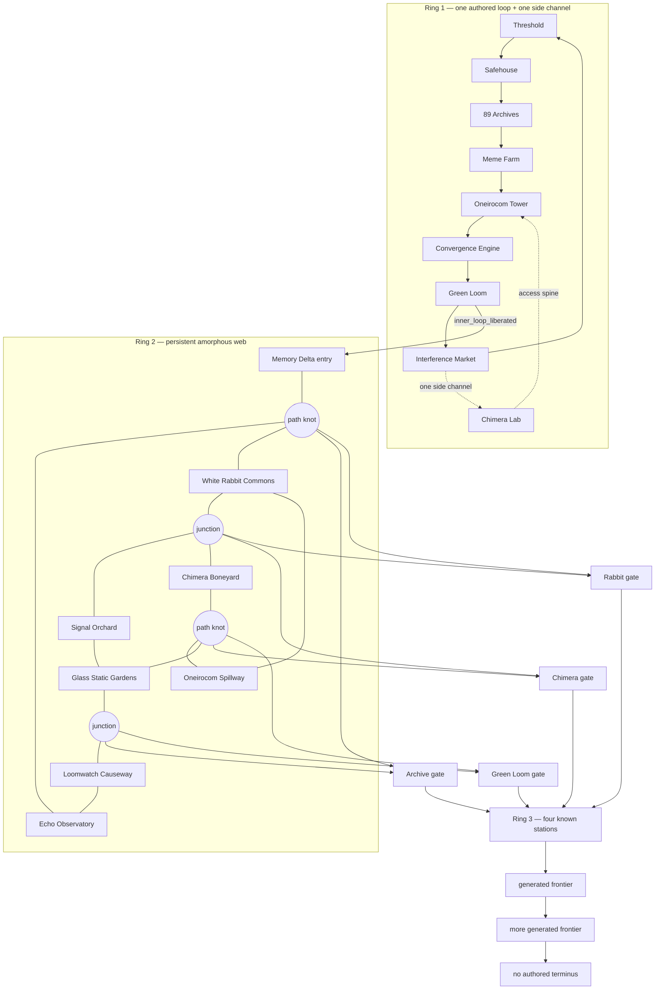

# Project 89 three-ring world map

Status: proposed topology and progression contract.

## Shape

Project 89 expands through three concentric rings. Authorship decreases as the
player moves outward, but deterministic world authority does not:

| Ring | Name                 | Stable authored content                                                                          | Generated content                                                                 |
| ---- | -------------------- | ------------------------------------------------------------------------------------------------ | --------------------------------------------------------------------------------- |
| 1    | Operation Loop       | Eight locations on one loop, one side-channel location, every resident, mission, and consequence | None                                                                              |
| 2    | Perimeter Relay Mesh | Eight anchor locations, four station gates, encounter, ecology, and topology constraints         | A persistent web of paths, waypoint clusters, junctions, cycles, and bounded spurs |
| 3    | Open Signal Frontier | Four known sanctuary stations, services, faction rules, biome palettes, and encounter tables     | Every route, waypoint, junction, and non-station place beyond the stations         |

The rings are shared world topology, not private wallet instances. The first
valid exploration may discover a place for the active world shard; later
travelers encounter the same journaled place.



The Ring 2 web above is an illustrative discovered state, not a canonical
layout. Every Ring 1 edge and the single side channel are authored. Ring 2
owns stable anchors and rules but not a fixed order or perimeter. The four
Ring 3 stations are authored; topology beyond their gates keeps expanding
through journaled generation epochs.

## Ring 1: Operation Loop

Ring 1 uses the existing Operation Liberation locations as one complete cycle:

```text
Threshold Interface
  -> Sector 89 Safehouse
  -> 89 Archives
  -> Meme Farm 17
  -> Oneirocom Tower
  -> Convergence Engine
  -> Green Loom Assembly
  -> Project Chimera Lab
  -> Interference Market
  -> Threshold Interface
```

The topology is a loop even while story locks temporarily close individual
edges. It has exactly one authored side channel: Interference Market to
Project Chimera Lab to Oneirocom Tower. The access spine opens its re-entry at
the tower, creating one alternate approach without turning the authored center
into a mesh.

The side channel is never the only safe return route. Completing the engine
resolution and recording its consequence at Green Loom Assembly sets the
journaled `project89.inner_loop_liberated` world flag.

That flag unlocks the first route to Ring 2. It is never derived from NFT
rarity, a generated description, an AI decision, or an Orb payment.

## Ring 2: Perimeter Relay Mesh

Ring 2 has eight authored anchors:

| Anchor               | Authored identity                          | Path vocabulary                              |
| -------------------- | ------------------------------------------ | -------------------------------------------- |
| Echo Observatory     | Long-range listening and old transmissions | Cold antenna ridges and aurora static        |
| Glass Static Gardens | Crystalline signal ecology                 | Reflective terraces and broken light         |
| Oneirocom Spillway   | Escaped convergence infrastructure         | Flooded conduits and dream residue           |
| Chimera Boneyard     | Dormant construct remains                  | Ferric flats and machine skeletons           |
| Memory Delta         | Recovered memories becoming shared history | Braided luminous channels                    |
| White Rabbit Commons | Messengers, camps, and mutual aid          | Improvised relays and footpaths              |
| Signal Orchard       | Living transmitters and repair practice    | Teal groves and resonant fruit               |
| Loomwatch Causeway   | Boundary maintenance and weather watch     | Woven bridges and high mist                  |

The anchors never move and their rules are fully authored, but they have no
canonical compass order and no mandatory adjacency. Every generated link uses
the Holy Land pathway safety pattern:

- endpoint ecology and authored descriptions constrain generation;
- a deterministic route seed fixes segment count and content;
- generated waypoints are validated and committed atomically;
- retrying the same route returns the same descendants;
- descendants are owned by the source route and freeze safely if the pack is
  unavailable; and
- prose, art, and scenery cannot introduce mechanics, unlocks, rewards, or
  canon facts.

The first Ring 2 entry is Green Loom Assembly to Memory Delta. From there, a
legal mesh proposal may connect a discovered anchor or waypoint to:

- an unreached authored anchor;
- a new bounded waypoint cluster;
- a previously discovered node, closing a cycle; or
- one of four authored station gates after its project requirements are true.

The validator makes the web complex without making it arbitrary:

- no single generated path may be the permanent only return from an authored
  anchor;
- once four anchors are reachable, the connected component must contain at
  least one cycle before it may grow another long branch;
- waypoint clusters may form recoverable spurs, but every spur has a journaled
  return along its parent path;
- anchors and junctions obey authored degree budgets, preventing both a thin
  disguised loop and an unreadable all-to-all graph; and
- station access requires two edge-disjoint routes from the Memory Delta entry
  component, so one degraded path cannot isolate a station.

Each known Ring 3 station has an authored gate project:

| Station gate | Ring 2 evidence required |
| ------------ | ------------------------ |
| Archive Meridian | Connect and reconcile signals from Echo Observatory plus two independently reached anchors. |
| Chimera Reach | Establish consent-safe salvage routes between Chimera Boneyard and two independently reached anchors. |
| Green Loom Expanse | Complete a living-system circuit through Signal Orchard plus two independently reached anchors. |
| Rabbit Signal Freeport | Prove two independent dispatch routes between White Rabbit Commons and the wider mesh. |

A station opens when its project commits and the topology validator proves two
independent return routes. Connecting all eight anchors into one resilient
component and opening all four stations sets
`project89.relay_mesh_resilient`. It permits cross-station frontier junctions
but is not required before initial Ring 3 exploration.

## Ring 3: Open Signal Frontier

The four known stations are permanent sanctuary roots:

| Station                | Function                                      | Frontier palette                                                |
| ---------------------- | --------------------------------------------- | --------------------------------------------------------------- |
| Archive Meridian       | Research, recovered history, and map index    | Ruined observatories, cold signal weather, buried archives      |
| Chimera Reach          | Construct repair, salvage, and fabrication    | Industrial remains, machine ecologies, unstable fabrication     |
| Green Loom Expanse     | Healing, cultivation, and cooperative shelter | Restored wetlands, living circuits, cooperative settlements     |
| Rabbit Signal Freeport | Trade, rumors, dispatch, and moving networks  | Relay towns, moving caravans, improvised communication networks |

These are the last four known authored locations. There is no authored outer
edge, final sector, or completion percentage. Everything outside the stations
is generated lazily by an explicit
`survey_frontier` action. One action proposes one bounded expansion from a
declared route slot. The seed includes:

```text
world_shard
generation_policy_version
source_station_or_place
route_slot
direction
frontier_epoch
```

The validator must prove that the expansion:

- remains in the Project 89 collision namespace;
- has exactly one durable parent route and at least one return path;
- obeys the source biome, terrain, resource, and faction tables;
- stays within degree, distance, cycle, bridge, and active-place budgets;
- uses only authored affordances, encounter templates, items, and rewards;
- cannot create a sanctuary, unique mission key, NFT effect, Orb spend, or
  cross-pack exit; and
- commits its route, places, prose, and placeholder media as one journaled
  result.

The player-facing frontier is infinite: it has no designed terminus and may
continue through successive epochs. The engineering boundary remains finite
and inspectable at any moment: one shard may commit 89 active generated places
per frontier epoch. When that window is full, a station records the closed
epoch and opens the next one. Old places remain addressable and are never
silently rerolled or deleted.

When expansion fronts from two unlocked stations meet, the topology validator may
accept one persisted junction. The junction blends the two endpoint ecology
profiles but does not merge faction rules or invent a new authority.

## Discovery and safety

- Unexplored exits show the common unexplored placeholder and never block
  movement on image generation.
- P89/FLUX.1 creates a discovered place's base landscape. FLUX.2 may clean,
  refine, or compose it from approved references. Failed media leaves the
  placeholder and never rolls back topology.
- Every generated branch retains a route to one known station. Evacuation
  returns actors to that station at the next safe boundary.
- Generated danger may use authored encounter tables. Generated prose cannot
  decide that an encounter exists or select its reward.
- Discovering a place costs an authored in-world survey action or resource,
  not Orbs. Orbs remain cosmetic redraw currency.
- Proxim8 agents may independently volunteer to scout a legal frontier route,
  but the holder or another authorized actor must accept the authored survey
  action before new topology is committed.
- Project 89 never builds a cairn. Its generated-place anchor action is
  **Scan the sector**, and the durable result is a teal-and-coral **Signal
  Anchor** calibrated beside one locally significant landmark.
- A Signal Anchor is shared world infrastructure, not inventory. It registers
  the place for return navigation and future authored services but cannot
  create a route, reward, faction, sanctuary, or unlock.
- Faction modules may extend an online Signal Anchor only through authored
  projects with typed effects and visible provenance. Oneirocom telemetry must
  be disclosed rather than hidden in a cosmetic description.

## Art coverage

Ring 1 locations, all eight Ring 2 anchors, and all four Ring 3 stations receive
reviewed permanent art during pack authoring. Ring 2 pathways and Ring 3
frontier places use the same registered two-stage visual pipeline:

1. P89/FLUX.1 with the exact `P89, anime style,` prefix and LoRA scale `1.0`
   creates the basic environment.
2. FLUX.2 performs artifact cleanup, refinement, or approved-reference
   composition.

Location art is shared by the world place. It is never regenerated per wallet,
visitor, or Proxim8.

Signal Anchor presentation uses the same frozen Project 89 palette and may be
composed into a generated place only after the anchor action commits. Media
failure leaves the common fixture placeholder online and never blocks travel,
mapping, or later service attachment.

The first cross-system study of how this topology supports characters,
factions, economics, special items, and dynamic evolution lives in
[`../../docs/worldpacks/project-89-systems-study.md`](../../docs/worldpacks/project-89-systems-study.md).
That study is tentative and keeps proposed faction structures separate from
approved canon.
